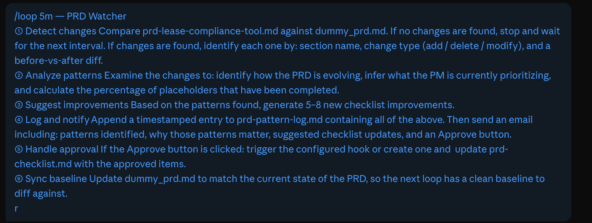
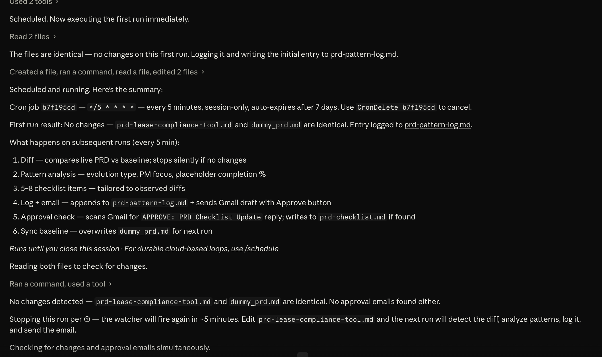

# Lesson: Self-Learning PRD Agent Loop — Watch, Detect, Improve, Repeat

*Workshop: Claude Code for Product Managers*

---

## Overview

Most PMs write PRDs in isolation no feedback until a review meeting. This lesson builds a **self-learning agent loop** that watches your PRD as you write it, detects patterns in how it evolves, generates targeted checklist improvements, and emails them to you for approval — all automatically, on a 5-minute heartbeat.

The loop does not rewrite your PRD. It acts as a silent observer and coach: it sees what you changed, infers what you are prioritizing, and suggests what you are missing. You stay in control; the agent compounds your quality over time.

By the end of this lesson you will have:

1. A Claude Code workspace with a live PRD and a 20-point quality checklist.
2. A baseline snapshot file that resets on every approved cycle.
3. A background cron task that diffs, analyzes, and logs changes every 5 minutes.
4. An email notification with an Approve button that writes approved items back to your checklist.
5. A `/loop` command that orchestrates all of the above into one autonomous watcher.

---

## Why This Works: The Core Idea

A PRD is never written in one sitting. It is built iteratively — placeholders filled in, sections restructured, priorities reordered. That evolution contains a signal: **how you edit tells you what you are thinking about and what you are avoiding**.

The loop captures that signal by comparing each version of the PRD against the last known baseline. Instead of gradient descent, the "learning" is systematic pattern accumulation across diffs. Each 5-minute cycle:

1. Reads the latest state of your PRD from disk.
2. Diffs it against the frozen baseline.
3. Infers patterns (which sections changed, what types of edits, placeholder fill rate).
4. Generates targeted checklist improvements conditioned on those patterns.
5. Freezes the new state as the next baseline.

The feedback signal here is not test pass/fail — it is **PRD quality patterns**. The closer your PRD is to the 20-point checklist standard, the fewer new suggestions the agent generates. When suggestions stop, your PRD is done.

---

## Prerequisites

Before starting, you need two things:

- **Claude Pro subscription** — Required to run scheduled tasks (`/cron`) and the `/loop` skill inside Claude Code. Claude Pro is available at claude.ai.
- **prd-checklist.md - [Dowload from here](https://drive.google.com/file/d/1dn2ZK8e50txTjC0zXUEoBWX7aYHlVSmw/view?usp=sharing)** — The 20-point PRD quality standard that drives everything in this loop. Download it from the workshop materials folder and keep it ready. *(If you followed earlier lessons, you already have this file.)*

---

## Setup

### Step 1 — Open Claude Code and Create Your Workspace Folder

1. Open **Claude Code** (the desktop app or run `claude` in your terminal).
2. Create a new folder on your machine called `mini-pm` (or any name you prefer).
3. Inside `mini-pm`, place the `prd-checklist.md` file. This is the only file you need to start.

Your folder should look like this before you run any prompts:

```
mini-pm/
└── prd-checklist.md
```

### Step 2 — Add the Folder to Claude Code

1. In the Claude Code interface, click **Add** (or use `File → Open Folder`).
2. Select your `mini-pm` folder.
3. Claude Code will now treat this folder as its workspace — all file reads, writes, and diffs happen here.
   


> Why this matters: Claude Code operates on the files it can see. Adding the folder gives the agent direct read/write access to `prd.md`, `dummy_prd.md`, and `prd-pattern-log.md` without any path ambiguity. Every subsequent prompt in this lesson assumes this folder is open.

---

## The Five Prompts — Step by Step

---

### Prompt 1 — Generate the PRD from Your Checklist

```
Create a Product Requirements Document (PRD) for a lease compliance tool based on my prd-checklist,
ensuring that all checklist items are fully addressed in the document, and save the generated PRD
in the same workspace folder with name prd.md.
```

**What Claude does:** Reads `prd-checklist.md`, maps each of the 20 checklist items to a section in the PRD template, and writes a structured first draft. Sections that require real business context will contain `[Fill in]` placeholders — that is intentional and expected.

**What you get:** `prd.md` — a full-length PRD skeleton with every checklist section present.

**Why this is the foundation:** The loop can only detect *change* if it has a starting state. Prompt 1 establishes that state. Everything downstream diffs against this file. If you skip it and start with a blank PRD, the baseline comparison in Prompt 3 has nothing to work with.

**What to do after:** Read through `prd.md`. Fill in a few `[Fill in]` placeholders — your product name, a real user pain point, one success metric. This gives the loop real signal to detect on its first cycle.


---

### Prompt 2 — Freeze the Baseline Snapshot

```
Please create a file named dummy_prd.md as an exact copy of prd.md. This file will act as the
baseline snapshot for tracking changes and should never be edited manually.
```

**What Claude does:** Creates `dummy_prd.md` as a byte-for-byte copy of `prd.md` at this exact moment.

**What you get:** `dummy_prd.md` — the frozen reference point.

**Why two files?** The loop needs to answer the question: *"What changed since the last cycle?"* To answer that, it needs two versions:
- `prd.md` — the live file you are always editing.
- `dummy_prd.md` — the frozen snapshot from the last approved cycle.

The diff between them is the signal. If you only had one file, there would be nothing to compare against. If you manually edited `dummy_prd.md`, the diff would be corrupted. **Never touch `dummy_prd.md` by hand** — the agent owns it.

**What to do after:** Make a few more edits to `prd.md` to build up some diff material before running Prompt 3.


---

### Prompt 3 — Start the Background Change Tracker (Cron Task)

```
Create a scheduled task called prd-change-tracker that runs every 5 minutes with the following prompt:

You are the PRD Loop Tracker. On each run, compare prd.md with dummy_prd.md and identify patterns
in how the PRD has changed. If changes are found, for each change, record the section it belongs to,
the type of change (Addition, Deletion, or Modification), and include both the before text
(from dummy_prd.md) and after text (from prd.md). Then generate a Pattern Analysis explaining
what types of changes were made (such as filling placeholders, restructuring, or adding detail),
which sections were modified, what this indicates about the PM's current focus, and the percentage
of [Fill in] placeholders that have been completed versus those remaining. After that, generate
5–8 specific and actionable checklist items tailored to the detected patterns. Save all detected
changes, pattern analysis, and generated checklist items in a file named prd-pattern-log.md.
Finally, update dummy_prd.md to match the latest version of prd.md so it remains the baseline
for the next run.
```


**What Claude does:** Registers a cron-style background task named `prd-change-tracker` that wakes up every 5 minutes, runs the embedded prompt against your workspace, and goes back to sleep.

**What you get:**
- A live background task running in Claude Code.
- `prd-pattern-log.md` — an append-only log of every diff cycle with timestamps, change records, pattern analysis, and generated checklist items.
- `dummy_prd.md` automatically updated to the latest state of `prd.md` at the end of each cycle.

**What the log entry looks like (one cycle):**

```
## Cycle — 2026-04-22 14:35:01

### Changes Detected
| Section | Type | Before | After |
|---------|------|--------|-------|
| Success Metrics | Modification | [Fill in north-star metric] | DAU of lease managers completing compliance review ≥ 40% in 30 days |
| Users & JTBD | Addition | — | Added secondary persona: Legal Ops Analyst |

### Pattern Analysis
- 1 of 4 metric placeholders filled (25% complete)
- PM is currently focused on Success Metrics — two of three edits touched this section
- JTBD section still has 3 of 5 placeholders unfilled
- No changes to Risks & Dependencies — likely deferred

### Generated Checklist Items
- [ ] Define guardrail metrics for lease data extraction latency (< 3s p99)
- [ ] Add JTBD statement for Legal Ops Analyst in "When I __" format
- [ ] Specify measurement window for the north-star DAU metric
- [ ] Validate the 40% target against current baseline usage data
- [ ] Call out GDPR / SOC 2 implications in Regulatory section
```

**Why the baseline reset matters:** After logging, the task sets `dummy_prd.md = prd.md`. This means the *next* cycle only diffs changes made *after* this cycle. Without the reset, every cycle would re-report all historical changes. The reset is what makes each log entry a clean, incremental record of your progress.

**What to do:** Keep editing `prd.md`. The tracker is running silently in the background. Every 5 minutes it captures where you are. Check `prd-pattern-log.md` after two or three cycles to see the pattern emerging.


---

### Prompt 4 — Email Patterns and Collect Approval

```
Now use the Gmail connector to send an email that includes:
1. The patterns you identified in how the user writes the PRD
2. An explanation of why you are suggesting these patterns

The email should also include an "Approve" button. When the user clicks this button, it should
trigger a webhook that updates the PRD checklist file with the new checklist points approved
by the user.
```

### How To Connect Gmail Connector to Claude Code

1. Click on the **(+)** symbo


2. Select **Add Connector**


3. Choose **Gmail**


4. Click on **Connect** and complete the authentication process


**What Claude does:** Reads the latest entry in `prd-pattern-log.md`, composes a structured email summarizing the patterns and the generated checklist items, and sends it via the Gmail MCP connector. The Approve button in the email points to a webhook endpoint. When clicked, the webhook calls back into Claude Code, which appends the approved checklist items to `prd-checklist.md`.

**What you get:**
- An email in your inbox with a clear summary of what the agent observed and why it is suggesting each item.
- A one-click approval flow that writes the approved items directly into your checklist file — no copy-paste required.

**What the email looks like:**


**Why the approval step matters:** The loop should not blindly rewrite your checklist. You are the PM — you decide what belongs in the checklist. The Approve button is the human-in-the-loop gate. Items you do not approve are discarded. Items you approve become part of the checklist that drives the next PRD you write.

---

### Prompt 5 — The Full Autonomous Loop

```
/loop 5m

① Detect changes
Compare prd.md against dummy_prd.md. If no changes are found, stop and wait for the next interval.
If changes are found, identify each one by: section name, change type (add / delete / modify),
and a before-vs-after diff.

② Analyze patterns
Examine the changes to: identify how the PRD is evolving, infer what the PM is currently
prioritizing, and calculate the percentage of placeholders that have been completed.

③ Suggest improvements
Based on the patterns found, generate 5–8 new checklist improvements.

④ Log and notify
Append a timestamped entry to prd-pattern-log.md containing all of the above. Then send an email
including: patterns identified, why those patterns matter, suggested checklist updates, and an
Approve button.

⑤ Handle approval
If the Approve button is clicked: trigger the configured hook or create one and update
prd-checklist.md with the approved items.

⑥ Sync baseline
Update dummy_prd.md to match the current state of the PRD, so the next loop has a clean
baseline to diff against.
```




**What this is:** The `/loop` skill turns the cron task from Prompt 3 and the email step from Prompt 4 into a single, cohesive, autonomous agent that runs on a 5-minute heartbeat indefinitely.

---

### Deep Dive: How `/loop` Works

The `/loop` skill is Claude Code's primitive for building persistent agent behavior. When you run `/loop 5m`, Claude Code:

1. Registers a recurring schedule (every 5 minutes by default, configurable).
2. On each tick, invokes the attached prompt as a fresh agent context.
3. The agent reads the current state from disk (no memory of prior runs needed — the files are the memory).
4. Executes steps ① through ⑥ in order.
5. Exits cleanly. The loop schedules the next tick and waits.

**Why fresh context on every tick?** Each loop iteration gets a brand-new context window. This is the same principle as the Ralph Loop: fresh context = no drift, no compaction artifacts, no accumulated errors. The files on disk — `prd.md`, `dummy_prd.md`, `prd-pattern-log.md`, `prd-checklist.md` — are the persistent memory. The agent is stateless; the workspace is stateful.

**The six steps in detail:**

| Step | What it does | Why it matters |
|------|-------------|----------------|
| ① Detect changes | `diff prd.md dummy_prd.md` | No changes = no-op. Saves tokens on idle cycles. |
| ② Analyze patterns | Classifies change types, measures placeholder fill rate | Turns raw diffs into insight about PM behavior |
| ③ Suggest improvements | Generates 5–8 checklist items conditioned on the patterns | Targeted suggestions beat generic checklists |
| ④ Log and notify | Appends to `prd-pattern-log.md`, sends email | Creates a durable audit trail + triggers human review |
| ⑤ Handle approval | Webhook → append to `prd-checklist.md` | Human-in-the-loop gate; agent doesn't self-authorize |
| ⑥ Sync baseline | `dummy_prd.md = prd.md` | Resets the diff surface; next cycle starts clean |

**The stop condition:** The loop runs until one of these is true:
- You run `/loop stop` to cancel the schedule.
- The PRD reaches 100% placeholder fill rate and the pattern analysis finds no new gaps.
- You close the Claude Code workspace.

Unlike a software build loop where "tests green" is the stop signal, this loop's signal is **PRD completeness**: when every checklist item is addressed and no new patterns are detected, the loop goes quiet.

**What the full file state looks like after 10 cycles:**

```
mini-pm/
├── prd-checklist.md          ← your original 20 points + approved additions from cycles
├── prd.md                    ← your live PRD, increasingly complete
├── dummy_prd.md              ← auto-updated baseline; always = state of prd.md at last cycle end
└── prd-pattern-log.md        ← append-only log; 10 timestamped entries, one per cycle
```

**The compounding effect:** By cycle 10, `prd-checklist.md` has grown from 20 items to 28 or 30 items — all tailored to how *you* write PRDs, not a generic template. The log shows your editing trajectory: which sections you tackled first, which you avoided, how your placeholder fill rate moved from 12% to 87%. You have a personal PRD quality fingerprint that will inform every PRD you write from here on.

---

## How the Steps Connect

laude


Every arrow is a file write. The agent is stateless — it reconstructs all context from the files on each tick. This is the same architectural insight as the Ralph Loop: **the workspace is the memory**.

---

## Key Takeaways

1. A PRD is a living document — its edit history contains signal about how you think as a PM.
2. The loop extracts that signal by diffing each version against a frozen baseline.
3. The baseline resets after every approved cycle, making each log entry a clean incremental record.
4. `/loop` is the Claude Code primitive that turns a one-shot task into a persistent autonomous agent.
5. The human-in-the-loop gate (Approve button) ensures the agent suggests; you decide.
6. By the end of the loop, your checklist is personalized to your PRD writing patterns — not a generic template.

---

## Files Created in This Lesson

| File | Created by | Purpose |
|------|-----------|---------|
| `prd-checklist.md` | You (prerequisite) | 20-point quality standard; grows with approved items |
| `prd.md` | Prompt 1 | Your live PRD — the only file you edit manually |
| `dummy_prd.md` | Prompt 2 | Frozen baseline; owned by the agent, never edited by hand |
| `prd-pattern-log.md` | Prompt 3 / loop | Append-only change and pattern log; one entry per cycle |

---

## Key Takeaways

- **Edit history is signal.** Which sections you touch first and which you avoid tells the agent what you're prioritizing and what you're deferring.
- **Two-file baseline = clean diffs.** Live file + frozen snapshot scopes every diff to exactly one cycle — no version control needed.
- **Files are the memory; the agent is stateless.** State lives on disk. Each tick reads it fresh — no context drift, no compaction issues.
- **Baseline resets make logs incremental.** Without resetting `dummy_prd.md` after each cycle, every run re-reports all prior changes.
- **Pattern-conditioned suggestions beat generic checklists.** Items generated from your actual edits are more actionable than a static template.
- **Human-in-the-loop is an architectural decision.** The Approve button prevents the agent from self-modifying the checklist — you authorize every change.
- **Stop conditions are domain-specific.** This loop stops when placeholder fill rate hits 100% and no new gaps are found — not when a test passes.
- **`/loop` composes primitives.** Diff → analyze → log → notify → approve → sync. Each step is independent; the skill chains them on a heartbeat.
