# The PRD Feedback Loop: How to Train AI Using Your Own Edits


## The Problem

Most AI workflows today are fundamentally static. You provide a prompt, tools like Claude generate a PRD, and then you manually refine it to match your expectations. However, all the valuable edits you make—your clarity improvements, added constraints, structural changes, and product thinking—are lost after that step. The AI does not learn from these corrections, which means it keeps repeating the same mistakes in future outputs. As a result, your unique way of thinking and writing PRDs never becomes part of the system, forcing you to repeatedly "fix" the AI instead of benefiting from it over time.

---

## How We Solve This: Self-Learning Feedback Loop


Introduce a self-learning feedback loop that converts user edits into long-term intelligence:

1. The system generates a PRD using a predefined checklist
2. The user modifies the PRD, creating a more accurate and refined version
3. A scheduled process compares the AI-generated PRD with the user-edited version
4. The system identifies patterns in changes, such as:
   - Added specificity
   - Restructured sections
   - Inclusion of edge cases
5. These patterns are converted into new checklist items
6. Each checklist item includes a reason inferred from user behavior (behavioral inference)
7. A human-in-the-loop step is introduced where:
   - Suggestions are reviewed
   - User approves or rejects them
8. Once approved, the system updates the original checklist

This creates a continuous loop:

```
Generate → Edit → Learn → Improve → Repeat
```

> [!IMPORTANT]
> **Key Insight:** Most people use AI as a one-shot tool — prompt in, output out. What we're building here is different. We're treating every edit you make as a signal, and teaching the system to learn from that signal over time. This is the foundation of a truly personal AI assistant.

---

## Prerequisites

- Active Claude Pro Subscription
- A PRD (Product Requirements Document) — if you don't have one, [download the sample PRD here](https://drive.google.com/file/d/1f3WpI2K1UozwkuATTHx9QQzv_e7S8uOs/view?usp=sharing)
- PRD Checklist File (`prd-checklist.md`) — [click to download](https://drive.google.com/file/d/1Z72lRsAPtNCzrLUNbZ4TL_p9djHAI0Qh/view?usp=sharing)

---

## Part 1: Project Setup


Before we write a single prompt, we need to give Claude a workspace — a folder it can read from and write to. Think of this as setting up the "memory" of your agent. Without this, Claude has no way to access your PRD or persist any files it generates.

### Step 1 — Create Your Project Folder

- Create a new folder (suggested name: `self-learning-prd-agent`)
- Inside this folder, add two files:
  - `PRD_v1_original.md` → your base Product Requirements Document
  - `prd-checklist.md` → the checklist you downloaded from the prerequisites section

### Step 2 — Open Claude

- Launch Claude on your system
- Make sure you're logged into your Pro account

### Step 3 — Add Your Folder to Workspace

In Claude, add/import the folder you just created (`self-learning-prd-agent`). This allows Claude to:
- Access your PRD file
- Read the checklist
- Generate and update files directly within the folder

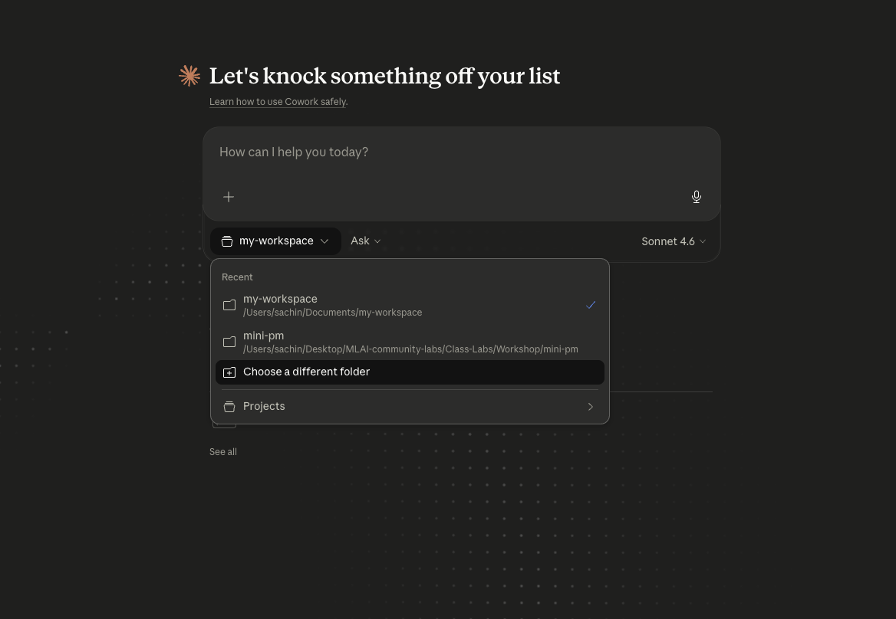

> [!IMPORTANT]
> **✅ Checkpoint — What just happened?**
> You've given Claude a shared workspace — it can now read your files and save outputs directly into your folder. This is what makes the agent persistent. Without connecting the folder, every chat starts from scratch and Claude has no context about your work.

---

## Part 2: First PRD Generation

Now that Claude has access to your workspace, we'll use it to generate an improved version of your PRD. The key idea here is **checklist-driven generation** — instead of just asking Claude to "improve the PRD," we give it a structured set of rules to follow. This makes the output consistent, reviewable, and comparable to your edits later.

### Step 1 — Open Claude

Make sure your workspace folder is already connected.

### Step 2 — Start a New Chat

This keeps the context clean and focused.

### Step 3 — Paste the Following Prompt

> [!TIP]
> **Prompt — Copy and paste this into Claude**

```
You are a senior Product Manager and PRD expert.

I have two files in my workspace:
1. prd-checklist.md → contains the structure, rules, and expectations
2. PRD_v1_original.md → contains the base PRD

Your task:

- Carefully read the checklist file and understand all requirements
- Review the original PRD
- Improve and rewrite the PRD so that it fully satisfies every checklist point

Output Instructions:
- Save the improved version as a new file named: PRD_v2_ai.md
- Keep the structure clean with proper headings
```


### Step 4 — Run the Prompt

Let Claude process both files and generate the improved PRD.

### Step 5 — Save the Output

Save the response as `PRD_v2_ai.md` inside your project folder.

> [!IMPORTANT]
> **✅ Checkpoint — What just happened?**
> Claude read your checklist, applied every rule to your original PRD, and produced a refined version — `PRD_v2_ai.md`. This is now the "AI's best attempt" at your PRD. Your job next is to read it, make your own edits, and save that as `PRD_v3_user.md`. That gap between `v2` and `v3` is where the learning happens. Every change you make is a lesson.

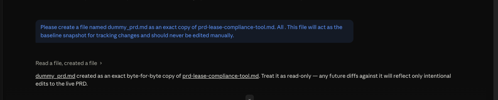

---

## Part 3: Scheduler Task — Pattern Learning

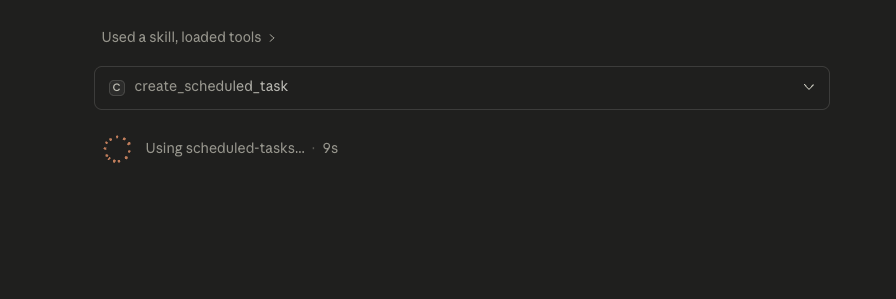

Here's where the system starts getting intelligent. You've made edits to the AI's PRD. Now we need a process that automatically looks at those edits, figures out *why* you made them, and converts that reasoning into structured checklist rules.

We do this using a **scheduled task** — a recurring job that runs every hour, compares the two PRD versions, and appends new learnings to a file called `learned-checklist.md`.

### Prompt

> [!TIP]
> **Prompt — Copy and paste this into Claude**

```
Create a scheduled task named `prd-learning-scheduler`.

This task should run every 1 hour.

On every run, execute the following:

- Read two files from the workspace:
  1. PRD_v2_ai.md (AI-generated PRD)
  2. PRD_v3_user.md (User-edited PRD)

- Compare both files and identify meaningful differences

- Extract patterns from user changes such as:
  - Added specificity
  - Added constraints
  - Added edge cases
  - Structural improvements
  - Clarity or tone improvements

- Convert these patterns into structured checklist learnings

- For each learning, include:
  - Checklist Item
  - Section
  - Observed Change
  - Frequency (if repeated)
  - Confidence Score (Low/Medium/High)
  - Reason (behavioral inference based on user edits)

- Append all learnings into a SINGLE file:
  → learned-checklist.md

Important Rules:
- Do NOT create new files every run
- Do NOT overwrite the file; always APPEND new learnings
- Avoid duplicate checklist items (merge if similar)
- Do NOT include timestamp in the file name
- Only focus on meaningful changes
- Learn strictly from user behavior, not assumptions
```

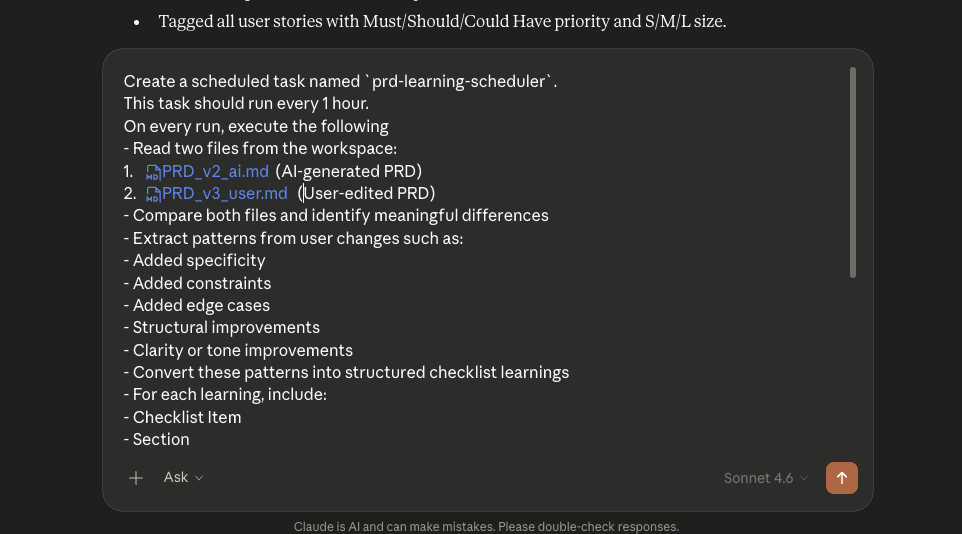

The Scheduler task is live 

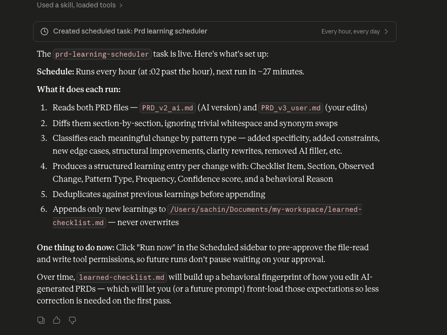


### How to Test the Scheduler

1. Go to **Scheduler** in the left side bar
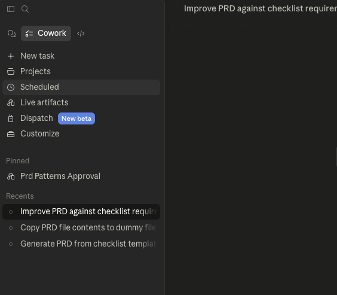
2. Click on your scheduler task
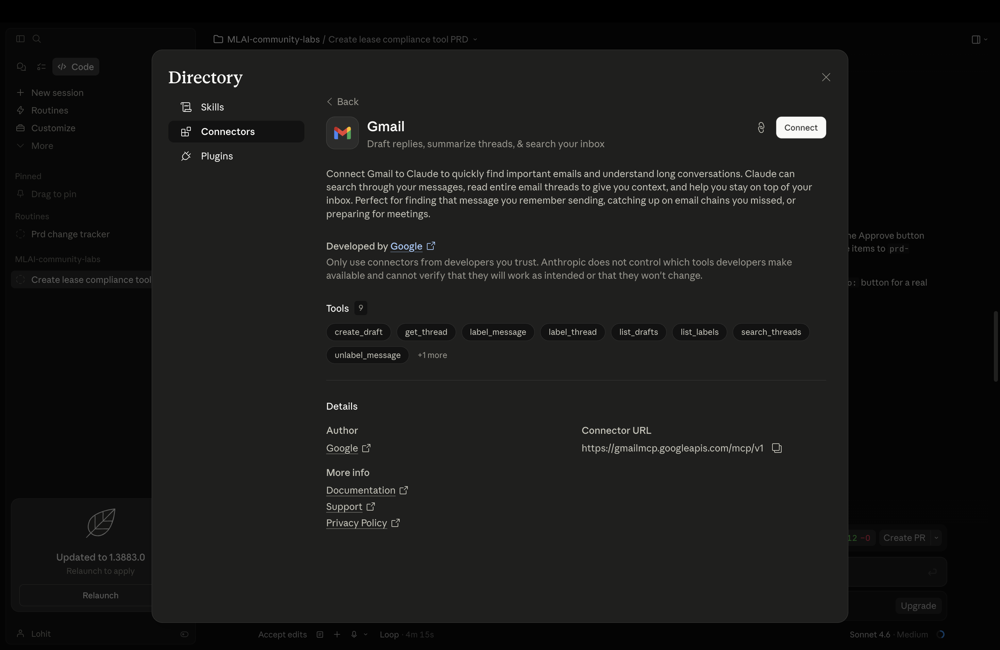
3. Click **Run**
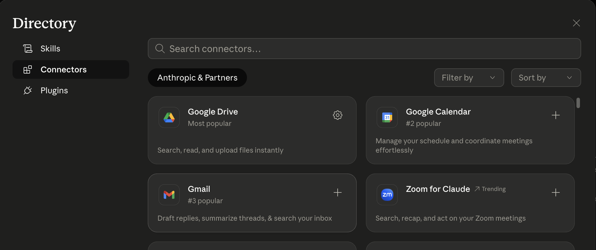

> [!IMPORTANT]
> **✅ Checkpoint — What just happened?**
> You've created an autonomous background process. Every hour, without any manual effort, it wakes up, reads both PRDs, extracts what you changed and why, and appends structured learnings to `learned-checklist.md`. Over time, this file becomes a reflection of how *you* think about PRDs — written in rules the AI can actually use. Notice the confidence scores: the system doesn't just log changes, it infers intent and assigns confidence to each pattern.

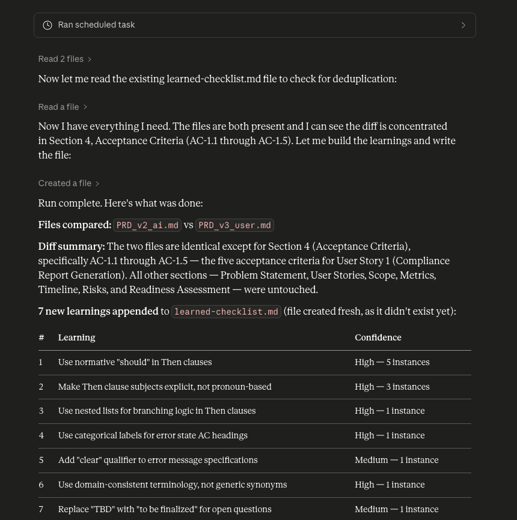

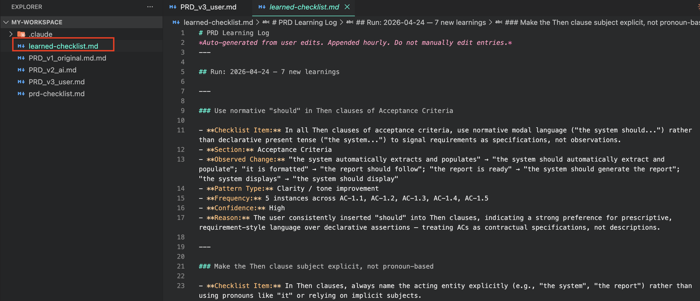

---

## Part 4: End-to-End Slack Approval Flow

We now have a system that automatically generates learnings — but we don't want to blindly trust them. This is where **human-in-the-loop** comes in. Before any new rule gets added to your master checklist, you need to approve it. We use Slack as the approval channel: the system DMs you a summary of high-frequency patterns (observed 2+ times), and you reply with a single word — `APPROVE` or `REJECT`.

This step is what separates a toy demo from a production-grade workflow. It ensures you stay in control even as the system learns.

### Step 1 — Create the Slack Approval Scheduler

This scheduler runs every 15 minutes, filters patterns with `Frequency >= 2`, and sends them to you for approval via Slack DM.

#### Prompt

> [!TIP]
> **Prompt — Copy and paste this into Claude**

```
Create a scheduled task named `slack-approval-checker`.

Run every 15 minutes.

On each run:

STEP 1 — Filter High-Frequency Patterns
- Read `learned-checklist.md`
- Extract only the checklist items where Frequency >= 2
- If no items meet this threshold, stop — do nothing

STEP 2 — Send for Approval via Slack DM
- Send a Slack direct message to: Sachin Parmar
- Message content:

  Subject: PRD Checklist Learning Updates

  Hi Sachin,

  The following checklist patterns have been observed 2 or more times in your PRD edits and are ready for review:

  [Insert only the filtered items with Frequency >= 2 from learned-checklist.md]

  Please reply with ONLY one word:

  APPROVE → to accept and update the checklist
  REJECT → to ignore

STEP 3 — Check for Reply
- Read the latest reply from Sachin Parmar in the DM thread

- If the reply contains "APPROVE":
  - Append ONLY the filtered items (Frequency >= 2) to `prd-checklist.md`

- If the reply contains "REJECT":
  - Do nothing

Important:
- Only process patterns with Frequency >= 2
- Never append low-frequency patterns regardless of approval
- Only check the latest reply in the thread
- Do not append duplicate checklist items
- Do not repeat the same update if already processed
```

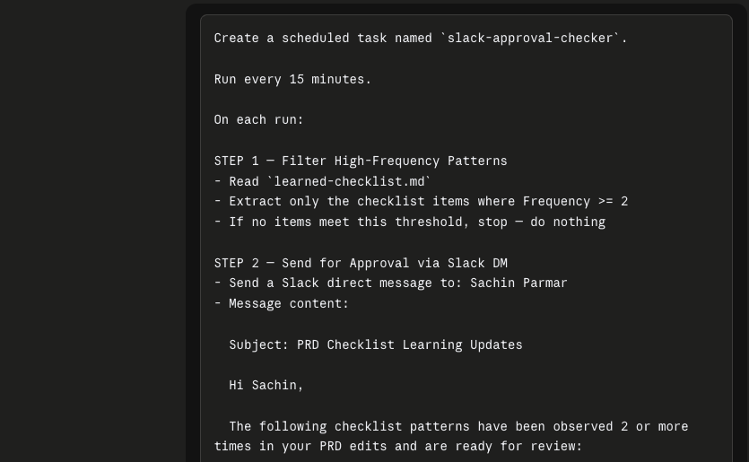

### Step 2 — Add Slack Connector

Now connect Claude to your Slack workspace so the scheduler can send you DMs.

1. Click on **Add Connector**
2. Search for **Slack**
3. Authenticate your account and grant permissions


### Step 3 — Verify Access in Claude

Ensure Claude can:
- Send direct messages
- Search Slack messages
- Read message threads

### Step 4 — Test the Full Flow

**Step A — Run the Scheduler**

1. Go to the **Scheduler** section in the left sidebar


2. Select your `slack-approval-checker` task (created in Step 1)

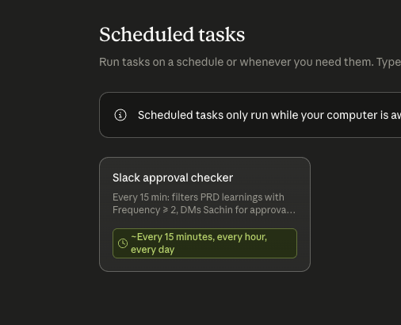

3. Click **Run**


**Step B — Confirm Message is Sent**

1. Go to your Slack workspace
2. Open your Direct Messages from Claude
3. Verify the approval request has arrived

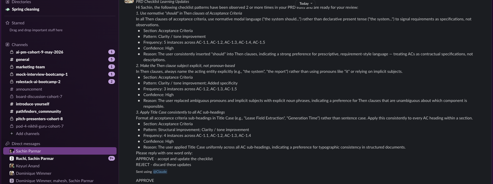

**Step C — Reply with Your Decision**

1. Open the DM from Claude
2. Reply in the thread with: `APPROVE`


**Step D — Run Scheduler Again to Process Reply**

1. Go back to Scheduler
2. Run `slack-approval-checker` again

### Expected Outcome

- Scheduler reads your Slack DM reply
- Detects: `APPROVE`
- Appends only patterns with `Frequency >= 2` to `prd-checklist.md` ✅


> [!IMPORTANT]
> **✅ Checkpoint — What just happened?**
> You've closed the full loop. The system learned from your edits, asked for your permission, received your approval, and updated the master checklist — all automatically. Next time Claude generates a PRD, it will use the updated checklist, which now includes rules derived from your own behavior. The AI has genuinely gotten better at writing PRDs *your way*, and it will continue improving every time you edit.

---

## What You've Built

Let's step back and appreciate the full system you just assembled:

| Component | What It Does |
|---|---|
| `PRD_v1_original.md` | Your raw PRD — the starting point |
| `prd-checklist.md` | The rules Claude uses to generate PRDs |
| `PRD_v2_ai.md` | Claude's best attempt based on the checklist |
| `PRD_v3_user.md` | Your edited version — the source of truth |
| `prd-learning-scheduler` | Hourly job that extracts learnings from your edits |
| `learned-checklist.md` | New rules inferred from your behavior |
| `slack-approval-checker` | Watches `#prd-approvals` for your reply and updates the master checklist |

Every cycle makes the system smarter. Every PRD you edit teaches it something new. And because you approve every update, you stay in control of what the AI learns. This is **agentic AI with human oversight** — the same pattern used in production AI systems at scale.
