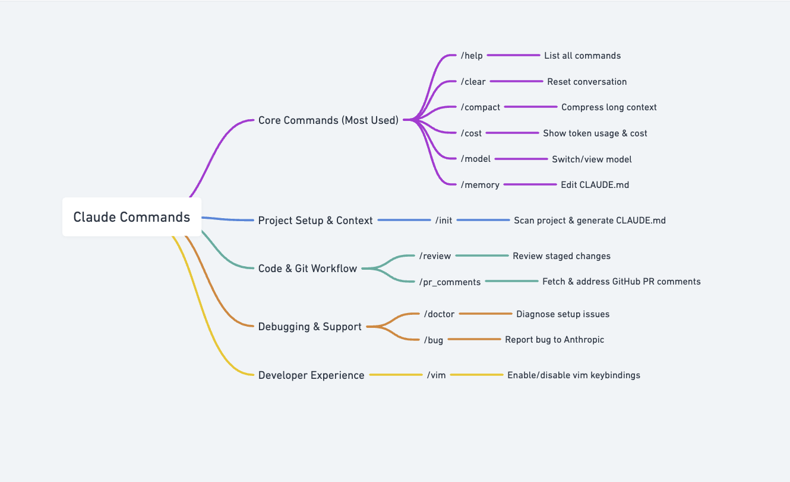
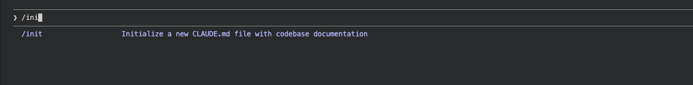
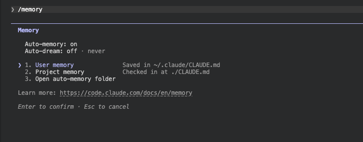
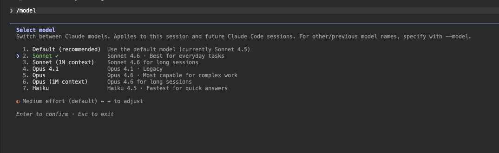
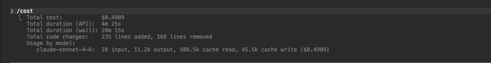
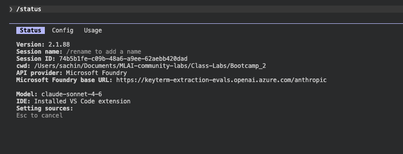
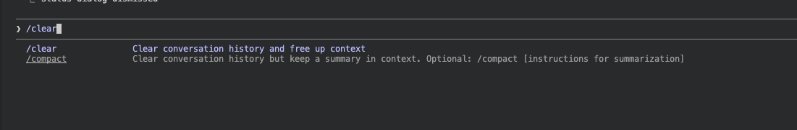

# Lesson 2.1 — Slash Commands in Claude Code: Speed Up Your PM Workflow

---


## Coming From Module 1

In Module 1, you built two CLAUDE.md files — one for your personal working style, one for LegalGraph's product context. Claude now knows who you are, what you're building, and how you like to work.

Everything you did in Module 1 was typed: full instructions, full prompts. That works well. But Claude Code also has a built-in command system that lets you trigger common actions with a single keystroke — no full sentences required.

That's what this lesson covers.

---

## What Are Slash Commands?

Slash commands start with `/`. Type `/` in the Claude Code chat and a menu of available commands appears automatically.

Each command triggers a specific behavior — scanning files, compressing a session, resetting context — without you having to describe what you want.

**The key distinction:**
- `@filename` → points Claude at a file (passes its contents into context)
- `/command` → triggers an action (tells Claude to *do* something)

You used `@` extensively in Module 1. Now you're learning `/`.

---

## 6 Slash Commands Every PM Should Know

### 1. `/init` — Set Up CLAUDE.md for a New Project

**What it does:** Scans your current project folder and auto-generates a starter `./CLAUDE.md` based on what it finds — file names, folder structure, any existing documentation.

**Why it matters:** When you join a project mid-stream (no CLAUDE.md exists yet), `/init` gives you a first draft instantly. Faster than writing it from scratch.

**How to use it:**
1. Open Claude Code in the new project folder
2. Type `/init` and press Enter
3. Claude scans the folder, generates CLAUDE.md, and saves it

> **Important:** `/init` gives you a starting point, not a finished file. Review it — then layer in your PM context: personas, north star metrics, working instructions. Same process as Lesson 1.3, just starting from a better draft.

**Try it:**
```
/init
```
You should see Claude scan your project folder and either create a new `CLAUDE.md` or suggest improvements to an existing one. After it runs, open the file and check what it produced.




---

### 2. `/memory` — See What Claude Knows About You

**What it does:** Shows you what's currently loaded from your CLAUDE.md files — global (`~/.claude/CLAUDE.md`) and project (`./CLAUDE.md`) — plus any session memory Claude has built up.

**Why it matters:** Before a big research or strategy session, you want to verify that Claude has the right context loaded. If it's working from stale or wrong information, `/memory` tells you before you waste 30 minutes of prompting.

**How to use it:**
1. Type `/memory` in Claude Code
2. Claude displays what it has loaded and knows about you

**What to look for:**
- Are your LegalGraph personas listed? (Jennifer, David, Rachel)
- Is your PRD template in there?
- Is the project description accurate?

> **Important:** If you updated CLAUDE.md but changes aren't reflected, use `/memory` to debug. The most common cause: you edited the file but didn't save it.

**Try it:**
```
/memory
```
You should see a list of all CLAUDE.md files currently loaded, with their contents. Check that your three personas (Jennifer, David, Rachel) are visible and your PRD template is there. If anything is missing, that's your signal to fix the CLAUDE.md before continuing.



---

### 3. `/model` — Switch Models Mid-Session

**What it does:** Shows the currently active Claude model and lets you switch to a different one without starting a new session.

**Why it matters for PMs:** Different tasks need different models. Fast drafting and quick lookups don't need the most powerful model. Deep competitive analysis, PRD writing, or anything where reasoning quality matters — does. `/model` lets you switch on demand, in the same session.

**How to use it:**
1. Type `/model` to see what's currently active
2. Select from the available models in the menu that appears
3. Continue your session — the new model takes over immediately

**When to switch:**
| Task | Model to use |
|------|--------------|
| Quick questions, formatting, summaries | Sonnet (faster, cheaper) |
| Deep research, PRDs, complex reasoning | Opus (more capable) |
| High-volume drafting, rapid iteration | Haiku (fastest) |

> **Important:** Switching models mid-session doesn't reset your context. Claude carries over the full conversation history — the new model picks up exactly where the previous one left off.

**Try it:**
```
/model
```
See which model is active. If you're on Sonnet, try switching to Opus and ask a follow-up question. Notice the difference in reasoning depth on complex questions.



---

### 4. `/cost` — Track Token Usage and Spend

**What it does:** Shows a breakdown of tokens consumed in the current session — input tokens, output tokens, cache usage, and estimated cost.

**Why it matters for PMs:** Long research sessions, chained prompts, and `@`-loading large files all burn tokens fast. `/cost` tells you exactly where you stand before you hit a budget limit or get surprised by a bill.

**How to use it:**
1. Type `/cost` at any point during a session
2. Claude displays a usage summary for the current session

**What to look for:**

| Metric | What it means |
|--------|---------------|
| Input tokens | Tokens Claude received — your prompts + all `@` files loaded |
| Output tokens | Tokens Claude generated — the responses |
| Cache read tokens | Tokens served from cache — these cost less |
| Estimated cost | Total $ spend for this session so far |

> **Good habit:** Run `/cost` after a long research session before you chain another prompt. If input tokens are high, it's because you've loaded large files via `@`. Consider whether all those files still need to be in context.

**Try it:**
```
/cost
```
Note the token count. Then load a large file with `@` and run `/cost` again — you'll see the input token count jump. That's the cost of loading context.



---

### 5. `/status` — See Your Session and Git State at a Glance

**What it does:** Displays a snapshot of your current Claude Code session — active model, git branch, working directory, any pending changes, and permission mode.

**Why it matters for PMs:** Before starting a research or writing session, you want to confirm you're in the right project folder, on the right branch, and using the right model. `/status` surfaces all of that in one line instead of you having to check each thing separately.

**How to use it:**
1. Type `/status` at the start of any session
2. Claude displays the current session state

**What to check:**

| Field | Why you care |
|-------|--------------|
| Working directory | Are you in the right project folder? |
| Git branch | Are you on the right branch before saving outputs? |
| Active model | Are you using the model you intended? |
| Pending changes | Any unsaved files that might affect context? |
| Permission mode | Is Claude allowed to write files, run commands? |

> **Make it a habit:** Run `/status` at the start of every session the same way you'd check your dashboard before a stakeholder meeting. Catch the wrong folder or wrong model before you spend 20 minutes prompting.

**Try it:**
```
/status
```
Verify the working directory matches your LegalGraph project folder and the model matches what you want for this session. If either is wrong, fix it before continuing.


---

### 6. `/clear` — Start a Fresh Session

**What it does:** Wipes the current conversation and starts fresh. Your CLAUDE.md files are unaffected and will load again automatically when the new session starts.

**Why it matters:** If a session has gone sideways, you've been debugging a prompt for too long, or you're switching to a completely different task — `/clear` resets without touching your persistent context.

**How to use it:**
1. Type `/clear`
2. A new session starts — CLAUDE.md loads automatically

**`/clear` vs `/compact` — which to use:**

| Situation | Use |
|-----------|-----|
| Session is long but on track, want to keep going | `/compact` |
| Session has gone off track, want a clean break | `/clear` |
| Starting a completely different task | `/clear` |
| Running out of context during research | `/compact` |

**Try it:**
```
/clear
```
After the session resets, immediately ask:
```
What do you know about LegalGraph?
```
Claude should answer with the company context from your CLAUDE.md — proving that `/clear` wiped the conversation but kept your persistent context intact.



---

## Full Command Reference


The 6 commands above are the ones you'll use most. Here's the complete set worth knowing:

| Command | What it does |
|---------|--------------|
| `/help` | List all available commands and what they do |
| `/clear` | Wipe the conversation history and start fresh |
| `/compact` | Compress conversation history when context gets long |
| `/cost` | Show tokens used and estimated cost for this session |
| `/model` | View or switch the active Claude model (e.g., Sonnet → Opus for harder tasks) |
| `/memory` | Open and edit your CLAUDE.md files directly from the chat |
| `/init` | Scan a new project and auto-generate a CLAUDE.md for it |
| `/review` | Review your staged git changes before committing |
| `/pr_comments` | Pull in comments from a GitHub PR and address them in context |
| `/doctor` | Diagnose Claude Code setup issues — run this if something feels broken |
| `/bug` | Report a bug directly to Anthropic from the CLI |
| `/vim` | Toggle vim keybindings for the input prompt |

**Full slash command docs:** [docs.anthropic.com/en/docs/claude-code/slash-commands](https://docs.anthropic.com/en/docs/claude-code/slash-commands)

---

## Things to Keep in Mind

- **Slash commands work everywhere** — desktop app, IDE extension, terminal. Same commands, same behavior.
- **You can't undo `/clear`.** It's gone. If there's output you need, save it to a file first.
- **`/compact` is not the same as `/clear`.** People confuse these. Compact = compress + continue. Clear = start over.
- **`/init` doesn't overwrite an existing CLAUDE.md** without asking. Safe to run even if a CLAUDE.md already exists.

---

## Your Action Items

1. Open Claude Code in your LegalGraph project folder
2. Type `/memory` — verify your CLAUDE.md from Lesson 1.3 is loaded correctly
3. Check: are your three personas (Jennifer, David, Rachel) visible? Is your PRD template there?
4. If yes — you're ready for Lesson 2.2
5. If something is missing or wrong — go back to Lesson 1.3 and fix the CLAUDE.md before moving on

---

*Next: [Lesson 2.2 — Custom Slash Commands](./Lesson2.2-Custom-Slash-Commands.md)*
