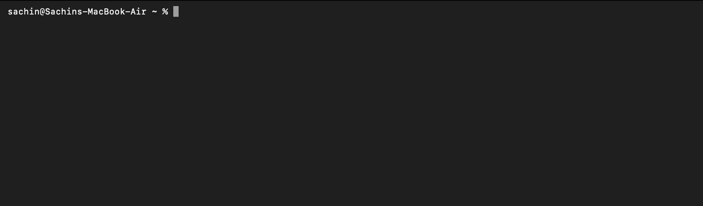
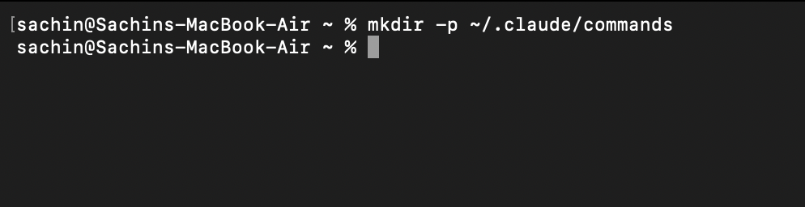
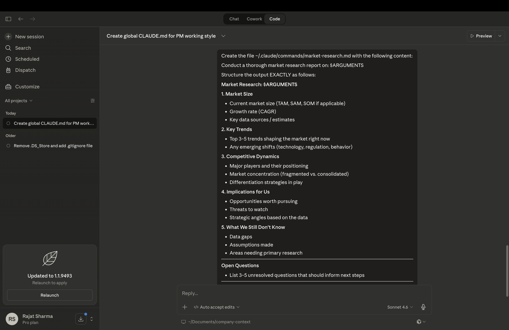
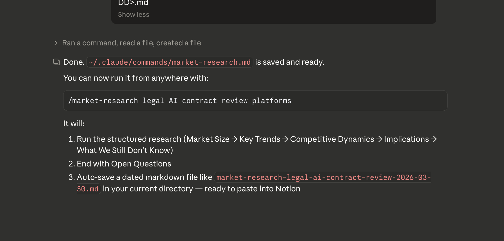
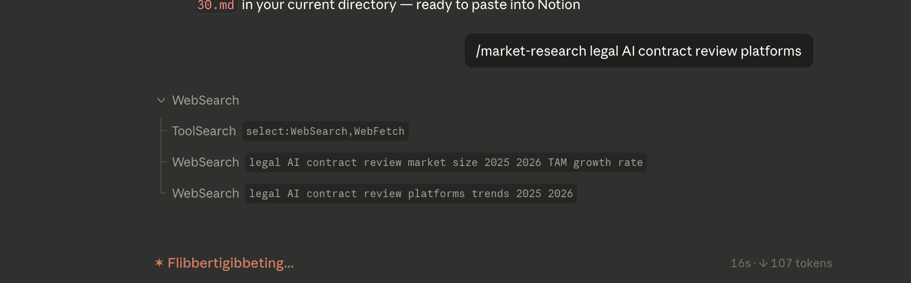
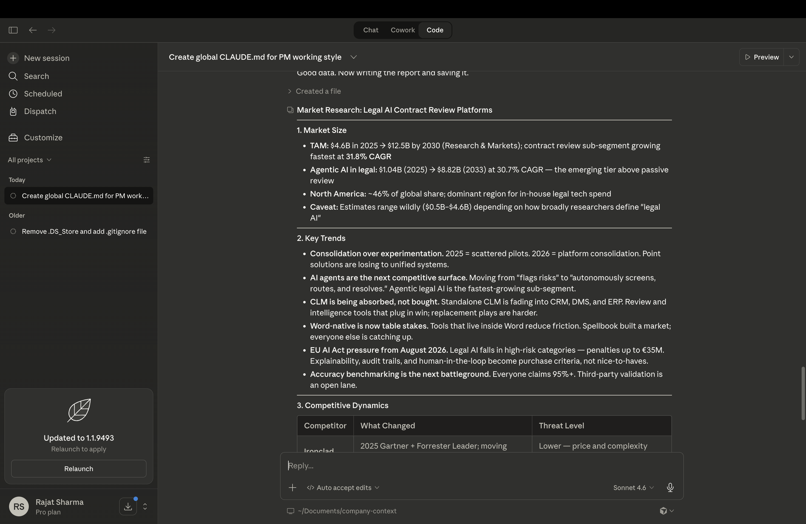
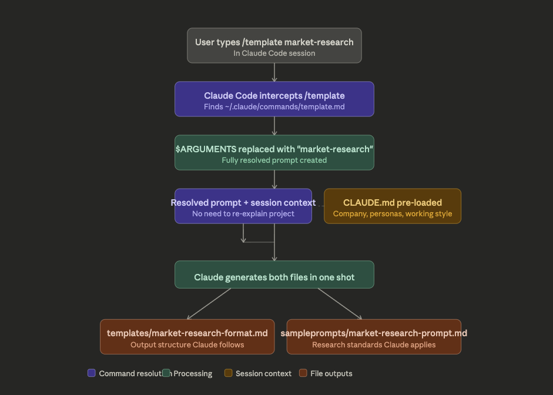

# Lesson 2.2 — Custom Slash Commands: Build Your PM Command Library

---

## What Custom Slash Commands Are

A custom slash command is a `.md` file stored in a specific folder. The filename becomes the command name. The file content becomes the prompt Claude receives when you run it.

| File | Command it creates |
|------|--------------------|
| `~/.claude/commands/template.md` | `/template` |

---

## Two Places to Store Commands

| Location | Available | Use for |
|----------|-----------|---------|
| `~/.claude/commands/` | Everywhere — all projects, all sessions | Your personal PM toolkit |
| `./.claude/commands/` | This project folder only | Team workflows — commit to git so everyone gets them |

---

## How to Create a Custom Command

### Step 1 — Open your terminal

**Mac**
- Press `Cmd + Space`, type **Terminal**, press Enter
- Or open **iTerm2** if you have it installed

**Windows**
- Press `Win + R`, type **cmd**, press Enter
- Or search for **PowerShell** in the Start menu and open it



---

### Step 2 — Create the folder

Run this command:

**Mac**
```bash
mkdir -p ~/.claude/commands
```



**Windows (PowerShell)**
```powershell
New-Item -ItemType Directory -Force -Path "$HOME\.claude\commands"
```

**Confirm it worked:**

**Mac**
```bash
ls ~/.claude/commands
```
> No output is fine — it just means the folder is empty. No error = success.

**Windows (PowerShell)**
```powershell
dir "$HOME\.claude\commands"
```
> You should see an empty directory listing with no errors.

---

### Step 3 — Write the prompt inside the file using Claude Code Desktop

Instead of manually writing the file, let Claude Code do it for you.

**Open Claude Code Desktop** and paste this exact prompt:

```
Create the file ~/.claude/commands/market-research.md with the following content:

Conduct a thorough market research report on: $ARGUMENTS

Structure the output EXACTLY as follows:

## Market Research: $ARGUMENTS

### 1. Market Size
- Current market size (TAM, SAM, SOM if applicable)
- Growth rate (CAGR)
- Key data sources / estimates

### 2. Key Trends
- Top 3–5 trends shaping the market right now
- Any emerging shifts (technology, regulation, behavior)

### 3. Competitive Dynamics
- Major players and their positioning
- Market concentration (fragmented vs. consolidated)
- Differentiation strategies in play

### 4. Implications for Us
- Opportunities worth pursuing
- Threats to watch
- Strategic angles based on the data

### 5. What We Still Don't Know
- Data gaps
- Assumptions made
- Areas needing primary research

---

**Open Questions**
- List 3–5 unresolved questions that should inform next steps

---

After completing the research, save the full report as a markdown file in the current working directory with the filename: market-research-<topic-slug>-<YYYY-MM-DD>.md
```




Claude Code will create the file automatically. No manual editing needed.

> **Why this works:** Claude Code has direct access to your filesystem. You describe what you want — it writes the file to the right location.



---

### Bonus: Create Templates for User Research and PRD

Use the same approach to create two more reusable commands.

---

**User Research Template** — paste this into Claude Code Desktop:

```
Create the file ~/.claude/commands/user-research.md with the following content:

Conduct a structured user research report on: $ARGUMENTS

Structure the output EXACTLY as follows:

## User Research: $ARGUMENTS

### 1. Research Objective
- What question are we trying to answer?
- Decision this research will inform

### 2. User Persona
- Who was studied (segment, role, context)
- Recruitment criteria

### 3. Jobs to Be Done
- Primary job (functional)
- Secondary jobs (emotional, social)
- Current workarounds / solutions in use

### 4. Key Findings
- Top 3–5 insights from the research
- Direct quotes or evidence for each

### 5. Pain Points & Unmet Needs
- Ranked by frequency and severity
- Gap between current solution and ideal

### 6. Implications for Product
- Features or bets suggested by the findings
- What to build, change, or drop

---

**Open Questions**
- List 3–5 follow-up questions that need more research

---

After completing the report, save it as a markdown file in the current working directory with the filename: user-research-<topic-slug>-<YYYY-MM-DD>.md

Replace spaces with hyphens in the topic slug and use today's date.
```

---

**PRD Template** — paste this into Claude Code Desktop:

```
Create the file ~/.claude/commands/prd.md with the following content:

Write a Product Requirements Document for: $ARGUMENTS

Structure the output EXACTLY as follows:

## PRD: $ARGUMENTS

### 1. Problem Statement
- What problem are we solving and for whom?
- Why does it matter now?

### 2. User Persona
- Primary user segment
- Their context, goals, and constraints

### 3. Jobs to Be Done
- Functional job
- Emotional and social jobs

### 4. Success Metrics
- Primary metric (what moves the needle)
- Secondary metrics (guardrails)
- How we measure and by when

### 5. Requirements

**Must Have (P0)**
- [ ] Requirement 1
- [ ] Requirement 2

**Should Have (P1)**
- [ ] Requirement 3

**Nice to Have (P2)**
- [ ] Requirement 4

### 6. Out of Scope
- Explicitly list what this does NOT cover

### 7. Open Questions
- List 3–5 unresolved decisions that need answers before build

---

After completing the PRD, save it as a markdown file in the current working directory with the filename: prd-<topic-slug>-<YYYY-MM-DD>.md

Replace spaces with hyphens in the topic slug and use today's date.
```

---

Once created, use these commands the same way:

```
/user-research enterprise onboarding drop-off
/prd AI-powered contract review feature
```

### Step 4 — Use it



```
/market-research legal AI contract review platforms

```

Claude receives the full content of `template.md` with `$ARGUMENTS` replaced by `market-research` — and generates both output files automatically.



---

### What happens behind the scenes



**1. You type `/template market-research`**
Claude Code intercepts `/template` and finds `~/.claude/commands/template.md`.

**2. `$ARGUMENTS` gets replaced**
Every instance of `$ARGUMENTS` in the file is replaced with `market-research`. The file becomes a fully resolved prompt.

**3. Your CLAUDE.md is already loaded**
Every session starts by loading your CLAUDE.md. By the time you run any command, Claude already knows your company, personas, metrics, and working style. The command doesn't need to explain any of that.

**4. Claude creates both files in one shot**
- `templates/market-research-format.md` — the output structure Claude follows
- `sampleprompts/market-research-prompt.md` — the research standards Claude applies

One command. Two files. Full scaffolding for any type of work.


## Example: Running `/template market-research`

When you type `/template market-research`, Claude:

1. Reads `~/.claude/commands/template.md`
2. Replaces `$ARGUMENTS` with `market-research` throughout
3. Creates `templates/market-research-format.md` — the structure every future research report follows
4. Creates `sampleprompts/market-research-prompt.md` — the standards Claude applies every time it runs research

You review both files, edit anything that doesn't match your stakeholders, and you're done. No manual prompting. No blank-page scaffolding.

---

## Why One General Command

The same `/template` command works across every future module:

| What you type | What gets created |
|---------------|-------------------|
| `/template market-research` | market research template + prompt |
| `/template user-research` | user research template + prompt |
| `/template prd` | PRD template + prompt |
| `/template competitive-analysis` | competitive analysis template + prompt |

You build the command once. You reuse it for every type of PM work.

---

## Things to Keep in Mind

- **`$ARGUMENTS` is optional.** Commands with no variable run the same way every time — useful for recurring workflows like a weekly review.
- **You can use `@` inside command files.** When a research command references `@templates/...` and `@sampleprompts/...`, those files load automatically every time the command runs.
- **Filenames are case-sensitive on Mac and Linux.** Keep all command filenames lowercase with hyphens: `market-research`, not `MarketResearch`.

---

## Your Action Items

1. Run: `mkdir -p ~/.claude/commands`
2. Create `~/.claude/commands/template.md` with the content above
3. Verify the file exists: `ls ~/.claude/commands/`

You'll use this command in Lesson 2.3 to generate your market research scaffolding in one step.

---

*Next: [Lesson 2.3 — Market Research: Chaining Prompts](./Lesson2.3-Chaining-Research-Prompts.md)*
