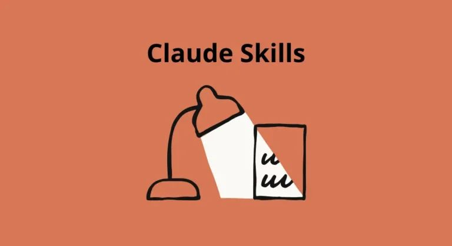
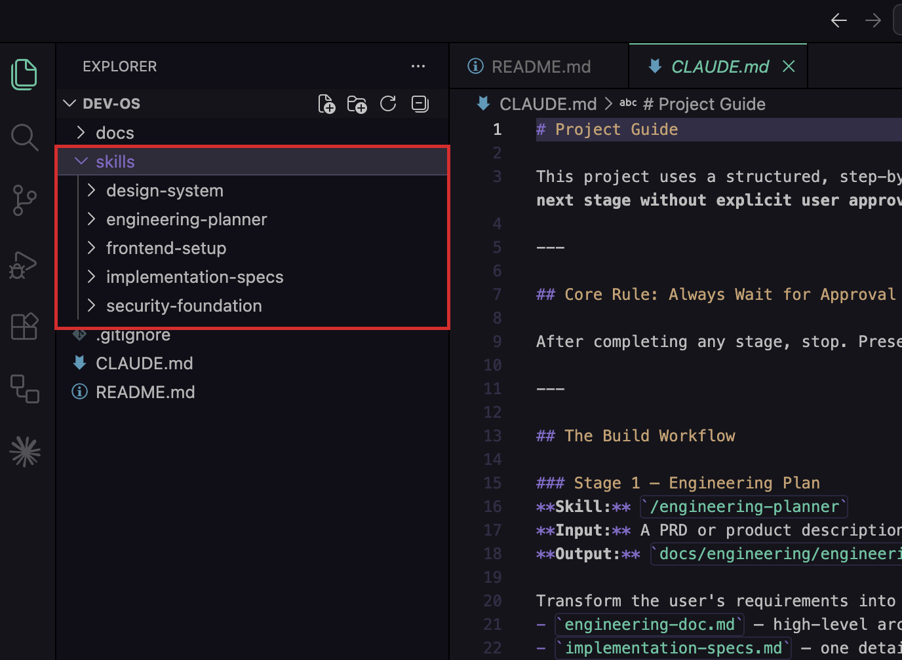
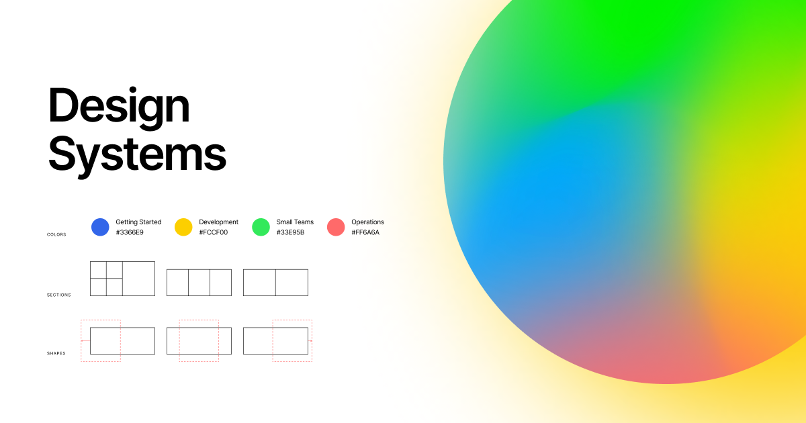
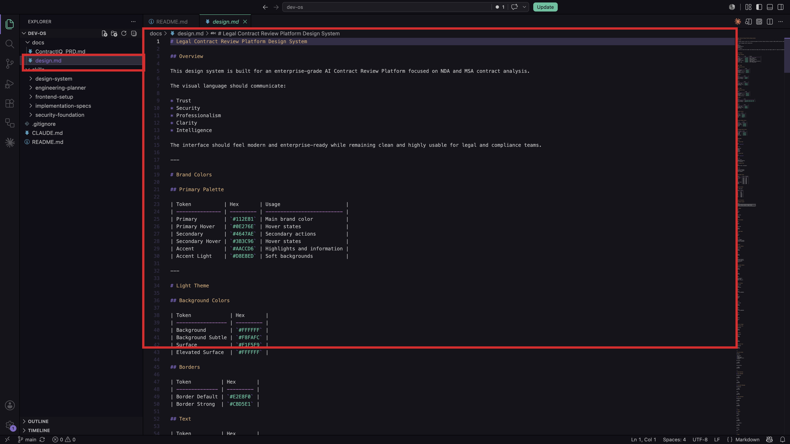
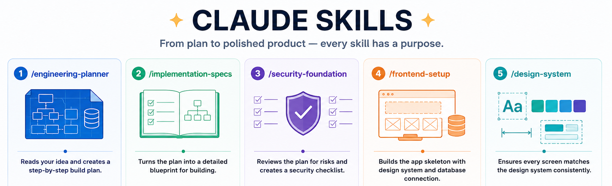

[← Back to Lab 1 Overview](../readme.md)

[← Lesson 1](../01-project-foundation/readme.md) | **Lesson 2** | [Lesson 3 →](../03-engineering-planning/readme.md)

---

# Lesson 2 — Skills and the Design System



## What Are Claude Code Skills?

Every time you open a new conversation with Claude, it starts completely fresh — no memory of your decisions, your style choices, or your rules.

A **skill** is a saved set of instructions you write once and store in your project. When you type a command like `/design-system` or `/engineering-planner`, Claude reads those instructions and follows them exactly — every time, for every teammate, across every session.

Think of it like a recipe card. Instead of explaining the dish from scratch every time, you write the recipe once and anyone can cook it consistently.

Skills live in the `skills/` folder of your project, one folder per command:

```
skills/
├── engineering-planner/   →   /engineering-planner
├── implementation-specs/  →   /implementation-specs
├── security-foundation/   →   /security-foundation
├── frontend-setup/        →   /frontend-setup
└── design-system/         →   /design-system
```



Each folder contains one file — `SKILL.md` — which is the plain-text instruction set Claude reads when you run the command.

> **Learn more:** [The Complete Guide to Building Skills for Claude](https://resources.anthropic.com/hubfs/The-Complete-Guide-to-Building-Skill-for-Claude.pdf)

---

## What Is a Design System?



A design system is a set of visual decisions you make once — colors, fonts, spacing, button shapes — written down so every new screen follows the same rules automatically.

Without it, each page you build drifts slightly from the last. Nothing looks broken. Nothing looks finished either.

In this project, the design system lives at **`docs/design.md`**. It defines the colors, fonts, spacing, component shapes, and animation rules for ContractIQ. When Claude builds any screen, it reads this file first so every element matches everything else.

## Note

The `design.md` file is already included in the repository you cloned — you do not need to create it. If you want to build your own design system from scratch, follow the step-by-step instructions here: [How to Create a Design System](../00-resources/create-design-system.md)




---

## The 5 Skills in This Project



### `/engineering-planner`
Reads the product description and turns it into an organized build plan.
- Figures out which features are essential for launch and which can wait
- Maps out all the information the product needs to store and how it connects
- Breaks the build into stages so you can ship something working early
- Saves everything to `docs/engineering/` for the next skill to read

### `/implementation-specs`
Takes the plan and turns it into a detailed blueprint — a room-by-room guide before construction begins.
- Breaks the build into clear sections (upload, analyze, display results, login)
- Describes exactly what needs to be built in each section and in what order
- Flags every place two features have to work together so nothing is discovered by accident
- Saves everything to `docs/specs/`

### `/security-foundation`
Reviews the plan for safety issues before any building starts — like a safety inspector walking through blueprints. You will run this skill in Lab 3.
- Checks that private data can only be accessed by the person it belongs to
- Verifies that uploaded files are checked before being processed
- Makes sure secret keys are stored safely and never visible to users
- Produces a labeled checklist: fix before launch vs. fix before going live

### `/frontend-setup`
Builds the empty shell of the application with the design system already baked in. You will run this skill in Lab 2.
- Reads `docs/design.md` first so brand colors and fonts are built in from day one
- Creates the folder structure so every future file has a logical home
- Sets up pre-built interface pieces (buttons, forms, cards) wired to your brand colors
- Creates the connection to the database so the app can save and load information

### `/design-system`
The skill you use most, starting in Lab 2. Every time Claude builds a new screen, this skill makes sure it matches everything else.
- Reads `docs/design.md` at the start of every session — never works from memory
- Uses named colors and spacing from the design system rather than inventing new values
- Checks that text is always readable against its background
- When the same visual pattern appears more than once, turns it into a shared building block

---

## How to Build a Skill From Scratch

**1. Pick one clear job.** One skill, one purpose. If you can't describe it in a sentence, it's not ready.

**2. Create the folder and file.**
```
skills/your-skill-name/
└── SKILL.md
```
The folder name becomes the slash command.

**3. Write SKILL.md in four sections:**
```markdown
## Purpose
What does this skill do and when should someone run it?

## Inputs
Which files should Claude read before starting? List them by path.

## Instructions
What should Claude do, step by step? Be specific.

## Output
What files should exist when the skill finishes?
```

**4. Name your files explicitly.** Don't say "read the design document" — say "read `docs/design.md`". Vague references produce inconsistent results.

**5. Test and refine.** Run the command, review the output, and tighten any instruction that produced something unexpected. Treat `SKILL.md` like code — update it, commit it, review it.

---

### Reference Prompt — Let Claude Write the Skill for You

You don't have to write the `SKILL.md` yourself. Copy the prompt below, fill in the blanks, and paste it into Claude Code. It will create the skill file for you.

```
I want to create a new Claude Code skill.

Skill name: [what you want to type as a slash command, e.g. brand-voice]

Job: [one sentence — what should this skill do?]
Example: "Review any new page I build and make sure the writing matches our brand tone document."

Reference files: [any files Claude should read before running the skill]
Example: docs/brand.md, docs/PRD.md

Output: [what should exist when the skill finishes?]
Example: A revised version of the page with tone corrections applied.

Please create the folder skills/[skill-name]/ and write a SKILL.md file inside it
with Purpose, Inputs, Instructions, and Output sections.
```

**Example filled in:**

```
I want to create a new Claude Code skill.

Skill name: brand-voice

Job: Review any new page I build and rewrite the copy to match our brand tone.

Reference files: docs/brand.md

Output: A revised version of the page with tone corrections applied inline.

Please create the folder skills/brand-voice/ and write a SKILL.md file inside it
with Purpose, Inputs, Instructions, and Output sections.
```

---

In the next lesson, you will run `/engineering-planner` for the first time and watch it turn the product description into a concrete build plan.

---

## What You Learned

- **Why skills exist** — every new Claude session starts blank; skills solve this by encoding your decisions, style rules, and step-by-step instructions in a file that Claude reads every time, making the AI's behavior repeatable across sessions and teammates.
- **The four-section `SKILL.md` structure** — Purpose, Inputs, Instructions, and Output gives a skill a clear contract: what it does, what it reads, what it produces, and where it saves the result.
- **`@` file references** — how to point Claude at a specific file or folder in your prompt so it reads your actual project content rather than working from general knowledge or a stale copy you pasted in.
- **The five skills and their pipeline order** — `/engineering-planner` → `/implementation-specs` → `/security-foundation` → `/frontend-setup` → `/design-system` form a stage-gated sequence where each skill's output becomes the next skill's input. The first two run in this lab; the rest run in Labs 2 and 3.
- **Design systems prevent visual drift** — defining colors, fonts, and spacing once in `docs/design.md` means every new screen inherits the same look without you having to describe your brand on every prompt.
- **Letting Claude write the skill for you** — using the reference prompt to describe the job, reference files, and expected output is faster than writing `SKILL.md` from scratch and produces a consistent, well-structured result.

---

[← Back to Lab 1 Overview](../readme.md)

[← Lesson 1](../01-project-foundation/readme.md) | **Lesson 2** | [Lesson 3 →](../03-engineering-planning/readme.md)
