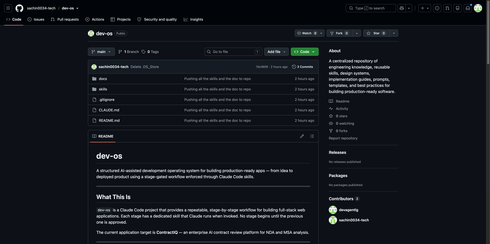
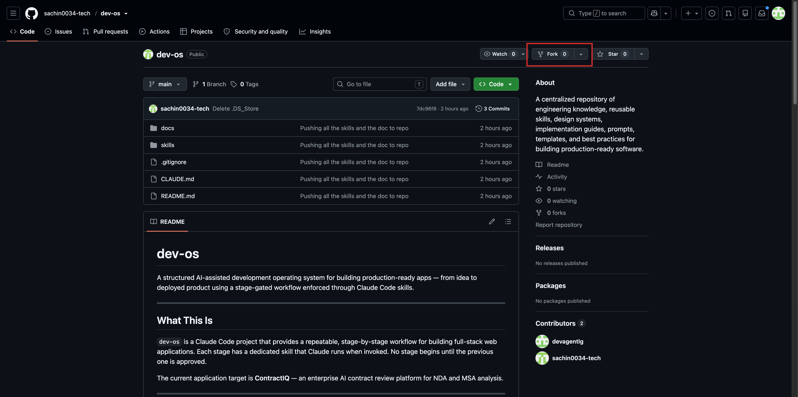
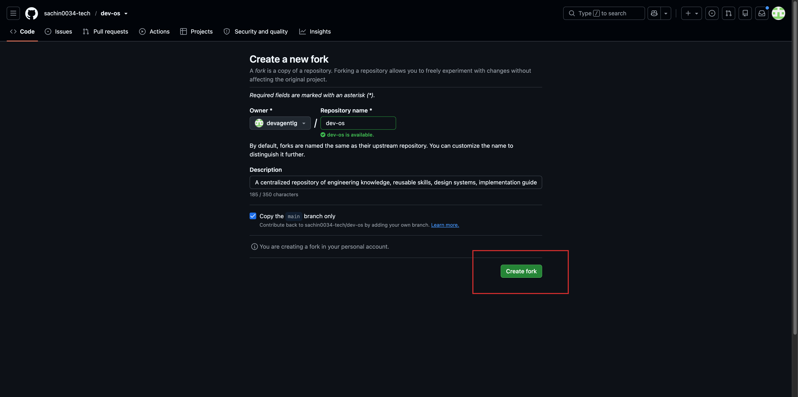
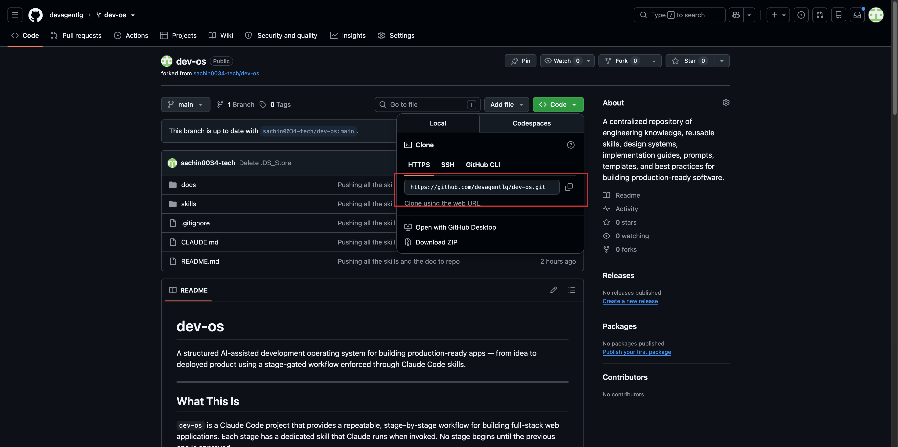
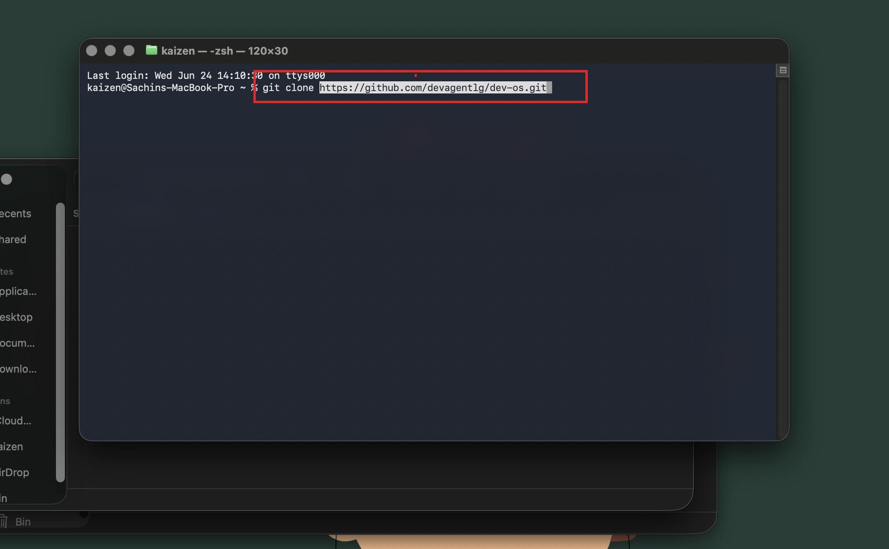
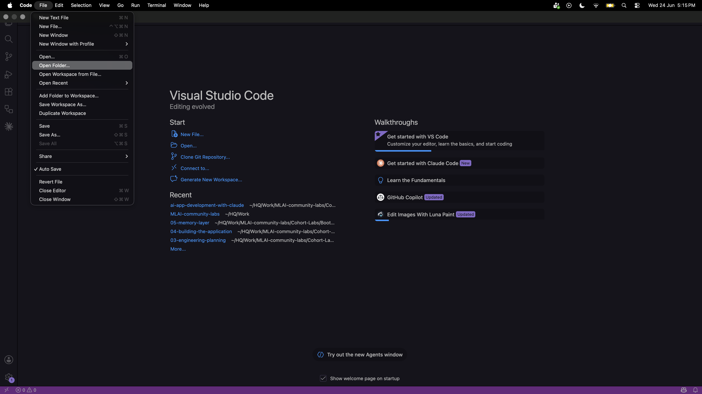
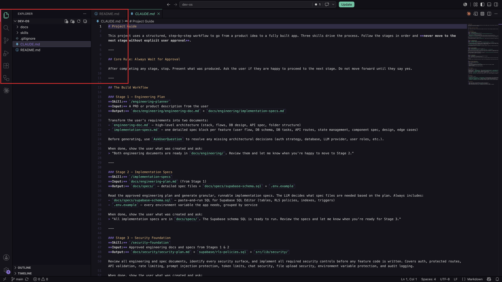

**Lesson 1** | [Lesson 2 →](../02-skills-and-design-system/Readme.md)

---

# Lesson 1 — Project Foundation


## The Problem We Are Solving

Picture a founder at a 20-person SaaS company. A potential enterprise client sends over a 30-page Master Service Agreement. She needs to sign it by end of week. She has no in-house lawyer, so she either spends 90–120 minutes reading every clause herself, or she pays $400 for an hour of legal time to get a summary she barely understands.

She does this 10 times a month. It is slow, expensive, and she still worries she is missing something — an auto-renewal trap, a liability clause that could sink the company, an IP assignment she did not notice.

This is not a rare edge case. It is the daily reality for hundreds of thousands of founders, operations managers, and freelancers who sign NDAs and MSAs without the legal training to know what they are agreeing to.

## The Solution We Are Building

We are building **ContractIQ** — a web application where a user uploads a contract PDF, and within 30 seconds sees a structured breakdown of every term that matters: what it says, where in the document it appears, and how confident the AI is in its reading.

If something looks off, the user can click into that term and see the exact sentence the AI pulled it from. They can also correct it. And when they have a specific question — "what happens if I miss a payment?" — they can ask it in plain English and get an answer grounded in the actual document, not a generic legal explanation from the internet.

The tool does not replace a lawyer for high-stakes situations. It gives people enough understanding to know when they need one — and saves them the hours they would otherwise spend getting to that point.

---

## Step 1 — Fork the Starter Repository

We are not starting from a blank folder. A starter repository has already been set up with the project structure, configuration files, and workflow rules you will need throughout this course.

Go to this URL in your browser: [https://github.com/sachin0034-tech/dev-os](https://github.com/sachin0034-tech/dev-os)



In the top-right corner of the page, click the **Fork** button. GitHub will ask you where to fork it — select your own account and click **Create fork**.



Forking creates your own copy of the repository under your GitHub account. This matters because you need a place to save your work as you build. The original repository stays untouched. Your fork is yours to commit to, experiment on, and share.



---

## Step 2 — Clone Your Fork to Your Computer

Once the fork is created, GitHub will take you to your copy of the repository. Click the green **Code** button, make sure **HTTPS** is selected, and copy the URL shown.



Open your terminal and run:

```bash
git clone <paste the URL you copied here>
```

Cloning downloads the repository from GitHub onto your local machine. From this point on, you work on the local copy and push changes back to GitHub when you are ready.



---

## Step 3 — Open the Project in VS Code

Open VS Code. Go to **File > Open Folder** and select the `dev-os` folder that was just created by the clone command.



You will see a file tree on the left side. Here is what each part of the project contains and why it is there.

---

## Understanding the File Structure

```
dev-os/
├── CLAUDE.md
├── docs/
│   ├── design.md
│   └── ContractIQ_PRD.md
└── skills/
    ├── engineering-planner/
    │   └── SKILL.md
    ├── implementation-specs/
    │   └── SKILL.md
    ├── security-foundation/
    │   └── SKILL.md
    ├── frontend-setup/
    │   └── SKILL.md
    └── design-system/
        └── SKILL.md
```





**`CLAUDE.md`**
This is the instruction manual for your AI coding assistant, Claude Code. It defines the rules Claude follows when helping you build — which stage of development you are in, what it is allowed to do, and what order work gets done. Think of it as the project constitution that keeps Claude focused and consistent across the entire build.

**`docs/design.md`**
The design system for ContractIQ — the colors, fonts, spacing rules, and component patterns that every page in the app will follow. When Claude builds a new screen, it refers here first so the product looks and feels consistent without you having to describe the style every time.

**`docs/ContractIQ_PRD.md`**
The Product Requirements Document — the same document you have been reading in this lesson. It defines the problem, the users, the features, the database schema, the pricing, and the metrics. Every technical decision in this course traces back to something in this file.

**`skills/engineering-planner/SKILL.md`**
A custom slash command for Claude Code. When you run `/engineering-planner`, Claude reads the PRD and produces a set of engineering documents — architecture decisions, data models, API contracts — that translate the product vision into a technical plan.

**`skills/implementation-specs/SKILL.md`**
The next step after engineering planning. Running `/implementation-specs` takes those engineering documents and breaks them down into granular, file-by-file implementation instructions, including the complete SQL file needed to set up the database.

**`skills/security-foundation/SKILL.md`**
Runs after the specs are written. It audits the planned implementation for security gaps — missing Row Level Security policies, exposed API keys, unsigned URLs — and produces a checklist of controls that must be in place before any code ships.

**`skills/frontend-setup/SKILL.md`**
Scaffolds the Next.js 14 project with the right folder structure, dependencies, and configuration. Running this skill creates the skeleton of the application you will build into over the coming lessons.

**`skills/design-system/SKILL.md`**
Applied throughout all frontend work. It enforces the rules in `design.md` at the component level — making sure buttons, cards, and layouts match the design system without requiring you to manually check every file.

---

Each lesson in this course follows a stage-gated flow: you run a skill, review what Claude produces, and move to the next stage only when the output looks right. The skills directory is the engine that drives that flow.

In the next lesson, you will run the first skill — `/engineering-planner` — and turn the PRD into a concrete technical plan.

---

## What You Learned

- **Forking and cloning** — how to create your own copy of a GitHub repository and download it to your machine so you have a personal working environment for the build.
- **`CLAUDE.md` as a project constitution** — how a single instructions file controls what Claude Code is allowed to do, what stage the project is in, and which rules apply across every session.
- **The PRD as the source of truth** — why every technical decision in this project traces back to the Product Requirements Document, and how to read it to understand what is being built and for whom.
- **Skills as reusable slash commands** — how the `skills/` folder turns complex, multi-step AI instructions into short commands (`/engineering-planner`, `/design-system`) that anyone on the team can run consistently.
- **Stage-gated development** — the pattern of running a skill, reviewing the output, and approving before the next stage begins — keeping you in control of direction at every step.
- **Why the design system comes first** — setting `docs/design.md` up before writing any component code means every screen inherits the same colors, fonts, and spacing without manual checking later.

---

**Lesson 1** | [Lesson 2 →](../02-skills-and-design-system/Readme.md)
