[← Back to Lab 2 Overview](../readme.md)

**Lesson 1** | [Lesson 2 →](../02-memory-layer/readme.md)

---

# Lesson 1 — Building the Application


## Where We Are

By this point you have completed **Lab 1 — Planning & Architecture**:

- Forked the `dev-os` starter repo, cloned it to your machine, and opened it in VS Code.
- Explored the five skills and reviewed the design system in `docs/design.md`.
- Used Plan Mode to run `/engineering-planner` and `/implementation-specs`, producing the engineering documents in `docs/engineering/`.

Now it is time to build. This lesson walks through four prompts that take you from an empty folder to a running application connected to a live database.

---

## What You Will Do in This Lesson

| Step | What Happens |
|---|---|
| Prompt 1 | Scaffold the Next.js folder structure |
| Prompt 2 | Implement the application based on the engineering documents |
| Prompt 3 | Generate the database SQL schema |
| Prompt 4 | Load the schema into Supabase and connect the app |

By the end, you will have a working app you can open in a browser.

---

## Before You Start — Set Up Supabase

## What is Supabase?

**Supabase** is an open-source Firebase alternative built on top of PostgreSQL. It gives you a hosted database, instant REST and GraphQL APIs, authentication, storage, and realtime subscriptions — all in one platform.

| Feature | What It Means |
|---|---|
| PostgreSQL | Full relational database — standard SQL |
| Auto-generated API | REST and GraphQL APIs built from your tables automatically |
| Row Level Security | Fine-grained access control per row |
| Free tier | Generous free plan — no credit card required |

---

## Step 1: Go to Supabase and Click "Start Your Project"

1. Open your browser and go to [https://supabase.com/](https://supabase.com/)
2. Click **"Start your project"**

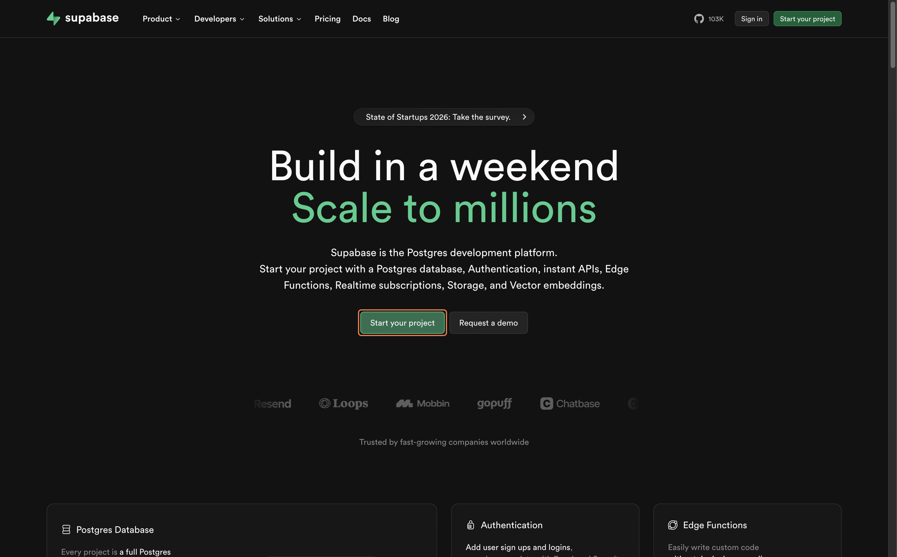

---

## Step 2: Sign Up

Create a Supabase account:

- Sign up with **GitHub** (recommended — fastest), or
- Use your **email address**


---

## Step 3: Create a New Organization

After signing in, Supabase will prompt you to create an organization:

1. Enter a name for your organization (e.g. your name or team name)
2. Select the **Free** plan
3. Click **"Create organization"**

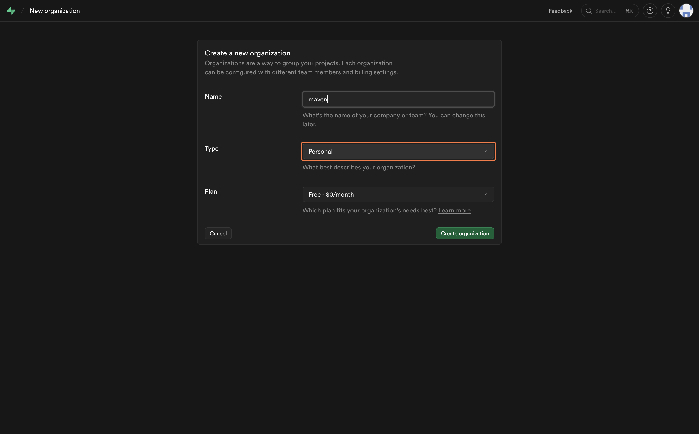

---

## Step 4: Create a New Project

Inside your organization:

1. Click **"New project"**
2. Enter a **Project Name** (e.g. `contractIQ-db`)
3. Set a strong **Database Password** — save this somewhere safe
4. Choose the **Region** closest to you
5. Click **"Create new project"**

> Wait 1–2 minutes while Supabase provisions your database.


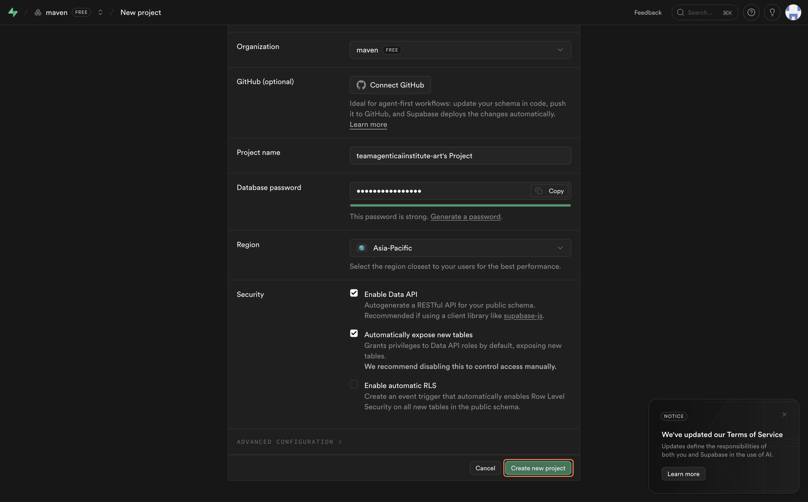


### Copy Your Credentials

You need three values from Supabase. Here is where to find them:

**Project URL**
1. Go to your project overview — the URL is shown at the top. It looks like `https://xyzxyzxyz.supabase.co`.

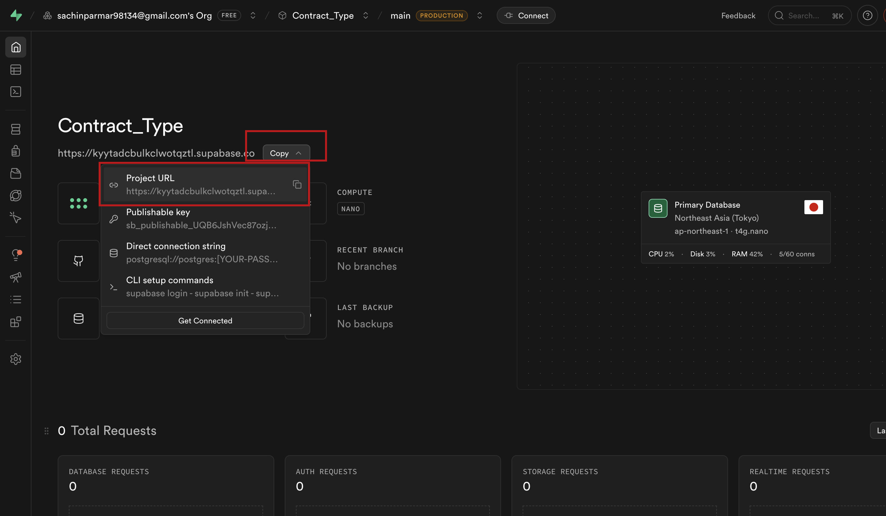

**Anon Key (public)**
1. Click **Project Settings** in the left sidebar.
2. Click **API**.
3. Scroll down to **Project API keys** and copy the value next to **`anon` `public`** (also listed as the **legacy anon key**). This is safe to use in browser code.

**Service Role Key (secret)**
1. On the same **API** settings page, go to **Legacy API keys**.
2. Copy the value next to **`service_role`**. This key bypasses Row Level Security — keep it out of your frontend code and never commit it to GitHub.

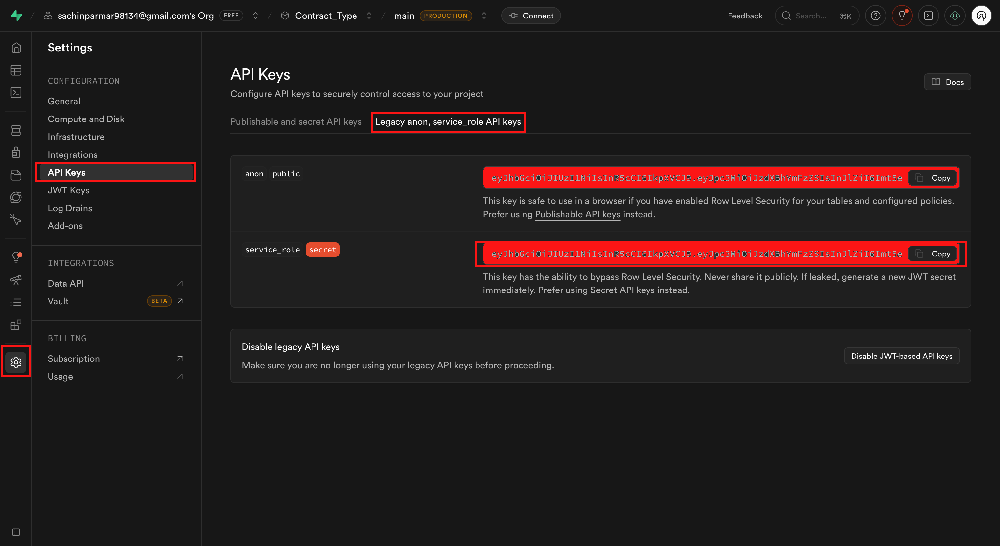

Set these aside. You will add them to your `.env` file at the end of this lesson.

---

## Open Claude Code in VS Code

For every prompt in this lesson: open your project folder in **VS Code**, open the integrated terminal (**Terminal > New Terminal**, or `` Ctrl+` ``), and start the Claude Code CLI:

```bash
claude
```

Paste each prompt below into that same terminal session, one at a time, and let Claude finish before moving to the next one.

---

## Prompt 1 — Scaffold the Folder Structure

```
Use @skills/frontend-setup/SKILL.md to set up the frontend foundation for this project.
```

> **Note:** Claude may ask whether to create a new subfolder or work inside the current directory. Choose **current directory** and continue.

### What This Does

The `frontend-setup` skill creates the complete Next.js 14 folder structure — pages, components, API routes, and configuration files — with the design system already baked in. Think of it as building the empty shell of the house before any furniture goes in: every room exists, every door is in the right place, and the wiring is ready.

**What you get after this prompt:**

```
apps/web/
├── app/
│   ├── (auth)/
│   │   ├── login/
│   │   └── signup/
│   ├── (dashboard)/
│   │   └── dashboard/
│   └── layout.tsx
├── components/
│   ├── ui/
│   └── shared/
├── lib/
│   ├── supabase/
│   └── utils/
├── types/
├── styles/
├── public/
├── .env.local.example
├── next.config.ts
├── tailwind.config.ts
└── package.json
```

The design tokens from `docs/design.md` are loaded into Tailwind so your brand colors and fonts are available from the first component you write. The Supabase client is configured and waiting for your credentials.

Review the file tree once the skill finishes. If anything looks off, describe the issue and Claude will correct it before you move on.

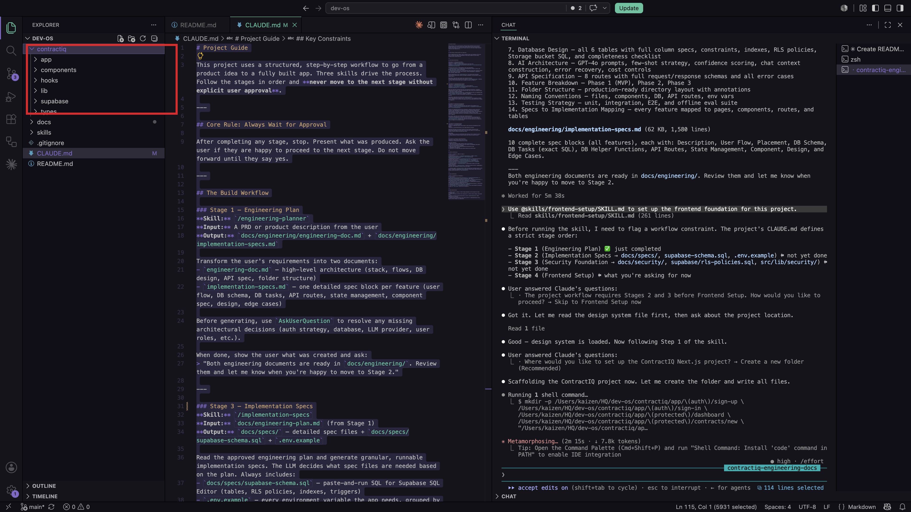


### Add Your Credentials to `.env`

> **Note:** You will now see a `.env.local.example` file in your project. Rename it to `.env.local`, then paste in your Supabase Project URL, Anon Key, and Service Role Key — both the anon key and service role key go in as shown below. Also add your OpenAI API key.

```
NEXT_PUBLIC_SUPABASE_URL=https://xyzxyzxyz.supabase.co
NEXT_PUBLIC_SUPABASE_ANON_KEY=your-anon-key-here
SUPABASE_SERVICE_ROLE_KEY=your-service-role-key-here
OPENAI_API_KEY=sk-...
```

Replace the placeholder values with the credentials you copied earlier.


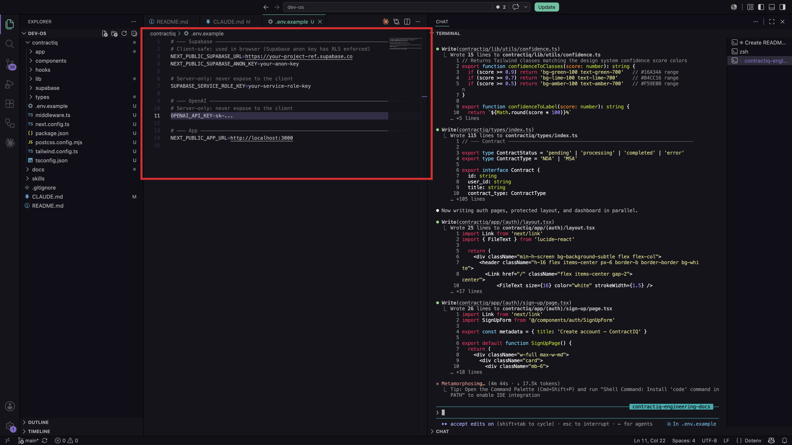

---

## Prompt 2 — Implement the Application

Once the folder structure looks right, paste this prompt into the same Claude Code terminal session:

```
Based on docs/engineering/engineering-doc.md and docs/engineering/implementation-specs.md, start implementing the application.

Before writing any code:
- Read and understand the Engineering Document.
- Read and understand all feature specifications.
- Identify dependencies between features.
- Create an implementation plan and execution order.

Implementation Rules:
- Follow the architecture defined in the Engineering Document.
- Follow the design system defined in docs/design-system.md.
- Follow all folder structure and naming conventions.
- Use TypeScript throughout the application.
- Create reusable and maintainable components.
- Write production-ready code only.
- Do not leave TODO comments or placeholder implementations.
- Implement proper loading, error, and empty states.
- Implement validation and security requirements defined in the specs.
- Keep code modular and scalable.
- Use the gpt-4o-mini model.
```

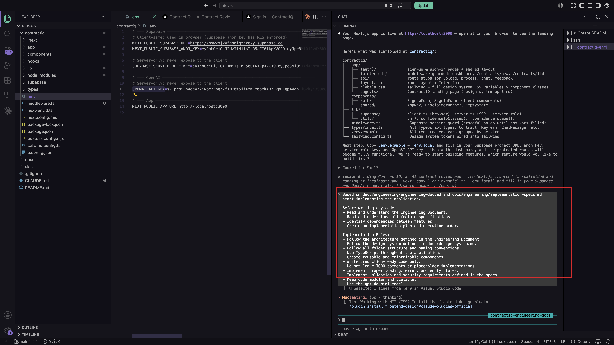


> **Note:** Once Claude finishes, open a new terminal in VS Code and run the development server to see your app. Make sure you are in the frontend folder first — `cd` into it if needed, then run:
>
> ```bash
> cd apps/web
> npm run dev
> ```

Once the server starts, you will see a local URL in the terminal — click it or open `http://localhost:3000` in your browser.

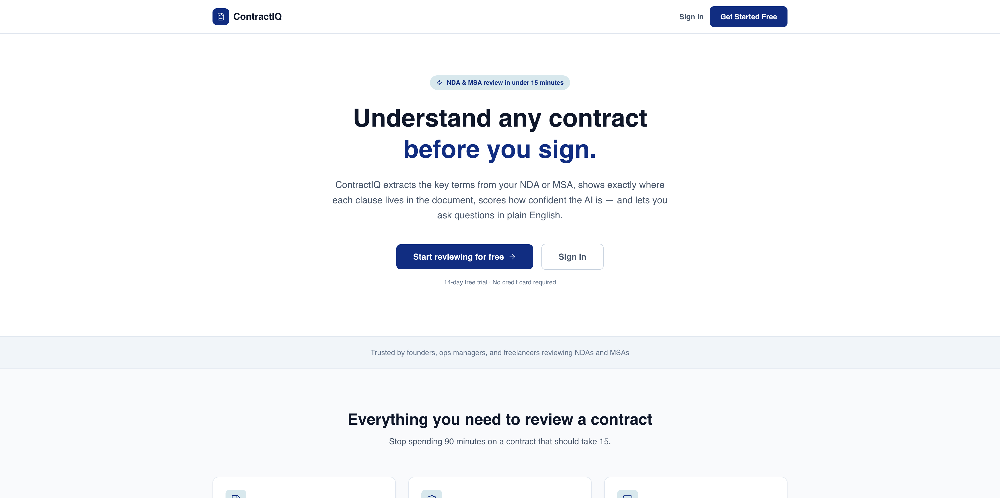

### What This Does

Claude reads both engineering documents — the high-level architecture and the file-by-file implementation specs — before writing a single line of code. It maps dependencies between features, then builds them in the correct order so nothing references something that does not exist yet.

The result is production-quality code: typed, styled to the design system, with loading states, error boundaries, and validated inputs throughout.

This prompt takes the most time. Claude may ask clarifying questions before it begins — answer them so it has full context. Do not interrupt mid-implementation unless something is clearly wrong.

---

## Prompt 3 — Generate the Database Schema

The application code is now written, but the database is still empty — there are no tables to store users, contracts, or chat messages yet. This prompt tells Claude to read the data models from your engineering documents and produce a single `database.sql` file you can run directly in Supabase to create everything at once.

Once the application code is in place, run this prompt in the same Claude Code terminal:

```
Create a database.sql file that contains all SQL statements required to set up the database for the application. Based on the Engineering Document and Implementation Specifications, generate a complete production-ready database schema.
```

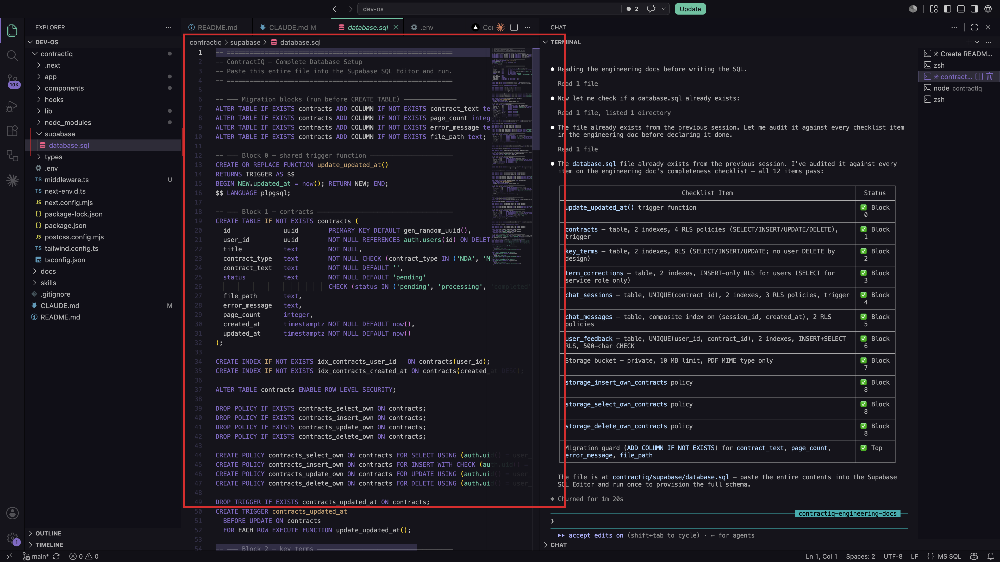

### What This Does

Claude reads the data models in your engineering documents and writes a single `database.sql` file that creates every table, relationship, index, and Row Level Security policy the app needs. This file is ready to paste directly into Supabase.

---

## Load the Schema and Connect the App

### Run the SQL in Supabase

1. Open your Supabase project dashboard.
2. Click **SQL Editor** in the left sidebar.

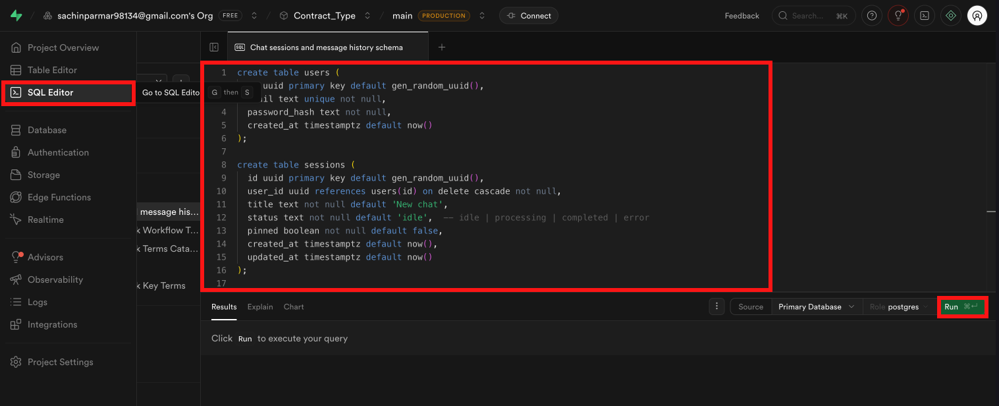

3. Open `database.sql` in VS Code. Select all (`Cmd+A` on Mac, `Ctrl+A` on Windows). Copy.
4. Paste the SQL into the Supabase SQL Editor.
5. Click **Run** (or press `Cmd+Enter`).

Supabase will execute all the statements. When it finishes without errors, your database tables are live.

If you see an error, read the message — it usually names the exact line that failed. Common causes are a table being referenced before it is created (a foreign key ordering issue) or a typo in a policy name. Paste the error back into the Claude Code terminal and it will fix the specific line.


> **Important:** `SUPABASE_SERVICE_ROLE_KEY` must never appear in browser-side code and must never be committed to GitHub. The `.env` file should already be listed in `.gitignore` — verify this before your first push (you'll do this for real in Lab 3).

---

## Test Your Application

Open a terminal in VS Code (**Terminal > New Terminal**), make sure you're inside your frontend folder, then start the development server:

```bash
npm run dev
```

Open `http://localhost:3000` in your browser and walk through these checks:

| Check | What to Look For |
|---|---|
| Home page loads | No blank screen, no console errors |
| Sign up works | Create a test account; confirm the user appears in Supabase **Authentication > Users** |
| Log in works | Sign in with the test account |
| Dashboard loads | Authenticated route renders correctly |
| Core feature works | Upload a file or trigger the main feature of the app |
| Database writes | Check the relevant table in Supabase **Table Editor** to confirm data was saved |

If anything fails, open the browser dev console (`F12`) and read the error. Most issues at this stage come from a missing environment variable or a table name mismatch between the SQL schema and the application code. Paste the error into the Claude Code terminal with the relevant file path and it will fix it.


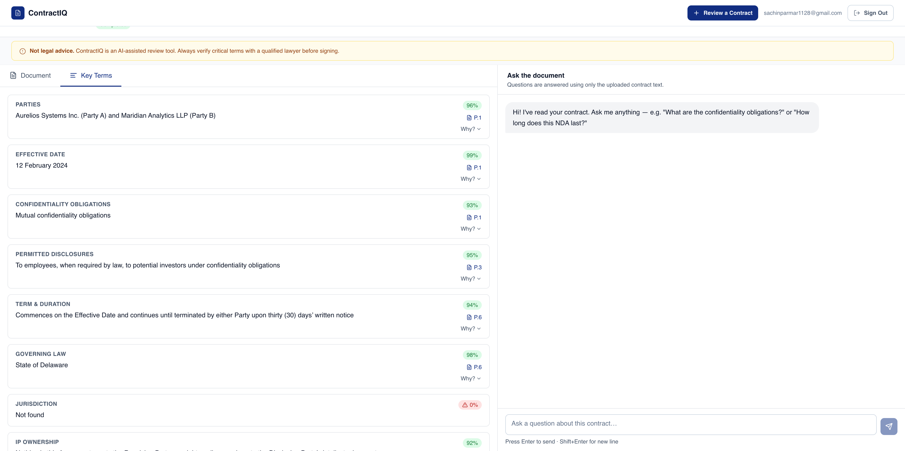

---

## What You Have Built

At the end of this lesson you have:

- A Next.js 14 application with a complete production folder structure
- A live Supabase database with the full schema loaded and Row Level Security enabled
- Authentication wired end-to-end
- The core features of ContractIQ implemented and running in a browser

The next lesson adds the memory layer — giving the application the ability to remember user context across sessions.

---

## What You Learned

- **Supabase setup and credentials** — how to create a project, locate the three keys you need (URL, anon key, service role key), and why the service role key must stay server-side and out of version control.
- **The four-step build sequence** — scaffold folder structure → implement from engineering documents → generate SQL schema → load schema and connect credentials; each step depends on the previous one being complete.
- **Reading engineering documents before writing code** — Claude uses the architecture and implementation specs as a map so every file is placed correctly, every dependency is resolved in the right order, and nothing is left as a placeholder.
- **Loading a database schema into Supabase** — how to paste and run `database.sql` in the SQL Editor, and how to diagnose the two most common errors (foreign key ordering, table name mismatches).
- **End-to-end verification checklist** — testing home page load, sign-up, login, dashboard render, core feature, and database writes as a structured sequence rather than clicking around and hoping for the best.
- **Environment variable safety** — the difference between `NEXT_PUBLIC_` variables (safe in browser code) and secret keys that must only appear in server-side routes, and how `.gitignore` protects `.env.local` from accidental commits.

---

[← Back to Lab 2 Overview](../readme.md)

**Lesson 1** | [Lesson 2 →](../02-memory-layer/readme.md)
