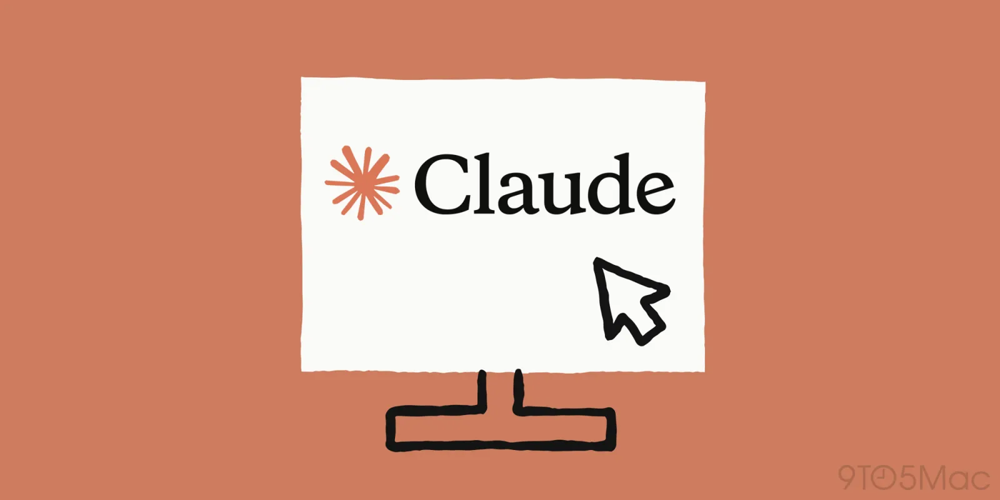
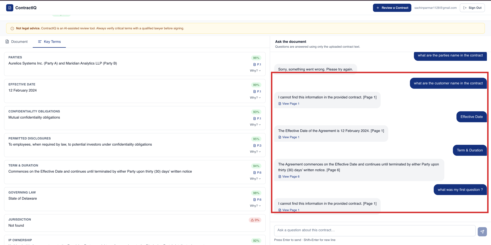
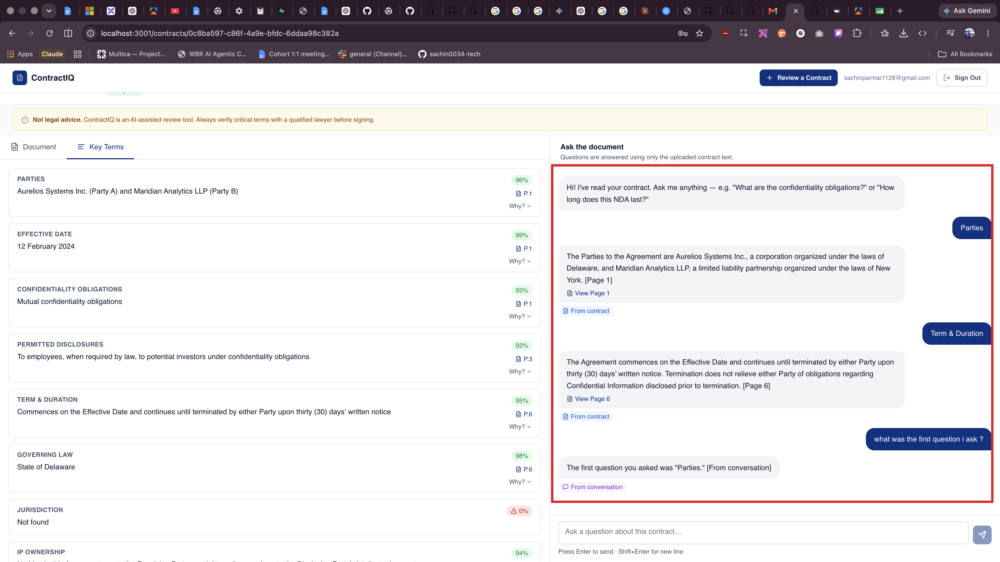

[← Back to Lab 2 Overview](../readme.md)

[← Lesson 1](../01-building-the-application/readme.md) | **Lesson 2**

---

# Lesson 2 — Memory Layer



## Where We Are

By this point you have:

- **Lab 1** — Forked the `dev-os` starter repo, explored the skills and design system, and produced the engineering documents in `docs/engineering/`.
- **Lab 2, Lesson 1** — Scaffolded the Next.js project, implemented the application, ran the database schema in Supabase, and confirmed the app loads in a browser.

Now you are going to give the assistant a memory. Currently every time a user sends a message, a new session is created — the assistant has no idea what was said before, what contract was uploaded, or what questions were already asked. This lesson fixes that.

---

## The Problem — No Memory

Open your running app and go to the chat interface. Ask the assistant something about the contract:

```
What is the termination clause?
```

It answers correctly. Now ask a follow-up:

```
Can you summarise what you just told me?
```

The assistant has no idea what it just told you. It cannot answer the follow-up because each message is a brand new, isolated API call with no context carried over.

This is the problem memory solves.



---

## What Is Memory in an AI Application?

Memory is not a single thing — there are four distinct types, and it is important to know which one you are using and why.

| Type | Where It Lives | How Long It Lasts | Example |
|---|---|---|---|
| **In-Context Memory** | The `messages[]` array sent to the API | Current session only | Passing the last 10 chat turns to the model |
| **External / Persistent Memory** | A database (Supabase) | Forever, until deleted | Saving every message to `chat_messages` and reloading it next visit |
| **Retrieved Memory (RAG)** | A vector store or semantic search index | Forever | Searching across all past contracts to find relevant clauses |
| **Parametric Memory** | Baked into the model's weights at training time | Permanent — you cannot change it without retraining | General legal knowledge the model already has |

### What We Are Building in This Lesson

We are combining **In-Context Memory** with **External / Persistent Memory**:

```
User sends a message
        │
        ▼
Fetch all previous messages for this session from Supabase
        │
        ▼
Classify the question — does it refer to:
  → Contract content only
  → Conversation history only
  → Both
        │
        ▼
Build the context window:
  [system prompt] + [contract text if needed] + [message history] + [new question]
        │
        ▼
Send to Claude API
        │
        ▼
Save the new user message + assistant response back to Supabase
        │
        ▼
Return the response with source attribution
```

The external memory (Supabase) is what makes history survive a page refresh. The in-context memory is what makes follow-up questions work within a session.

---

## Before vs After

**Before this lesson:**

```
Turn 1: "What is the termination clause?"  →  API call (contract text only)
Turn 2: "Summarise what you just said"     →  API call (nothing — starts fresh)
                                                ↑ BROKEN
```

**After this lesson:**

```
Turn 1: "What is the termination clause?"  →  API call (contract text)
                                           ←  Answer saved to Supabase
Turn 2: "Summarise what you just said"     →  API call (contract text + Turn 1 + Turn 2)
                                           ←  Works — AI remembers Turn 1
```

---

## Step 1 — Open Claude Code in VS Code

Open your project folder in **VS Code**, open the integrated terminal (**Terminal > New Terminal**), and start the Claude Code CLI:

```bash
claude
```

---

## Step 2 — Run the Memory Layer Prompt

Copy and paste the following prompt into the same Claude Code terminal session:

```
Implement a Conversation Memory Layer for the ContractIQ chat system.

CONTEXT
The chat assistant has access to an uploaded contract and a persisted conversation
history. The problem: the assistant ignores conversation history when answering
because it always uses an "answer only from the contract" system prompt, regardless
of what the user is actually asking.

WHAT IT MUST DO

Before generating a response, the system must:

1. CLASSIFY the user's question into one of three context types:
   - CONTRACT  — question is about the document content
   - HISTORY   — question is about the conversation itself
   - BOTH      — question references both the conversation and the document

2. RETRIEVE the right context based on classification:
   - CONTRACT  → send contract text + last 10 conversation turns
   - HISTORY   → send only conversation history (no contract text), up to 20 turns
   - BOTH      → send contract text + last 10 conversation turns

3. RESPOND with a system prompt matched to the source:
   - CONTRACT  → "Answer only from the contract. Cite [Page X]."
   - HISTORY   → "Answer only from the conversation. End with [From conversation]."
   - BOTH      → "Answer from both. Attribute each fact to its source."

4. ATTRIBUTE the source in the UI so the user knows where the answer came from.

CRITICAL IMPLEMENTATION REQUIREMENT
The full conversation history must be loaded from the database BEFORE the new
user message is saved. If history is loaded after saving, the classifier will
always see the new message as part of history and misclassify the context.
```

Press **Enter**.

---

## What This Prompt Does

The prompt instructs Claude to make three targeted changes to the existing chat implementation:

**1. Load history before every response**
Before calling the Claude API, the chat route now fetches all previous messages for the current session from the `chat_messages` table in Supabase. These are passed to the API as the `messages[]` array so the model sees the full conversation.

**2. Add a query classifier**
A lightweight classification step runs on the user's question before the API call. It categorises the question into one of three buckets:

| Classification | Context Included |
|---|---|
| `contract` | System prompt + contract text only |
| `history` | System prompt + message history only |
| `both` | System prompt + contract text + message history |

This keeps the context window lean — a question like "what did you say earlier?" does not need the full contract text, and a question about a specific clause does not need a long chat history.

**3. Save messages and add source attribution**
Every user message and every assistant response is saved to `chat_messages` immediately. Responses include a `[Page X]` citation so the user can trace the answer back to the contract.

---

## What Claude Will Change

Claude will modify the existing chat API route and may create a small helper module. The changes are surgical — the rest of the application is untouched.

Files typically modified:

```
app/
└── api/
    └── chat/
        └── route.ts          ← main changes here

lib/
└── memory/
    └── index.ts              ← new: loads history, classifies query, saves messages
```

Review the diff before approving. Confirm that:

- The existing upload and extraction flows are unchanged
- The `chat_messages` table write happens after every turn, not just on success
- The classifier falls back to `both` when the query type is ambiguous

---

## Step 3 — Test the Memory

Start the development server if it is not already running:

```bash
npm run dev
```

Open the app and go to the chat interface for any previously uploaded contract. Run through this test sequence:

| Turn | Message | What to Check |
|---|---|---|
| 1 | Ask about a specific clause (e.g. "What is the governing law?") | Answer is grounded in the contract, includes a page citation |
| 2 | Ask a follow-up ("What does that mean in practice?") | AI references its own previous answer — memory is working |
| 3 | Refresh the page and reopen the same contract | Chat history reloads from Supabase — persistence is working |
| 4 | Ask "What have I asked you so far?" | AI summarises the conversation — history retrieval is working |

If Turn 3 fails (history does not reload), check that the `chat_messages` Supabase write is completing without error. Open the browser dev console and look for a failed fetch.



---

## What You Have Built

At the end of this lesson your application has:

- **In-context memory** — the full conversation history is passed to the model on every turn, enabling follow-up questions and multi-turn reasoning
- **Persistent memory** — every message is saved to Supabase so history survives page refreshes and return visits
- **Query classification** — the system only includes the context the question actually needs, keeping API calls efficient
- **Source attribution** — every response cites the page it drew from, so users can verify answers against the original document

---

## What You Learned

- **The four types of AI memory** — in-context (messages array), external/persistent (database), retrieved (RAG/vector search), and parametric (baked into model weights) — and why this lesson combines the first two to solve the stateless API problem.
- **Why stateless calls break multi-turn chat** — each API call starts fresh with no knowledge of previous turns; persisting messages to Supabase and reloading them before every call is what makes follow-up questions work.
- **Query classification for lean context windows** — categorising each question as `contract`, `history`, or `both` before calling the API means the model only receives the context it actually needs, keeping calls fast and cost-efficient.
- **The memory data flow** — fetch history from Supabase → classify query → build context window → call Claude API → save user message and assistant response; this loop runs on every turn.
- **How to verify memory is working** — the four-turn test sequence (specific question, follow-up, page refresh, history summary) confirms in-context memory, persistent storage, and history retrieval independently.
- **Source attribution as a trust mechanism** — citing the exact page the answer came from lets users verify the AI's reading against the original document, which is critical in a legal context where a misread clause has real consequences.

---

## Troubleshooting — Let Claude Fix It

If something is broken or not working as expected, you do not need to debug it manually. Claude Code can diagnose and fix most issues when you describe the symptom clearly. Below are the most common problems and the exact prompts to use.

---

### How to Use These Prompts

1. Open a terminal in VS Code and start a Claude Code session in your project root: `claude`
2. Copy the prompt for your error and paste it in — do not paraphrase it
3. Approve the changes Claude proposes and re-test

---

### Common Issues

#### Chat history does not reload after a page refresh

```
The chat history is not reloading when I refresh the page. Messages are being saved to Supabase (I can see them in the dashboard) but the chat interface starts blank every time. Fix whatever is preventing the persisted messages from being fetched and displayed on load.
```

---

#### Follow-up questions are ignored — the assistant acts like each message is the first

```
The assistant has no memory of previous turns within the same session. Every message is answered as if the conversation just started. The memory layer should be loading history from Supabase before each API call. Find out why it is not, and fix it.
```

---

#### Query classifier is always returning the same type (e.g. always "contract")

```
The query classifier is not working correctly — it is categorising every question as the same type regardless of what I ask. A question like "what did you say earlier?" should be classified as "history", not "contract". Review the classifier logic and fix the misclassification.
```

---

#### Messages are being saved twice or the chat history is duplicated

```
I am seeing duplicate messages in the chat UI and in the Supabase chat_messages table. Each turn is being saved more than once. Find where the save is being called multiple times and fix it so each message is written exactly once per turn.
```

---

#### Source attribution ([Page X] or [From conversation]) is missing from responses

```
Responses from the assistant are no longer showing source attribution like [Page X] or [From conversation]. The system prompt instructs the model to include these but they are missing. Find out why and restore the attribution so users can trace answers back to the source.
```

---

#### A feature is not working and you are not sure why

If you hit an error or broken behaviour that is not listed above, use this general-purpose prompt:

```
[Paste the error message or describe what is broken]

I am building a ContractIQ app with a memory layer in Next.js using Supabase. The issue is happening in the chat flow — specifically around loading history, classifying queries, or saving messages. Please diagnose the root cause and fix it.
```

---

#### You want to add a new feature

```
I want to add [describe the feature] to the ContractIQ chat. The existing memory layer loads conversation history from Supabase, classifies each query as contract / history / both, and saves every turn back to Supabase. The feature should fit into this flow without breaking the existing classification or persistence logic. Implement it.
```

---

### Tips for Getting the Best Results from Claude

- **Include the error message** — paste the full stack trace or console error, not just "it broke"
- **Say where it breaks** — "when I refresh the page", "after the second message", "when I ask about the conversation" gives Claude a precise reproduction path
- **One problem at a time** — if multiple things are wrong, fix the most fundamental one first (usually the database write or the history fetch)
- **Review the diff** — Claude will show you what it changed before applying; read it to understand what was wrong
- **Re-test with the four-turn sequence** — after any fix, run through the test in Step 3 to confirm nothing else regressed

---

## This Lab Is Complete

Your application now works end to end on `http://localhost:3000`: a Next.js frontend, a live Supabase database, authentication, the core ContractIQ feature set, and a chat assistant with real memory.

It is **not yet secure for production and not yet on the internet**. Continue to **[Lab 3 — Security & Deployment](../../03-Security-and-Deployment-Lab/readme.md)** to fix common vulnerabilities and ship it live.

---

[← Back to Lab 2 Overview](../readme.md)

[← Lesson 1](../01-building-the-application/readme.md) | **Lesson 2** | [Continue to Lab 3 →](../../03-Security-and-Deployment-Lab/readme.md)
