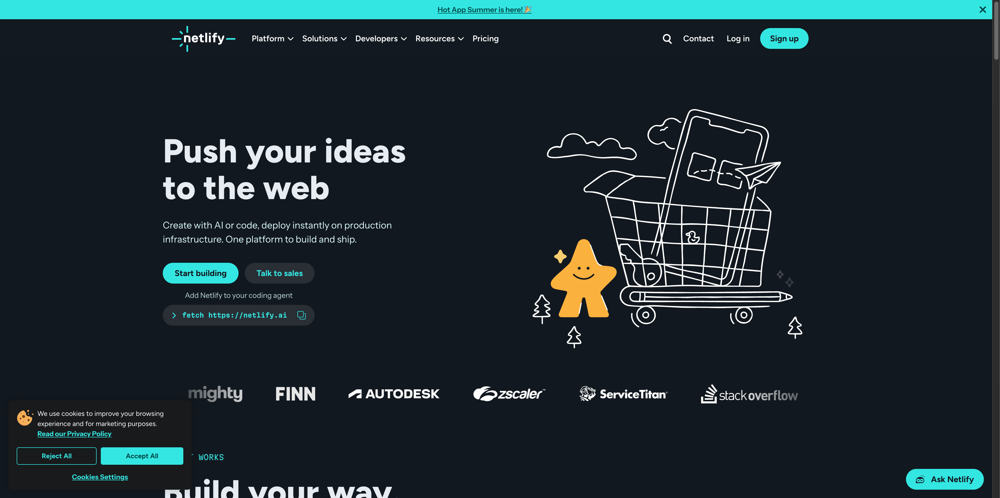
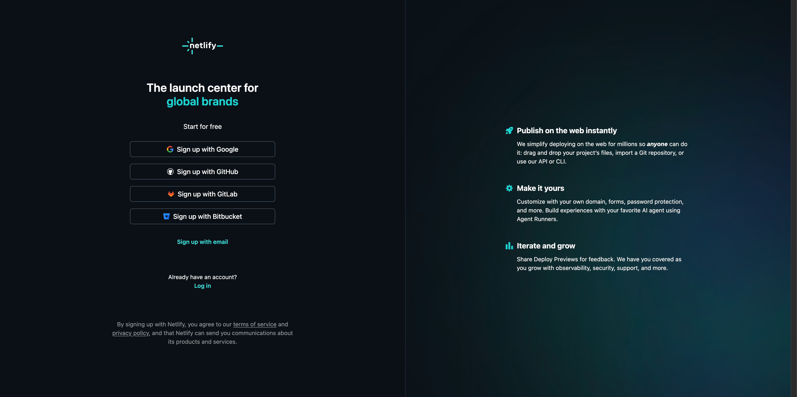
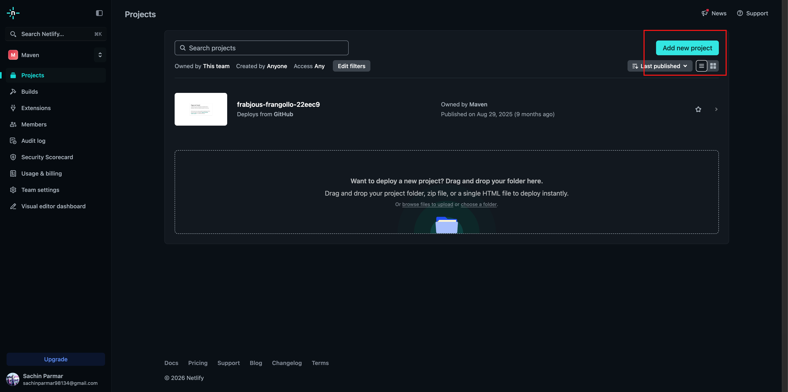
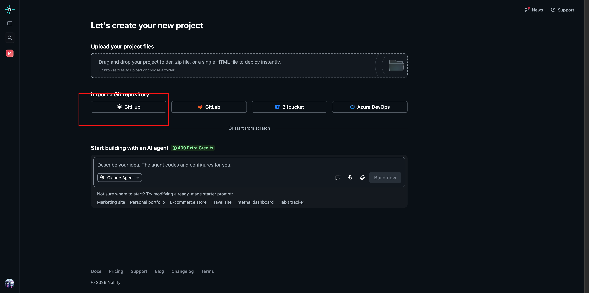
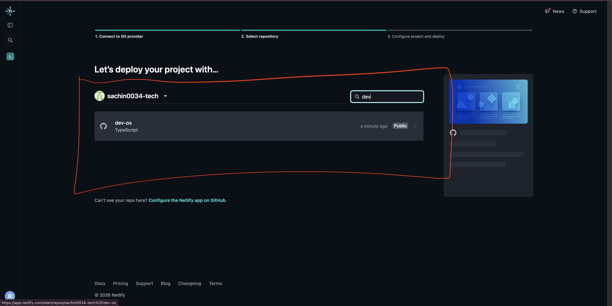
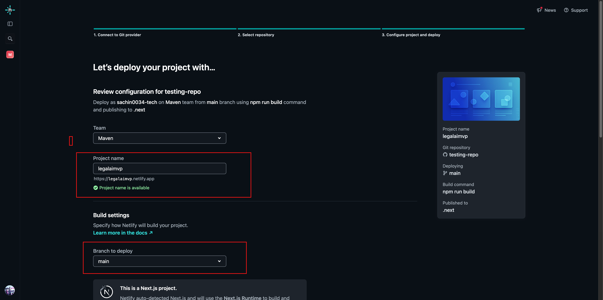
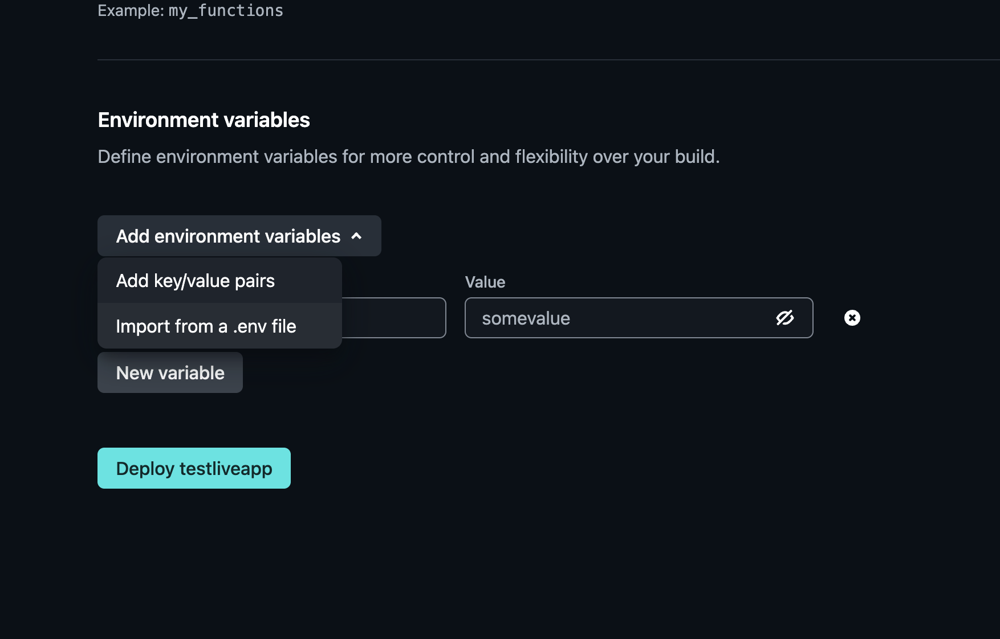
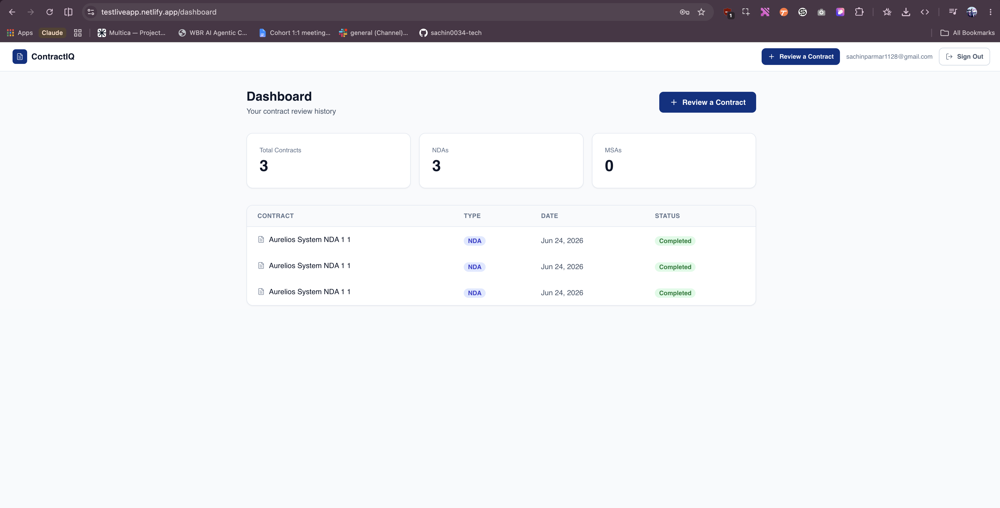
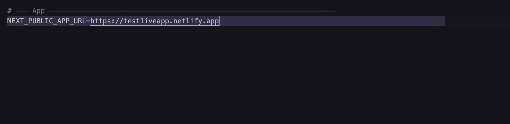
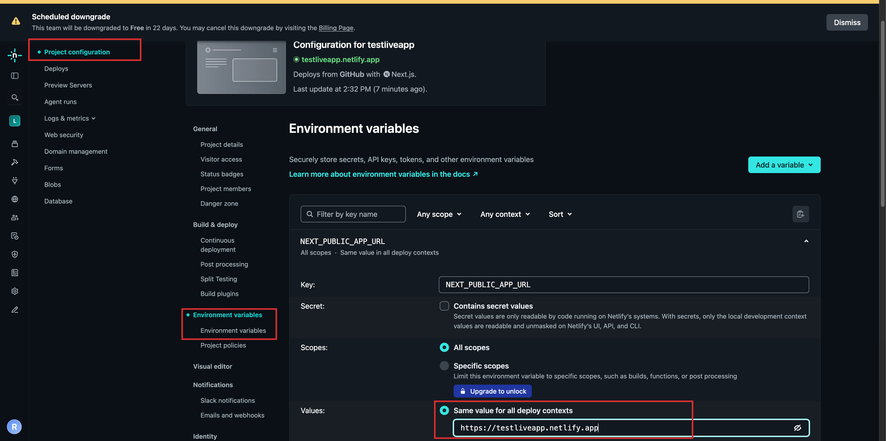

[← Lesson 6](../06-security-and-production/readme.md) | **Lesson 7**

---

# Lesson 7 — Deployment


## Where We Are

By this point you have:

- **Lesson 1** — Forked the `dev-os` starter repo, cloned it to your machine, and opened it in VS Code.
- **Lesson 2** — Explored the five skills and reviewed the design system in `docs/design.md`.
- **Lesson 3** — Used Plan Mode to run `/engineering-planner` and `/implementation-specs`, producing the engineering documents in `docs/engineering/`.
- **Lesson 4** — Scaffolded the Next.js project, implemented the application, ran the database schema in Supabase, and confirmed the app loads in a browser.
- **Lesson 5** — Added a memory layer so the assistant can recall conversation history within and across sessions.
- **Lesson 6** — Scanned the codebase with the `security-fix` skill and patched all common vulnerabilities.

Your app works locally and is secure. This lesson puts it on the internet so anyone can access it — not just you on your own machine.

---

## Part 1 — Push Your Code to GitHub

Netlify deploys by reading your GitHub repository. Your code must be on GitHub before Netlify can see it. Work through these steps first.

---

### Step 1 — Check Your `.gitignore`

Before staging any files, confirm that your `.env` file is listed in `.gitignore`. This file contains your secret API keys — it must never be pushed to GitHub.

Run:

```bash
cat .gitignore
```

Look for a line that says `.env` or `.env.local`. If it is there, you are safe to continue. If it is not, run this command first to add it:

```bash
echo ".env.local" >> .gitignore
```

---

### Step 2 — Stage Your Changes

Add all your new and modified files to the staging area — this tells Git which files you want to include in your commit:

```bash
git add .
```

Run `git status` to confirm. Files listed in green are staged and ready to commit. Confirm that `.env.local` does **not** appear in the list.

---

### Step 3 — Commit Your Changes

A commit is a snapshot of your project at this moment in time. Give it a clear message describing what you built:

```bash
git commit -m "Build full-stack AI contract review app with Supabase and memory layer"
```

You will see a summary of how many files changed. This snapshot is now saved in your local Git history.

---

### Step 4 — Push to GitHub

Send your committed changes up to GitHub:

```bash
git push origin main
```

> If your default branch is called `master` instead of `main`, use `git push origin master`.

You will see output showing the files being transferred. When it finishes, open your forked repo on GitHub in the browser — refresh the page and you will see all your new files there.

---

## Part 2 — Deploy with Netlify

**Netlify** is a free hosting platform that connects directly to your GitHub repository. Every time you push new code, Netlify automatically rebuilds and redeploys your app. No servers to manage, no complex configuration.

| Feature | What It Means |
|---|---|
| GitHub integration | Push to `main` and your app redeploys automatically |
| Environment variables | Secrets are stored securely in Netlify, not in your repo |
| Free tier | No credit card required for personal projects |
| Build logs | Every deploy shows a full log so you can diagnose failures |

---

### Step 5 — Sign Up and Connect GitHub

1. Open your browser and go to [netlify.com](https://netlify.com)
2. Click **Sign Up**



3. Choose **Sign up with GitHub** — this links Netlify directly to your GitHub account and lets it read your repositories



---

### Step 6 — Add a New Project

Once logged in:

1. Click **Add new project**



2. Click **Deploy with GitHub**



---

### Step 7 — Select Your Repository

Netlify will show a list of your GitHub repositories.

Find and click on your forked repo (e.g. `dev-os` or whatever you named it).



---

### Step 8 — Configure the Project

On the project settings screen, fill in the following:

| Setting | Value |
|---|---|
| **Project name** | A name for your app — this becomes part of your URL (e.g. `your-app-name.netlify.app`) |
| **Branch to deploy** | `main` |
| **Build command** | `npm run build` |
| **Publish directory** | `.next` |



> **Note:** If your project is inside a subdirectory (e.g. `apps/web`), set the **Base directory** field to that path before filling in the build command and publish directory.

---

### Step 9 — Add Your Environment Variables

Your deployed app needs the same secret keys you have in your local `.env.local` file. Netlify stores these securely so they are available at build time and runtime without ever being committed to your repo.

1. Scroll down to the **Environment variables** section
2. Click **Add environment variables**
3. Click **Import from .env file**
4. Open your local `.env.local` file, copy all of its contents, and paste them in
5. Click **Import**



All your keys — Supabase URL, Supabase API keys, OpenAI key — will be imported automatically.

> **Important:** The Netlify environment variables panel is private and encrypted — this is the correct and only place your secrets should live outside your local machine.

---

### Step 10 — Deploy

Click the **Deploy project** button.

Netlify will start building your app. This takes 1–2 minutes. You will see a live build log scrolling as it compiles your Next.js app.


If the build fails, read the error message in the log — it will name the exact line or file that caused the failure. See the Troubleshooting section at the end of this lesson for how to fix common build errors.

---

### Step 11 — Open Your Live App

When the build finishes, Netlify will show a green **Published** status and a URL like:

```
https://your-app-name.netlify.app
```

Click that URL — your app is now live on the internet.



> **Note:** Any time you push new code to GitHub, Netlify will automatically detect the change and redeploy your app within a couple of minutes. You never need to manually trigger a deploy again.

---

### Step 12 — Update `NEXTAUTH_URL` and Redeploy

Now that your app has a live Netlify URL, you need to update one environment variable — `NEXTAUTH_URL`. This tells your app where it is running so that authentication redirects work correctly on the live site.

**Update the variable locally**

1. Open your `.env.local` file in VS Code
2. Find this line:
   ```
   NEXTAUTH_URL=http://localhost:3000
   ```
3. Replace `http://localhost:3000` with your Netlify URL:
   ```
   NEXTAUTH_URL=https://your-app-name.netlify.app
   ```
4. Save the file



**Update the variable in Netlify**

1. Go to your Netlify project dashboard
2. Click **Project configuration** → **Environment variables**
3. Find `NEXTAUTH_URL` and click **Edit**
4. Replace the `localhost` value with your Netlify URL
5. Click **Save**



**Push and redeploy**

Open the terminal again and redeploy the app

```bash
git add .env.local
git commit -m "Update NEXTAUTH_URL to Netlify production URL"
git push origin main
```

Wait 1–2 minutes for Netlify to redeploy. Your authentication flow will now work correctly on the live site.


---

## What You Have Built

At the end of this lesson your application is:

- **Live on the internet** — accessible at a public URL, not just on your local machine
- **Automatically redeploying** — every `git push` to `main` triggers a fresh build with no manual steps
- **Securely configured** — all secrets are stored in Netlify's encrypted environment variable panel, not in your repository
- **Authentication-ready** — `NEXTAUTH_URL` is set to the production URL so login and redirect flows work correctly

---

## What You Learned

- **Why GitHub comes first** — Netlify reads your code directly from a GitHub repository; nothing can be connected or deployed until the code is pushed and visible there.
- **Checking `.gitignore` before pushing** — verifying that `.env.local` is ignored before running `git add .` is the last line of defence against accidentally committing API keys to a public repo.
- **What Netlify does** — it connects to your GitHub repo, builds your Next.js app on every push, and serves it from a global CDN with no server management required.
- **Environment variables in production** — the same secrets you store in `.env.local` locally must be added to Netlify's environment variable panel for the deployed app to connect to Supabase and call the AI API; they are stored encrypted and never exposed in the repo.
- **Build configuration for Next.js** — setting the build command to `npm run build` and the publish directory to `.next` tells Netlify how to compile and serve a Next.js application.
- **Why `NEXTAUTH_URL` must be updated** — authentication libraries use this variable to build redirect URLs; if it still points to `localhost`, logins on the live site will redirect to your local machine instead of the live app.
- **The push-to-deploy workflow** — after the initial setup, the only action needed to ship new code is `git push origin main`; Netlify handles the build and deploy automatically from that point forward.

---

## Troubleshooting — Let Claude Fix It

If your Netlify deploy fails or something is broken on the live site, use the prompts below.

---

#### Build failed — error in the Netlify build log

```
My Netlify deploy failed with this error: [paste the full error from the build log]. Fix it so the build succeeds.
```

> After Claude applies the fix, push the change to GitHub. Netlify will automatically pick it up and redeploy.

---

#### The app deploys but shows a blank page or crashes on load

```
My app deploys successfully on Netlify but when I open the URL I see a blank page / crash. The browser console shows: [paste the error]. The app works fine locally. Diagnose what is different about the production environment and fix it.
```

---

#### Authentication redirects are going to localhost after login

```
After logging in on the live Netlify site, the app redirects to localhost:3000 instead of the production URL. I need to update NEXTAUTH_URL to point to https://my-app.netlify.app. Check .env.local and confirm the variable is set correctly, then tell me exactly where to update it in Netlify.
```

---

#### Environment variables are not being picked up in production

```
The deployed app is throwing an error that suggests an environment variable is missing or undefined. The variable exists in my local .env.local file but the Netlify build cannot see it. The error is: [paste the error]. Check which variable is missing and tell me exactly where to add it in the Netlify dashboard.
```

---

#### A feature works locally but breaks on the live site

```
This feature works perfectly locally but is broken on the live Netlify site: [describe the feature]. The error shown in the browser console is: [paste the error]. Diagnose what is different between the local and production environments and fix it.
```

---

[← Lesson 6](../06-security-and-production/readme.md) | **Lesson 7**
