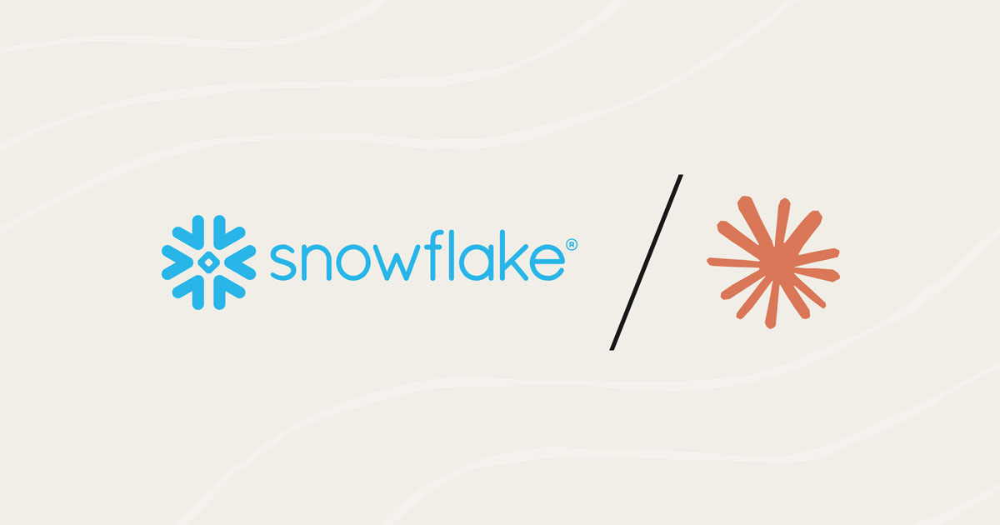
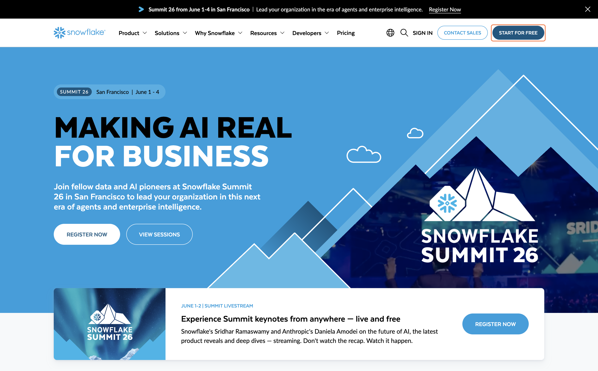
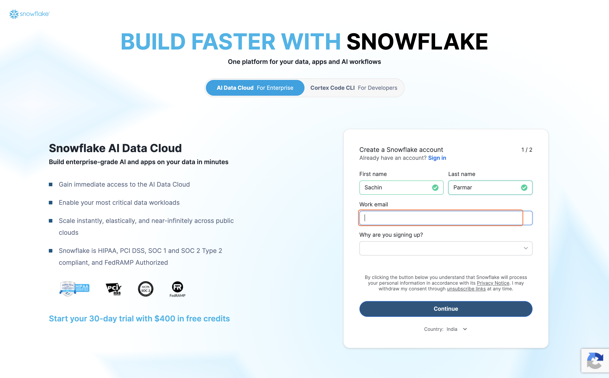
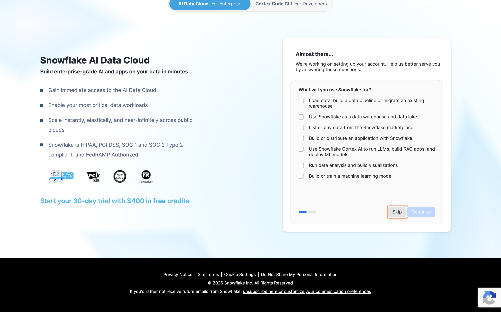
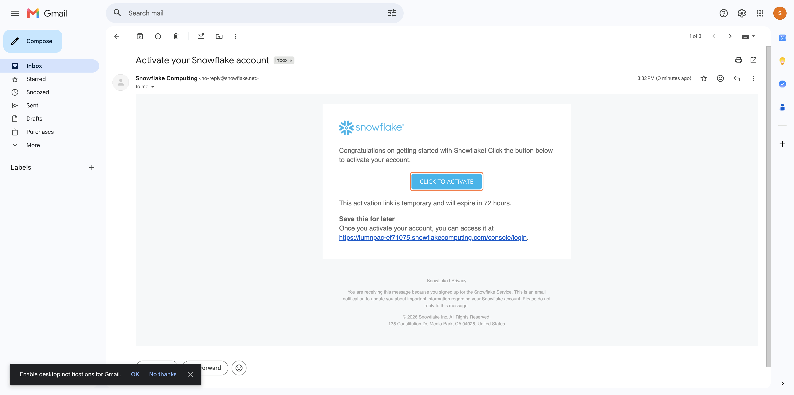

# Snowflake Trial Setup & SQL Execution

## Overview

In this lesson you will provision a free Snowflake trial account, run SQL in a worksheet, explore your database, and generate the config file needed for connecting Snowflake to external tools like n8n.

By the end of this module you will:

- Have an active Snowflake trial account
- Be able to create and run SQL worksheets
- Know how to explore your database structure
- Have your Snowflake config file ready for the n8n setup

---

## Step 1: Go to Snowflake

Open your browser and go to [https://signup.snowflake.com/](https://signup.snowflake.com/)

---

## Step 2: Click "Get Started"

Click the **"Get Started"** button at the top of the page to begin the sign-up process.

---

## Step 3: Create Your Account

Fill in your personal details on the sign-up form:

- **First Name** and **Last Name**
- **Email Address** — use a valid email you can access
- **WHy are you signing up**

Click **"Continue"** to proceed.

---

## Step 4: Enter Company Details and Choose Your Edition

On the next screen, complete the remaining fields:

| Field | What to Enter |
|---|---|
| **Company Name** | Your company or organization name |
| **Job Title** | Your role (e.g. `SDE`, `Data Analyst`, `Student`) |
| **Snowflake Edition** | Select **Standard** for this course |

Click **"Get Started"** when done.

---

## Step 5: Answer the Onboarding Questions (Optional)

Snowflake may ask a few onboarding questions such as your coding experience level.

- You can answer honestly **or** click **"Skip"** to bypass these questions
- These do not affect your account setup

---

## Step 6: Check Your Email

Once you complete the sign-up form, Snowflake will send an **activation email** to the address you provided.

- Check your inbox for an email from **Snowflake**
- Subject: *Activate your Snowflake account*

> Check your spam or junk folder if you do not see it within a few minutes.

---

## Step 7: Activate Your Account

1. Open the Snowflake activation email
2. Click **"CLICK TO ACTIVATE"**

This will open a browser tab to complete your account setup.

---

---

## What You Learned

- How to provision a free Snowflake trial account

- How to navigate your database structure in the Snowflake console
- How to locate your account credentials for connecting external tools

---

## Next Module

[Lab 01 — Setting Up Composio with Snowflake →](../01-setup-composio/readme.md)
