# Lab 01 — Setting Up Composio with Snowflake

## What is Composio?

Composio is a tool integration platform that lets AI agents (like Claude) connect to and act on external services — databases, SaaS tools, APIs, and more. Instead of writing custom integration code for every service, Composio handles the authentication and exposes each service as a ready-to-use "toolkit."

In this lab, you will connect **Snowflake** (your data warehouse) to **Claude Code** via Composio's MCP (Model Context Protocol) server. Once connected, Claude can run SQL queries against your Snowflake data directly from the terminal.

---

## Prerequisites

- A Snowflake account 
- Claude App installed and running

---

## Step 1 — Create a Composio Account

1. Go to [https://composio.dev](https://composio.dev)
2. Click **Get Started** → **Sign In**

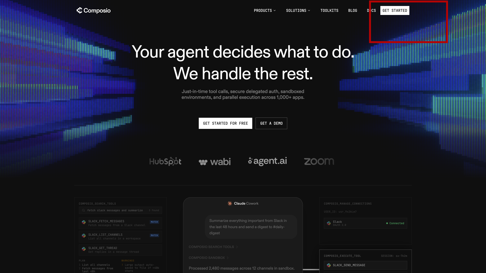

3. Create an account (or sign in with Google/GitHub)
4. You will be redirected to the Composio dashboard after signup

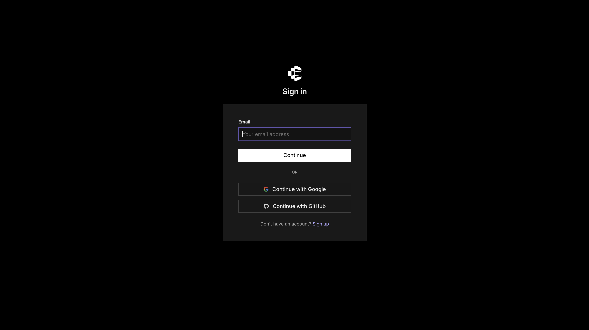

---

## Step 2 — Add Snowflake as a Toolkit

1. In the Composio dashboard, navigate to the **Toolkit** section in the left sidebar
2. Search for **Snowflake**

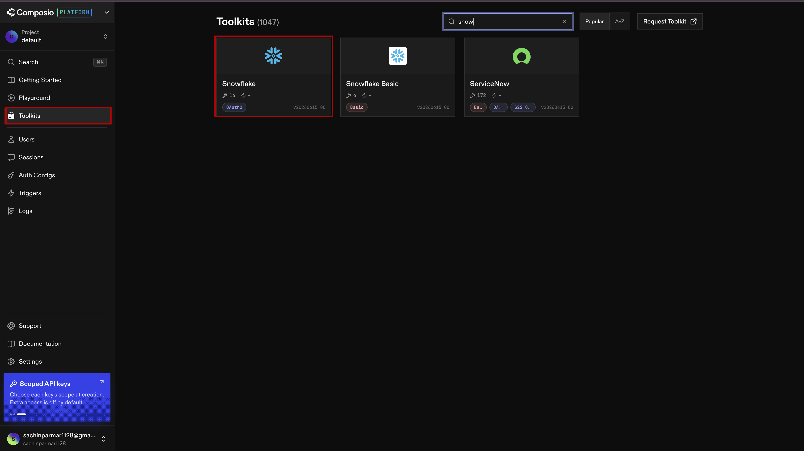

3. Click on it, then click **Add to Project**
4. A modal will appear — click **Next**

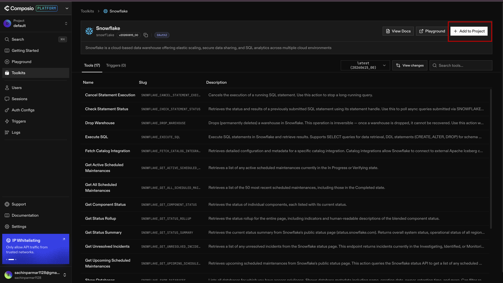

At this point Composio needs two things from Snowflake:
- **OAuth Client ID**
- **OAuth Client Secret**

Before you can get those, you need to register Composio as an OAuth application inside Snowflake.

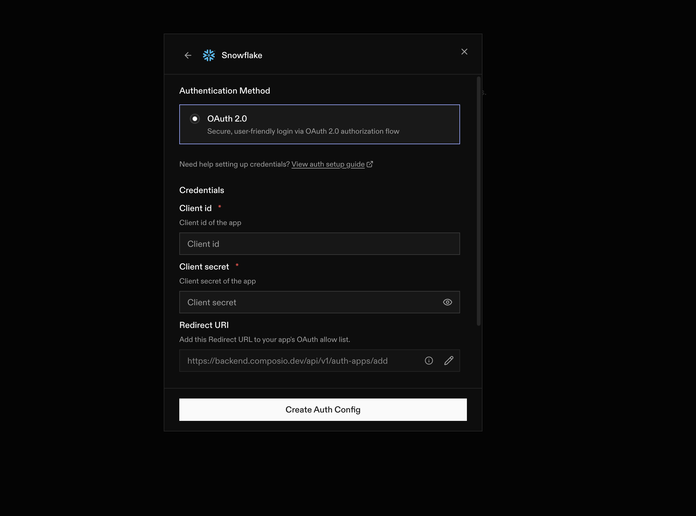

---

## Step 3 — Copy the Composio Redirect URL

In the same modal where you clicked Next, you will see a **Redirect URL** field. It will look like:

```
https://backend.composio.dev/api/v1/auth-apps/add
```

**Copy this URL** — you will paste it into the Snowflake SQL script in the next step.

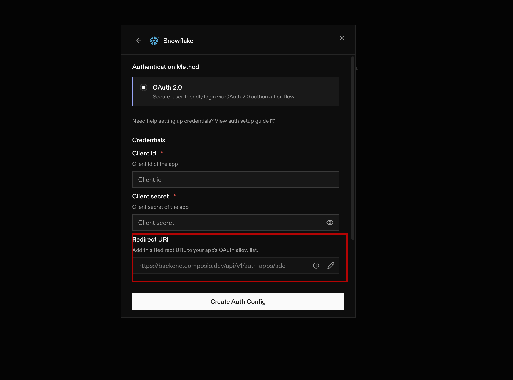

---

## Step 4 — Create the OAuth Integration in Snowflake

1. Log in to your **Snowflake account dashboard**
2. Go to **Projects** → **Workspace**

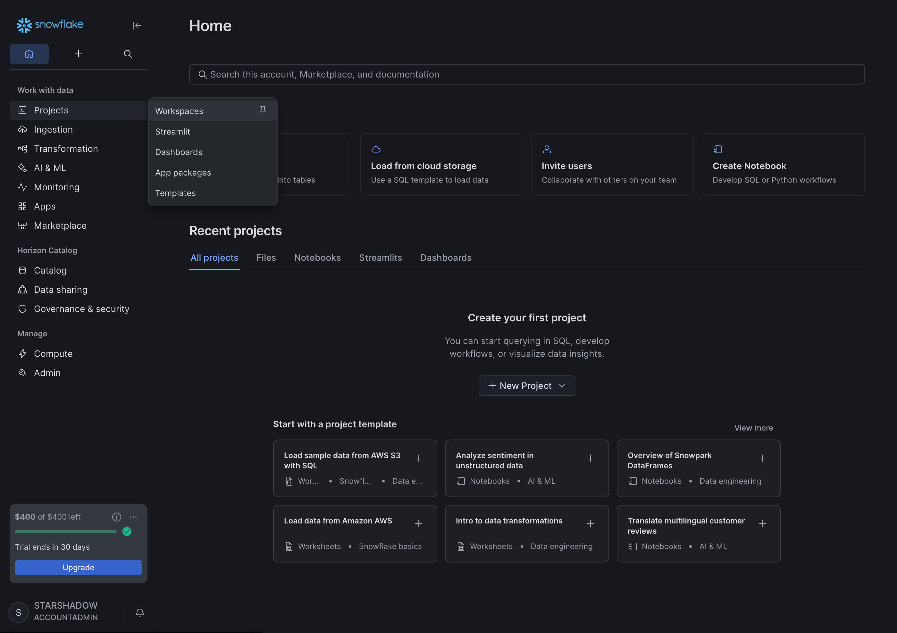

3. Click **+ Add** → **SQL** and then create an SQL file

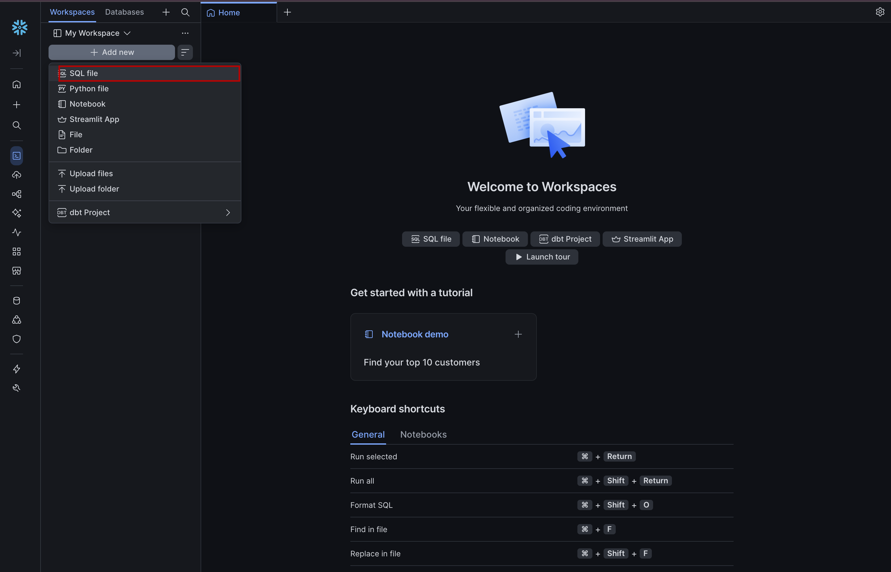

4. Rename the file to something like `composio-oauth-setup.sql`
5. Paste the following SQL into the worksheet:

## Note : Replace the OAUTH_REDIRECT_URI value with the Redirect URL you copied from Composio

```sql

-- Step 1: Create the OAuth Security Integration
-- Replace the OAUTH_REDIRECT_URI value with the Redirect URL you copied from Composio
CREATE OR REPLACE SECURITY INTEGRATION COMPOSIO_OAUTH
  TYPE = OAUTH
  ENABLED = TRUE
  OAUTH_CLIENT = CUSTOM
  OAUTH_CLIENT_TYPE = CONFIDENTIAL
  OAUTH_REDIRECT_URI = 'https://backend.composio.dev/api/v1/auth-apps/add'
  OAUTH_ISSUE_REFRESH_TOKENS = TRUE
  OAUTH_REFRESH_TOKEN_VALIDITY = 7776000;

-- Step 2: Confirm the integration was created
DESC SECURITY INTEGRATION COMPOSIO_OAUTH;

-- Step 3: Retrieve the OAuth Client ID and Client Secret
SELECT SYSTEM$SHOW_OAUTH_CLIENT_SECRETS('COMPOSIO_OAUTH');
```

> **Note:** In `OAUTH_REDIRECT_URI`, make sure the value matches exactly the URL you copied from Composio in Step 3.

6. Click **Run All** to execute all three statements

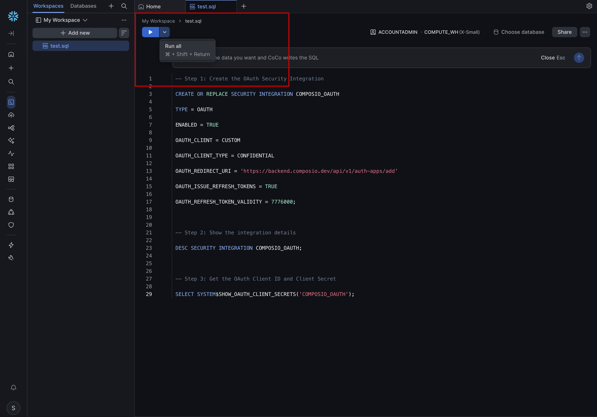

---

## Step 5 — Copy the Client ID and Client Secret

After running the SQL, the output of the third statement (`SELECT SYSTEM$SHOW_OAUTH_CLIENT_SECRETS(...)`) will return a JSON object containing:

- `OAUTH_CLIENT_ID`
- `OAUTH_CLIENT_SECRET`

Copy both values.

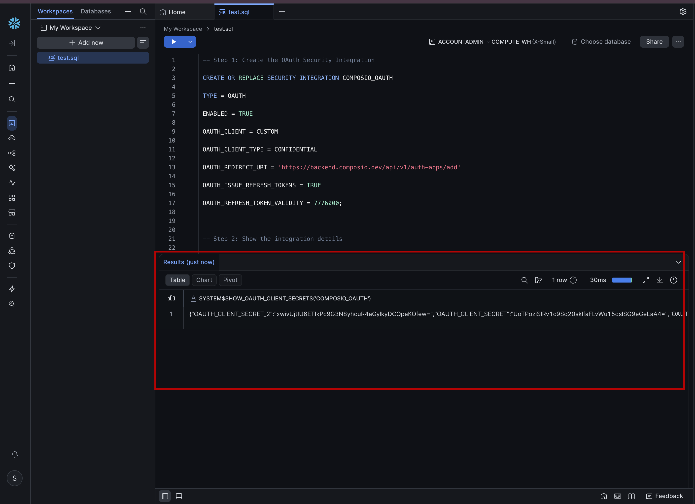

---

## Step 6 — Paste the Credentials Back into Composio

1. Return to the Composio modal (from Step 2)
2. Paste the **Client ID** and **Client Secret** into their respective fields
3. Complete the connection flow

---

## Step 7 — Generate the MCP URL

1. Go to this URL: [https://composio.dev/toolkits/snowflake/framework/claude-code](https://composio.dev/toolkits/snowflake/framework/claude-code)
2. Click **Generate MCP URL**
3. **Copy only the URL** that is generated (not the full command — just the URL portion)

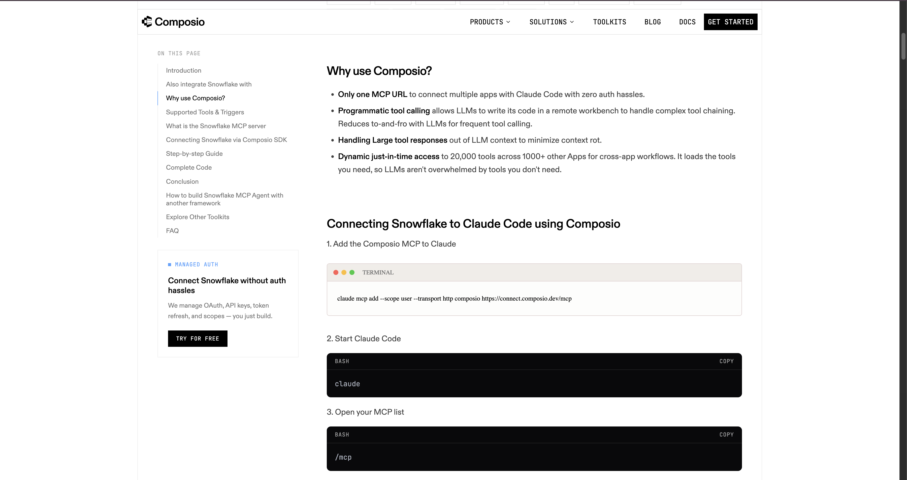

---

## Step 8 — Add Composio as an MCP Server in Claude 

Open your claude app and run the following prompt :


### Note : 

```bash
Run the following command in the terminal and add the Composio MCP server:

<Add the MCP Server URL that you have copy from step 7>

After running the command, complete the authentication process
```

This registers the Composio MCP server with Claude Code so it can communicate with Composio's tool layer.

---

## Step 9 — Authenticate Claude Code with Composio

Run the following command to log in and complete the authentication:

```bash
claude mcp login composio
```

Follow the prompts in the terminal — it will open a browser window for you to authorize the connection.

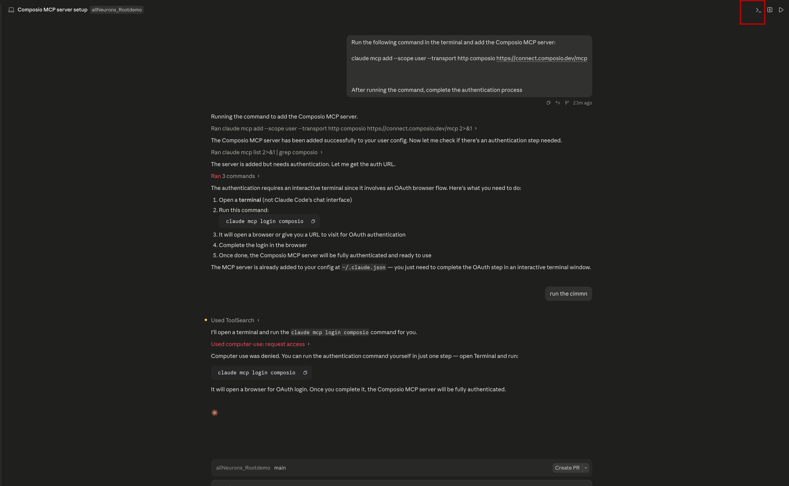

Once authenticated, Claude Code has access to your Snowflake instance through Composio and can query data, explore schemas, and run analysis directly from the terminal.

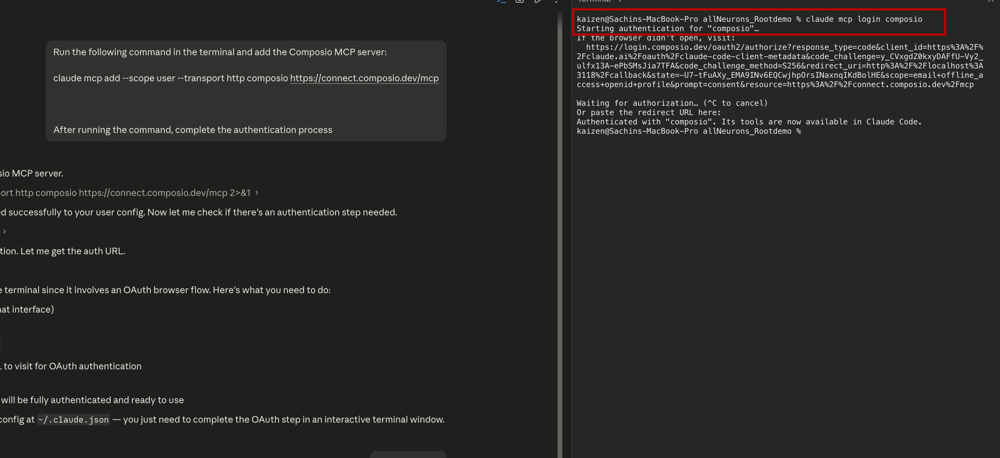


---

## Summary

| Step | What you did |
|------|-------------|
| 1–2 | Created a Composio account and started the Snowflake toolkit setup |
| 3 | Copied the Composio Redirect URL |
| 4–5 | Created an OAuth integration in Snowflake and retrieved credentials |
| 6 | Pasted credentials into Composio to complete the connection |
| 7 | Generated the Composio MCP URL |
| 8–9 | Registered and authenticated the Composio MCP server in Claude Code |
---

## What You Learned

- What Composio is and how it connects AI agents to external services
- How to create a Composio account and add Snowflake as a toolkit
- How to create an OAuth Security Integration inside Snowflake using SQL
- How to retrieve OAuth credentials from Snowflake and paste them into Composio
- How to register the Composio MCP server with Claude Code and authenticate it

---

## Next Module

[Lab 02 — Setting Up Apify →](../02-setup-apify/readme.md)
