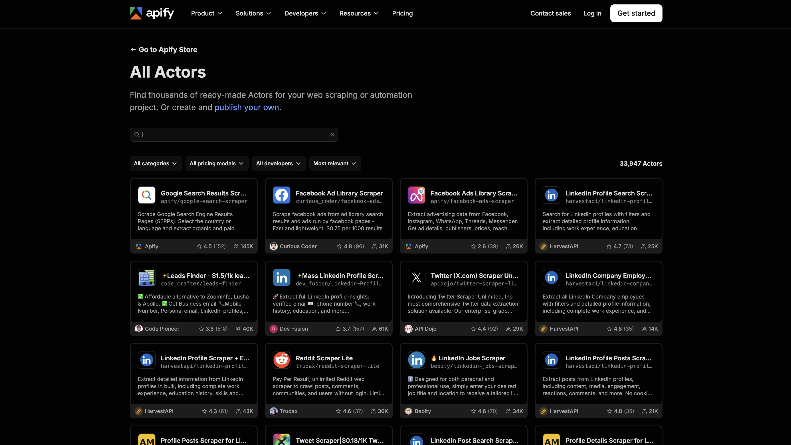
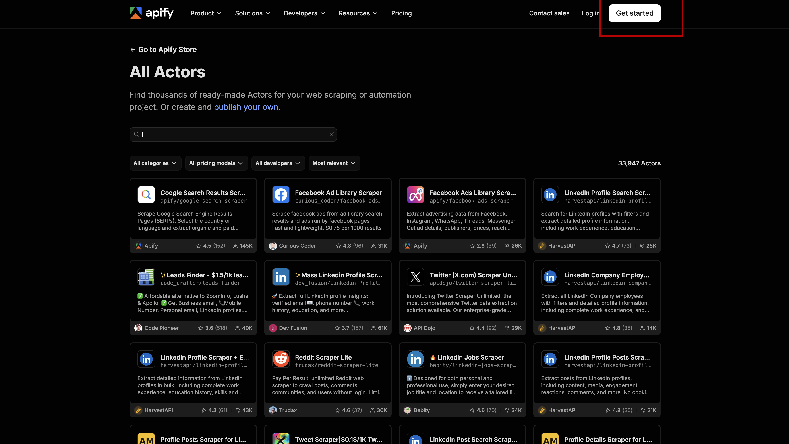
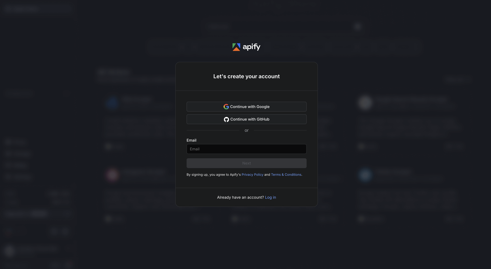
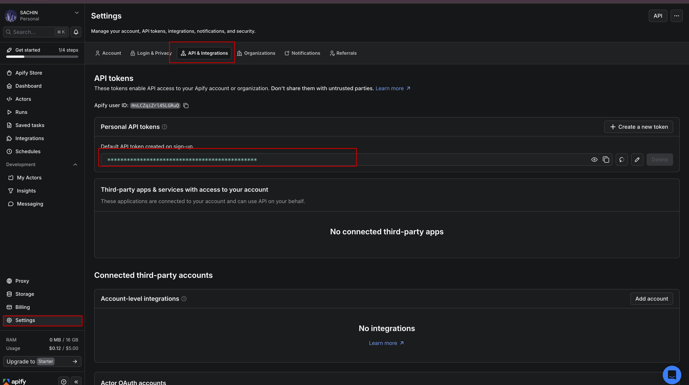
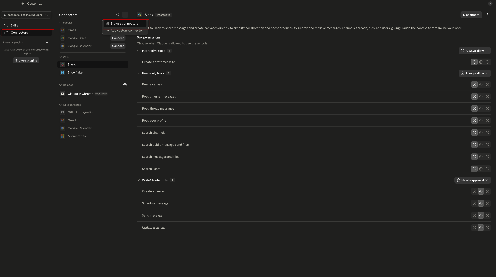
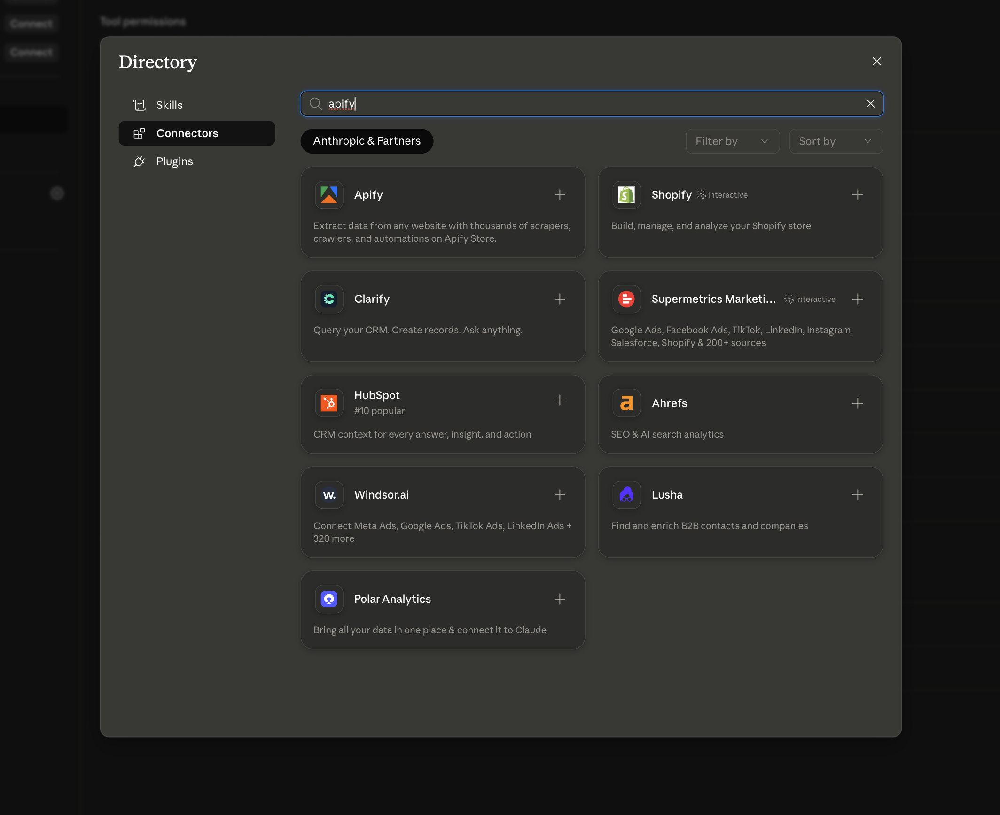
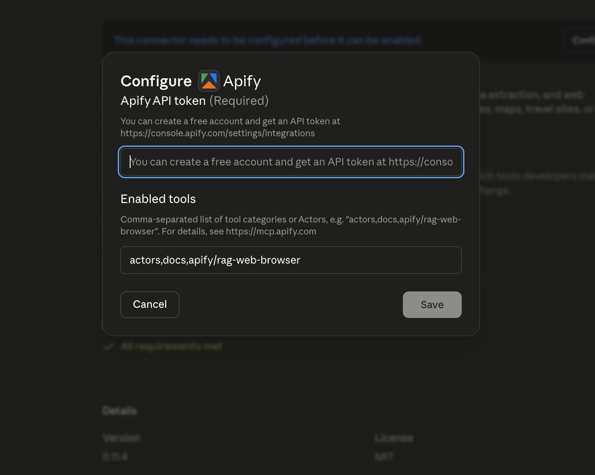
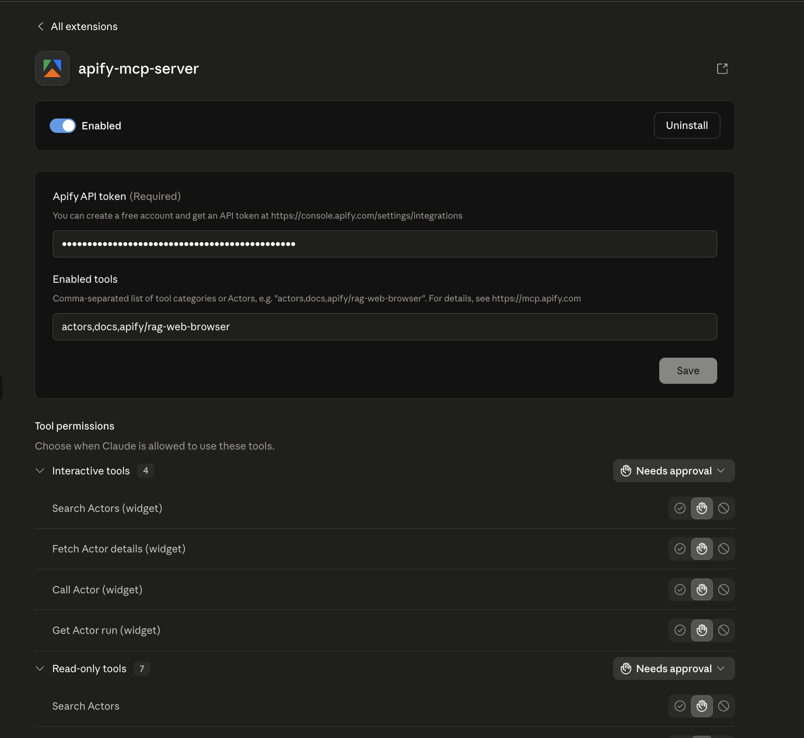

# Lab 02 — Setting Up Apify

## Context: Where We Are

In [Lab 01](../01-setup-composio/readme.md) you connected **Snowflake** to Claude Code via Composio's MCP server. Claude can now query your data warehouse directly from the terminal.

In this lab you will add **Apify** — a web scraping and data extraction platform — as a connector inside the Claude app. This gives Claude the ability to pull live data from the web (product pages, reviews, competitor sites, etc.) and feed it into your Snowflake pipeline.

---

## What is Apify?

Apify is a cloud platform for web scraping and browser automation. It hosts a marketplace of pre-built scrapers called **Actors** — each one targets a specific site or data source (Amazon products, Google search results, LinkedIn, Reddit, and hundreds more). Instead of building scrapers from scratch, you pick an Actor, run it with a URL or search query, and get back structured JSON data.

In the context of this project, Apify is the **data collection layer**: it pulls raw product intelligence from the web so Claude can analyze it against what you already have in Snowflake.

---

## Prerequisites

- Claude app (desktop) installed and open
- A Google account for signing in to Apify

---

## Step 1 — Create an Apify Account

1. Go to the Apify Actor store: [https://apify.com/store](https://apify.com/store)

2. Click **Get Started**

3. Sign in with **Google** (or create an account with email)
4. You will land on the Apify console dashboard

---

## Step 2 — Copy Your Personal API Token

Your API token is how the Claude connector authenticates with Apify on your behalf.

1. In the Apify console, click on your profile icon (top right) → **Settings**
2. Navigate to **API & Integrations**
3. Under **Personal API tokens**, copy the default token (or create a new one)

> Keep this token private — it grants full access to your Apify account.

---

## Step 3 — Install the Apify Connector in Claude

1. Open the **Claude desktop app**
2. Go to **Customize** (top-right menu or settings icon)
3. Click **Connectors** → **Browse Connectors**

4. Search for **Apify**
5. Click **Install** on the Apify connector

---

## Step 4 — Authenticate with Your API Token

1. After clicking Install, Claude will prompt you for an **API Token**
2. Paste the token you copied in Step 2
3. Click **Connect** (or **Save**)

---

## Step 5 — Verify the Connection

1. Confirm the Apify connector shows a green **Enabled** status in your connectors list

If Claude responds by triggering an Apify Actor and returning structured results, the connection is working.

---

## Summary

| Step | What you did |
|------|-------------|
| 1 | Created an Apify account |
| 2 | Copied your personal API token from Apify settings |
| 3 | Installed the Apify connector in the Claude app |
| 4 | Authenticated the connector with your API token |
| 5 | Verified the connection is active |

---

## What's Next

With both Composio (→ Snowflake) and Apify (→ web data) connected, Claude now has:
- A **live data collection layer** (Apify scrapes the web)
- A **storage and query layer** (Snowflake holds your structured data)

The next labs will use these two together to build the Product Intelligence Hub pipeline.
---

## What You Learned

- What Apify is and how Actors work as pre-built web scrapers
- How to create an Apify account and locate your personal API token
- How to install the Apify connector inside the Claude desktop app
- How to authenticate the connector so Claude can trigger scraping jobs on your behalf

---

## Next Module

[Lab 03 — Data Ingestion Pipeline →](../03-data-ingestion-pipeline/readme.md)
