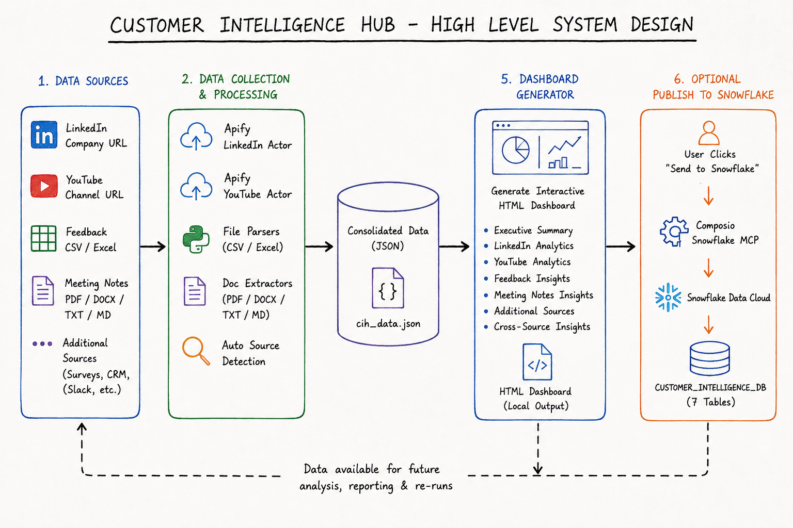
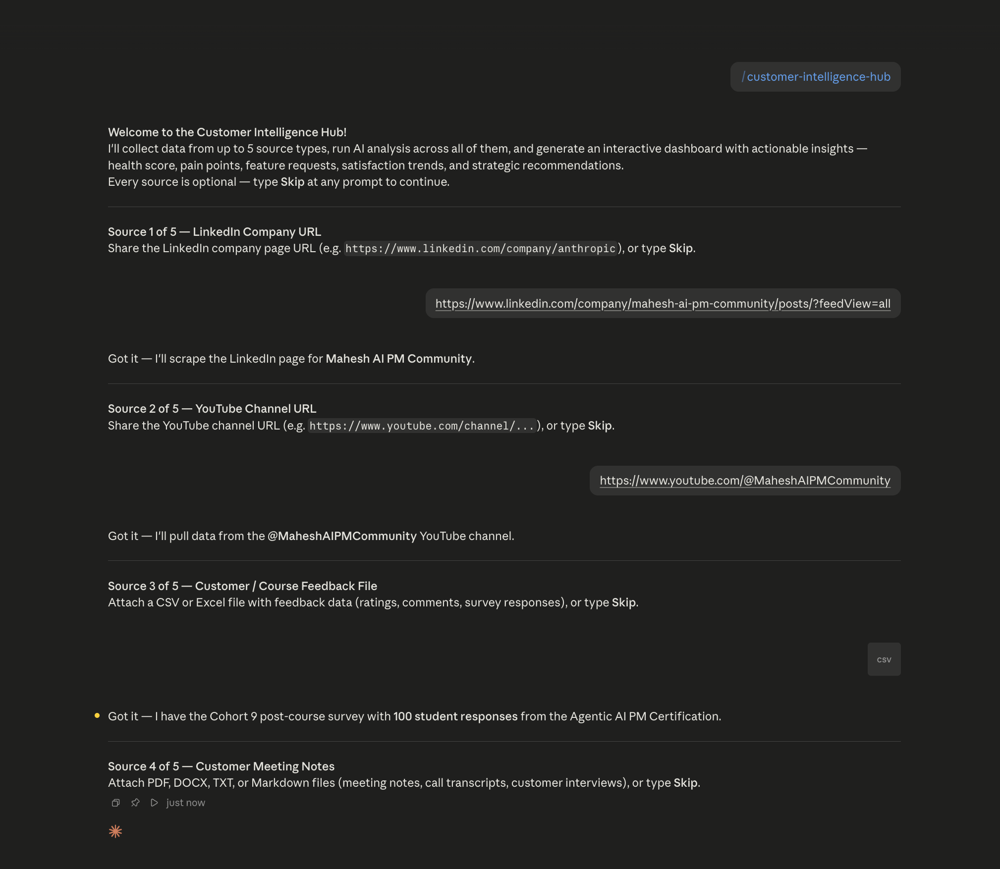
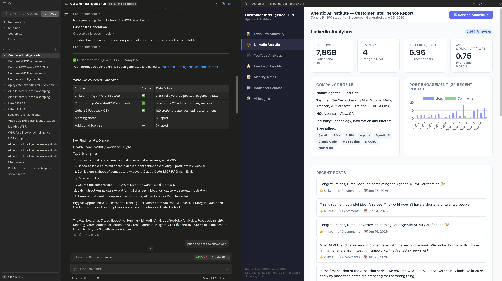
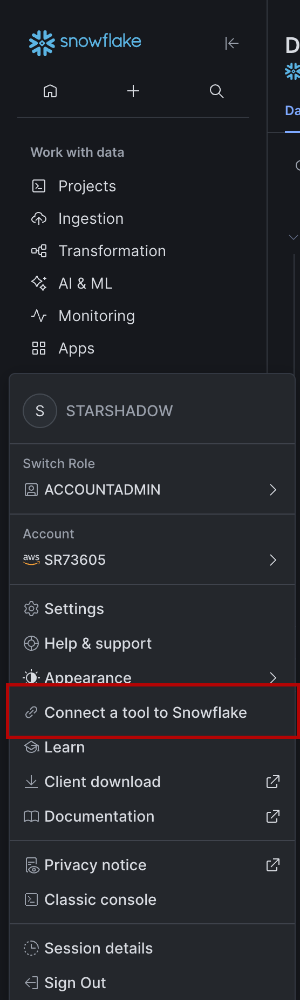
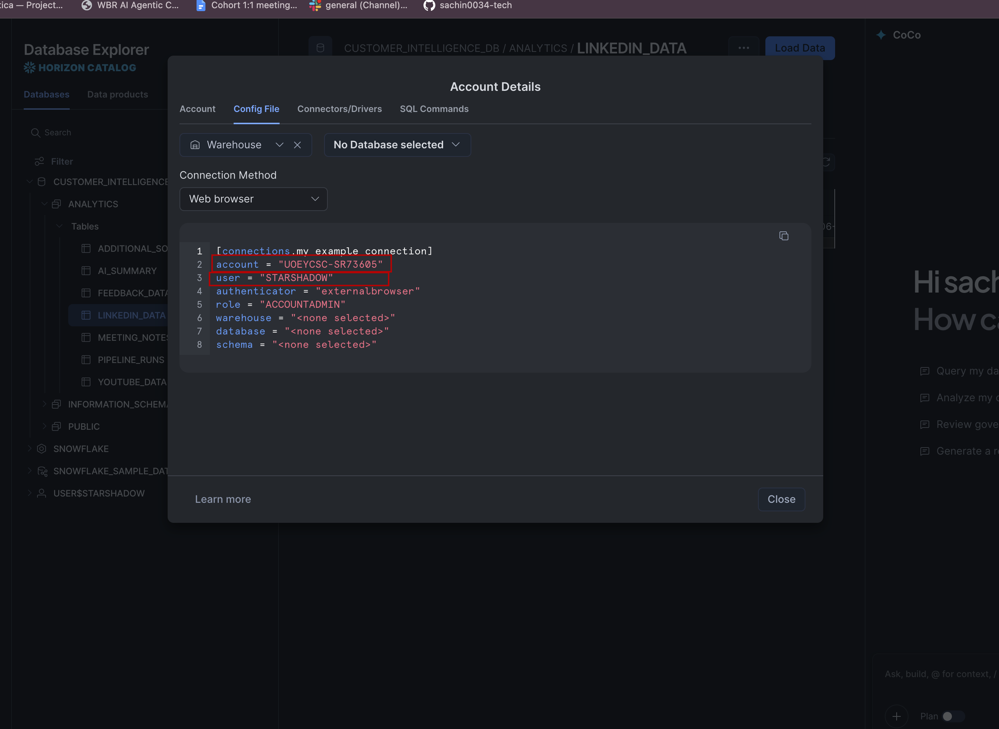
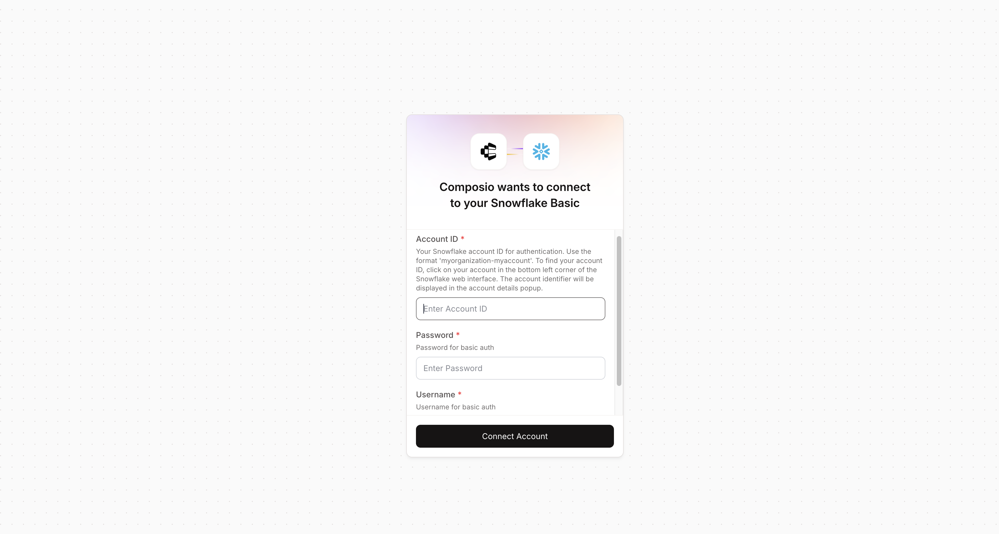
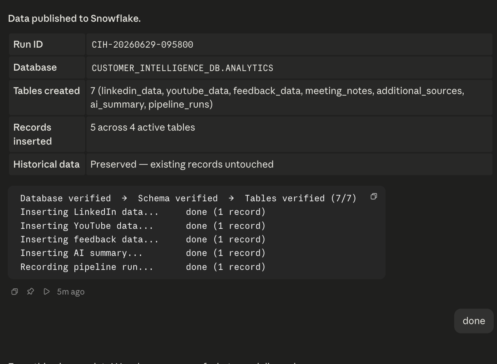
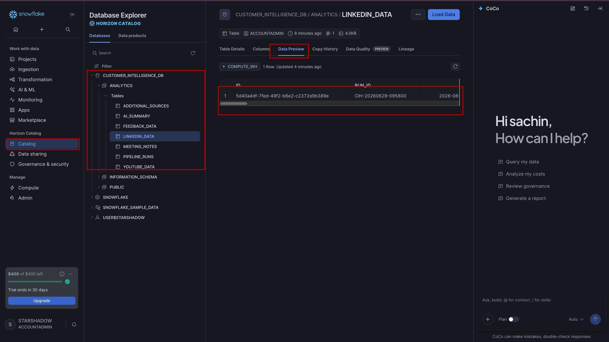

# Lab 03 — Installing the Skill & Running the Data Ingestion Pipeline

## Context: Where We Are

By now you have:
- [Lab 01](../01-setup-composio/readme.md) — Snowflake connected to Claude via Composio MCP
- [Lab 02](../02-setup-apify/readme.md) — Apify connected to Claude as a connector

In this lab you will install the **Customer Intelligence Hub skill** — the slash command that ties everything together — and run the full data ingestion pipeline for the first time.

---

## What is a Claude Skill?

A Claude skill is a Markdown file that contains a detailed prompt and a set of behavioural instructions. When you install it, it becomes a slash command (`/skill-name`) inside Claude. Calling the command loads the entire instruction set into Claude's context — it's like giving Claude a specialized job description for that one task.

---

## Prerequisites

Before starting this lab, make sure you have the following in place:

- [Lab 01](../01-setup-composio/readme.md) — Snowflake connected via Composio
- [Lab 02](../02-setup-apify/readme.md) — Apify connector installed in Claude
- [Download the skill file - Click Here](https://pragyaallc-my.sharepoint.com/:u:/g/personal/sachin_parmar_legalgraph_ai/IQBDcdh8Vfx4TKiGFk_GjPtPAV7sruWexnM8tBsjQBx0OPI?e=A8WT5p) — the skill file from this repo
- [How to add a skill to Claude - Guide Here](https://github.com/sachin0034-tech/MLAI-community-labs/tree/main/Cohort-Labs/Cohort%209/week%200%20%20-%20foundation/how-to-add-skills-to-claude) — official guide

---

## What Does the Customer Intelligence Hub Skill Do?




The skill (`/customer-intelligence-hub`) turns Claude into an end-to-end customer intelligence analyst. You give it up to 5 data sources and it handles everything — collection, processing, analysis, and reporting — automatically across 6 phases:

| Phase | What happens |
|-------|-------------|
| **1 — Source Collection** | Claude walks you through providing up to 5 sources one at a time: a LinkedIn company URL, a YouTube channel URL, a customer feedback CSV/Excel file, meeting notes (PDF/DOCX/TXT/MD), and any additional files or URLs. Every source is optional — type **Skip** to move past any you don't have. |
| **2 — Data Collection** | Claude uses Apify to scrape LinkedIn and YouTube, and parses your uploaded files inline using Python. Each source is processed independently — a failure in one never blocks the others. |
| **3 — Consolidation** | All collected data is merged into a single structured JSON object saved to `/tmp/cih_data.json`. |
| **4 — AI Analysis** | Claude reasons over all sources together and produces 11 insight sections: executive summary, a health score (0–100), what's working well, top pain points, most-requested features, satisfaction score, risks, recommended actions, and cross-source insights that no single source could surface alone. |
| **5 — HTML Dashboard** | Claude generates a fully interactive, self-contained HTML dashboard with 7 tabs — one per data source plus a cross-source insights view. No server required; it opens directly in a browser. |
| **6 — Snowflake Publishing** | On your confirmation, Claude pushes all collected data and AI insights into `CUSTOMER_INTELLIGENCE_DB` in Snowflake via the Composio connector. Historical runs are preserved — nothing is ever overwritten. |

In short: you provide the URLs and files, and in one command Claude collects the data, finds the patterns, and delivers a live dashboard plus a queryable data warehouse.

---

## Step 1 — Verify the Skill is Loaded

1. Open (or restart) the Claude desktop app
2. In any conversation, type `/` — you should see **customer-intelligence-hub** appear in the autocomplete list
3. That confirms the skill is installed and ready

---

## Step 2 — Run the Pipeline

In a Claude conversation, type:

```
/customer-intelligence-hub
```

Claude will greet you and begin collecting sources one at a time:

```
Welcome to the Customer Intelligence Hub!
...
Source 1 of 5 — LinkedIn Company URL
Share the LinkedIn company page URL, or type Skip.
```

Work through each prompt:

| Source | What to provide |
|--------|----------------|
| LinkedIn Company URL | e.g. `https://www.linkedin.com/company/anthropic` |
| YouTube Channel URL | e.g. `https://www.youtube.com/@anthropic-ai` |
| Customer Feedback | Upload a CSV or Excel file |
| Meeting Notes | Upload one or more PDF, DOCX, TXT, or MD files |
| Additional Sources | Any other files or URLs (surveys, CRM exports, support tickets) |

Type **Skip** at any prompt to move past a source you don't have right now.



---

## Step 3 — Review the Dashboard

Once all phases complete, Claude will output the path to your HTML dashboard:

```
Dashboard saved to: /tmp/customer_intelligence_dashboard.html
```

Open the file in your browser to explore:
- **Executive Summary** tab — health score gauge and key metrics
- **LinkedIn Analytics** tab — follower count, post engagement
- **YouTube Analytics** tab — subscriber count, top videos, engagement rate
- **Feedback Insights** tab — rating distribution, sentiment, top themes
- **Meeting Notes** tab — pain points, feature requests, action items, risks
- **Additional Sources** tab — insights from any extra files
- **Cross-source AI Insights** tab — patterns that span all your sources



---

## Step 4 — Publish to Snowflake (Optional)

When you're ready to persist the data, click **Send to Snowflake** in the dashboard header, or tell Claude:

> "Push the data to Snowflake."

> **Note — If Claude asks you to authenticate with Snowflake:**
> Click the URL that Claude provides, then in your Snowflake account go to **Profile** → **Connect a Tool** → **Config File** and fill in the following fields:



> - **account** — your Snowflake account ID
> - **user** — your Snowflake username



> - **password** — the password you set when you created your Snowflake account




Claude will create the `CUSTOMER_INTELLIGENCE_DB.ANALYTICS` schema (if it doesn't exist) and insert records across 7 tables. You'll see a plain-text progress log as each table is written, followed by a confirmation:

```
Data published to Snowflake.
Run ID: CIH-20260629-143201
Database: CUSTOMER_INTELLIGENCE_DB.ANALYTICS
Total records inserted: 6 across 7 tables
Historical data preserved — existing records untouched.
```



### Verify the Data in Snowflake

To confirm the data was published successfully:
1. In Snowflake, go to **Catalog** → **Data Explorer**
2. Open **CUSTOMER_INTELLIGENCE_DB** → **ANALYTICS**
3. Click any table, then go to **Data Preview** to see the inserted records



---

## Summary

| Step | What you did |
|------|-------------|
| 1 | Verified the `/customer-intelligence-hub` command appears in Claude |
| 2 | Ran the pipeline and provided data sources |
| 3 | Reviewed the generated interactive HTML dashboard |
| 4 | (Optional) Published the run to Snowflake |
---

## What You Can Do Next — Fetching Data from Snowflake

Now that your customer intelligence data lives in Snowflake, Claude can query it on demand to power a wide range of deliverables. Here are a few examples:

**Weekly Business Review (WBR)**
Ask Claude to pull the latest health scores, pain point trends, and satisfaction scores from `CUSTOMER_INTELLIGENCE_DB` and draft a WBR slide narrative — complete with week-over-week comparisons across pipeline runs.

> "Using our Snowflake data, generate a Weekly Business Review summary for last week's customer intelligence run. Highlight any change in health score and the top 3 pain points."

**Executive Deck**
Ask Claude to query the `ai_summary` and `meeting_notes` tables and produce a structured slide outline with a talking-point per slide — ready to drop into Google Slides or PowerPoint.

> "From our Snowflake analytics, create an executive presentation outline covering customer health, key risks, and recommended actions."

**Feature Prioritization**
Ask Claude to pull the `most_requested_features` data across multiple runs and rank features by frequency and demand signal — giving your product team a data-backed backlog.

> "Query the Snowflake feature requests data across all pipeline runs and rank the top 10 most requested features by how often they appear."

You now have a fully end-to-end pipeline: **live data collection → AI analysis → interactive dashboard → persistent Snowflake warehouse → on-demand reporting** — all from a single slash command.

---

## What You Learned

- What a Claude skill is and how it becomes a slash command
- How the Customer Intelligence Hub skill works across its 6 automated phases
- How to verify a skill is installed and ready in Claude
- How to run the full data ingestion pipeline end to end
- How to read and navigate the generated HTML dashboard
- How to publish pipeline results to Snowflake and verify the data was written
