# Snowflake Trial Setup & SQL Execution

## Overview

In this lesson you will provision a free Snowflake trial account, run SQL in a worksheet, explore your database, and generate the config file needed for connecting Snowflake to external tools like n8n.

By the end of this module you will:

- Have an active Snowflake trial account
- Be able to create and run SQL worksheets
- Know how to explore your database structure
- Have your Snowflake config file ready for the n8n setup

---

## Step 1: Go to Snowflake

Open your browser and go to [https://signup.snowflake.com/](https://signup.snowflake.com/)


---

## Step 2: Click "Get Started"

Click the **"Get Started"** button at the top of the page to begin the sign-up process.


---

## Step 3: Create Your Account

Fill in your personal details on the sign-up form:

- **First Name** and **Last Name**
- **Email Address** — use a valid email you can access
- **WHy are you signing up**

Click **"Continue"** to proceed.


---

## Step 4: Enter Company Details and Choose Your Edition

On the next screen, complete the remaining fields:

| Field | What to Enter |
|---|---|
| **Company Name** | Your company or organization name |
| **Job Title** | Your role (e.g. `SDE`, `Data Analyst`, `Student`) |
| **Snowflake Edition** | Select **Standard** for this course |

Click **"Get Started"** when done.

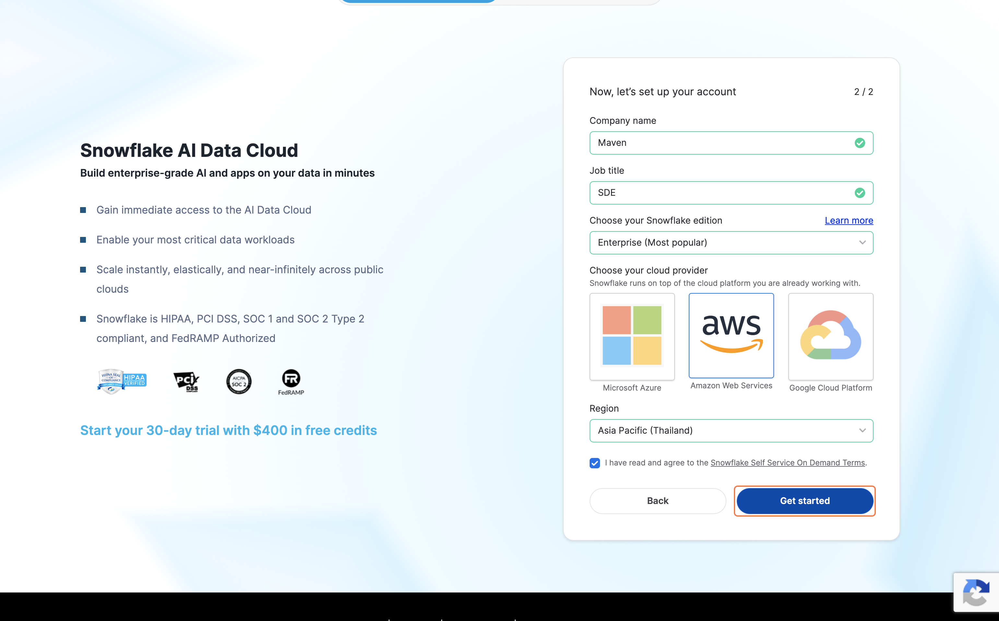

---

## Step 5: Answer the Onboarding Questions (Optional)

Snowflake may ask a few onboarding questions such as your coding experience level.

- You can answer honestly **or** click **"Skip"** to bypass these questions
- These do not affect your account setup


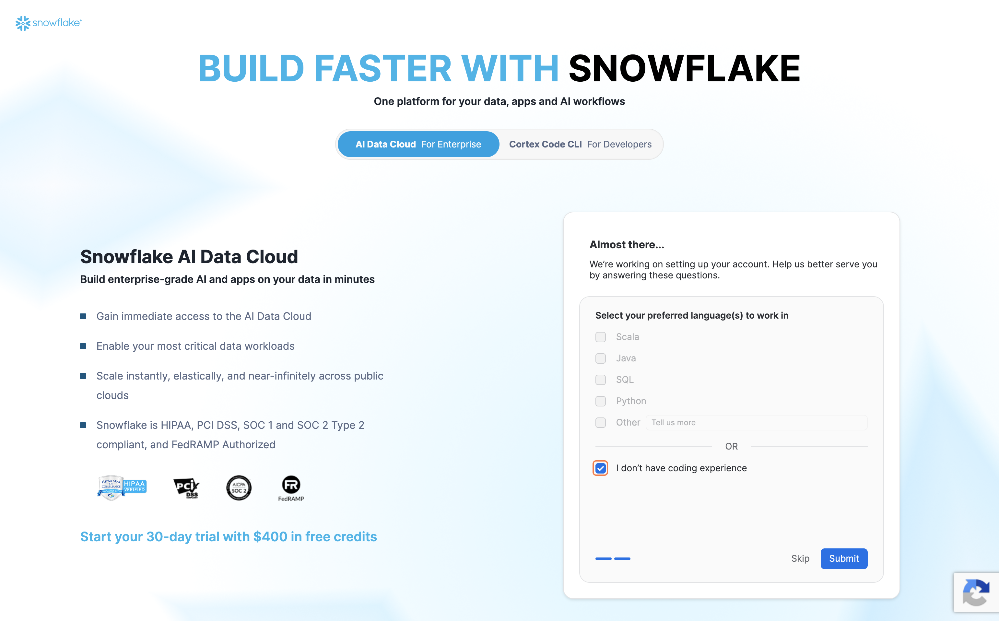

---

## Step 6: Check Your Email

Once you complete the sign-up form, Snowflake will send an **activation email** to the address you provided.

- Check your inbox for an email from **Snowflake**
- Subject: *Activate your Snowflake account*

> Check your spam or junk folder if you do not see it within a few minutes.


---

## Step 7: Activate Your Account

1. Open the Snowflake activation email
2. Click **"CLICK TO ACTIVATE"**

This will open a browser tab to complete your account setup.


---

## Step 8: Set Up Your Username and Password

On the activation page:

1. Enter a **username** of your choice
2. Enter a **password** and re-enter it to confirm
3. Click **"Get Started"**

> Save your username and the account URL — you will need these to log in later.

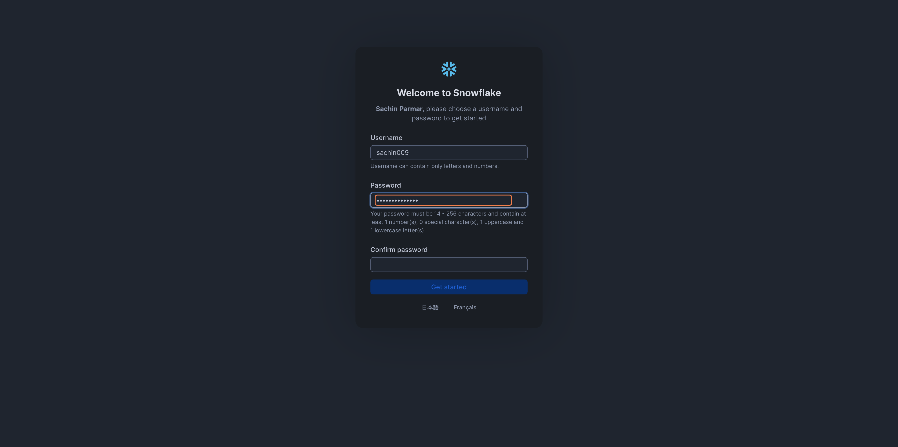

---

## Step 9: Go to Workspace

Once logged in to Snowflake:

1. In the left sidebar, click **"Projects"**
2. Click **"Workspace"** → then click **"My Workspace"**

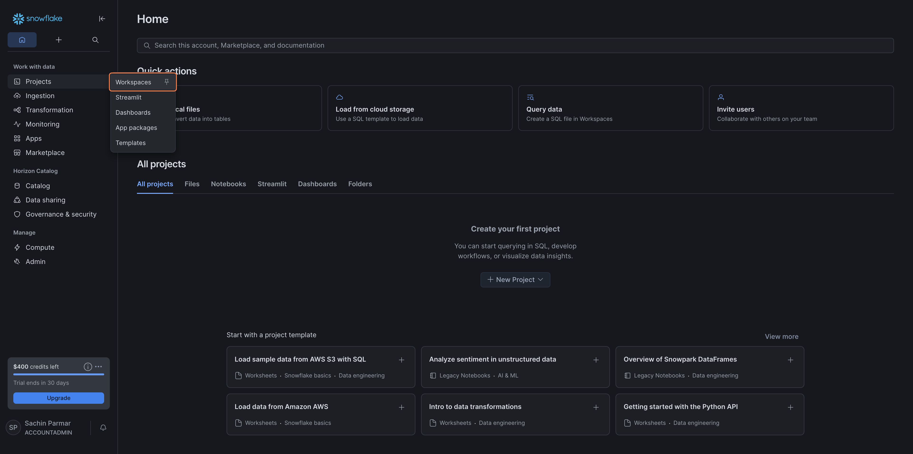

---

## Step 10: Create a SQL File and Name It `main.sql`

Inside your workspace:

1. Click **"Add new"**
2. Select **"SQL file"**
3. Rename the file to **`main.sql`**

This opens the code editor where you will write and run SQL.

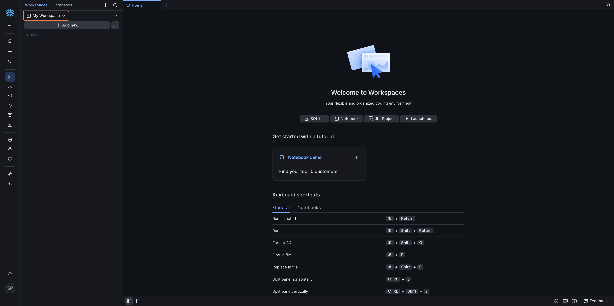

---

## Step 11: Paste the SQL Query into the Editor

Copy the SQL query below and paste it into the `main.sql` code editor:

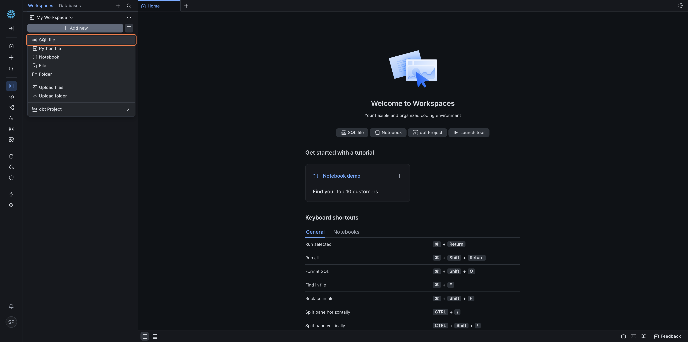

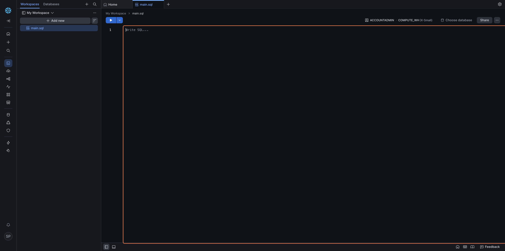

```sql
USE ROLE ACCOUNTADMIN;

CREATE DATABASE IF NOT EXISTS CONTRACT_DB;

USE DATABASE CONTRACT_DB;

CREATE SCHEMA IF NOT EXISTS PUBLIC;

USE SCHEMA PUBLIC;

CREATE OR REPLACE TABLE CONTRACT_DB.PUBLIC.CONTRACT_RISKS (
  risk_id VARCHAR(10),
  contract_type VARCHAR(20),
  clause_name VARCHAR(100),
  risk_level VARCHAR(10),
  risk_description VARCHAR(500),
  past_occurrences INT,
  financial_impact VARCHAR(200),
  recommended_action VARCHAR(300),
  flagged_by VARCHAR(50),
  created_at TIMESTAMP DEFAULT CURRENT_TIMESTAMP
);

INSERT INTO CONTRACT_DB.PUBLIC.CONTRACT_RISKS VALUES
('R001','NDA','Confidentiality Period','High','NDA with no expiry creates indefinite liability. Seen in 18 past contracts.',18,'Legal cost risk above $50,000','Add a 3 to 5 year sunset clause','Legal Team',CURRENT_TIMESTAMP),
('R002','NDA','Scope of Confidential Info','Medium','Overly broad definition restricts normal business operations.',12,'Operational risk','Narrow scope to specific categories only','Legal Team',CURRENT_TIMESTAMP),
('R003','NDA','Governing Law','Low','Governing law set to foreign jurisdiction adds legal cost.',6,'$10,000 to $30,000 if dispute arises','Negotiate to home state jurisdiction','Legal Team',CURRENT_TIMESTAMP),
('R004','MSA','Liability Cap','High','Uncapped liability. In 3 past MSAs claims exceeded contract value by 4x.',9,'Exposure exceeding $200,000','Negotiate cap to 2x total contract value','Finance',CURRENT_TIMESTAMP),
('R005','MSA','Payment Terms','Medium','Net-60 terms requested. Company standard is Net-30.',7,'Cash flow delay of 30 days','Counter-propose Net-30 or early payment discount','Finance',CURRENT_TIMESTAMP),
('R006','MSA','Auto-Renewal','Medium','Auto-renewal without opt-out window. 5 MSAs unintentionally renewed.',5,'$200,000 in unintended renewal costs','Add 60 day opt-out notice window','Legal Team',CURRENT_TIMESTAMP),
('R007','MSA','IP Ownership','High','Vendor claiming ownership of all work product.',6,'Loss of product IP — critical','Insist on work-for-hire clause','Legal Team',CURRENT_TIMESTAMP),
('R008','Lease','Escalation Clause','Medium','Annual rent escalation 8% above CPI. Market standard is 3-5%.',4,'Overpayment $15,000 to $40,000 over 3 years','Negotiate cap at CPI plus 2 percent','Finance',CURRENT_TIMESTAMP),
('R009','Lease','Early Exit Penalty','High','Penalty for early exit is 6 months rent.',2,'$180,000 recorded loss across 2 leases','Negotiate down to 2 months or add break clause','Finance',CURRENT_TIMESTAMP),
('R010','Lease','Maintenance Responsibility','Low','All maintenance including structural assigned to tenant.',3,'$5,000 to $20,000 unexpected cost per year','Push back — structural should be landlord responsibility','Operations',CURRENT_TIMESTAMP);

SELECT * FROM CONTRACT_DB.PUBLIC.CONTRACT_RISKS;
```

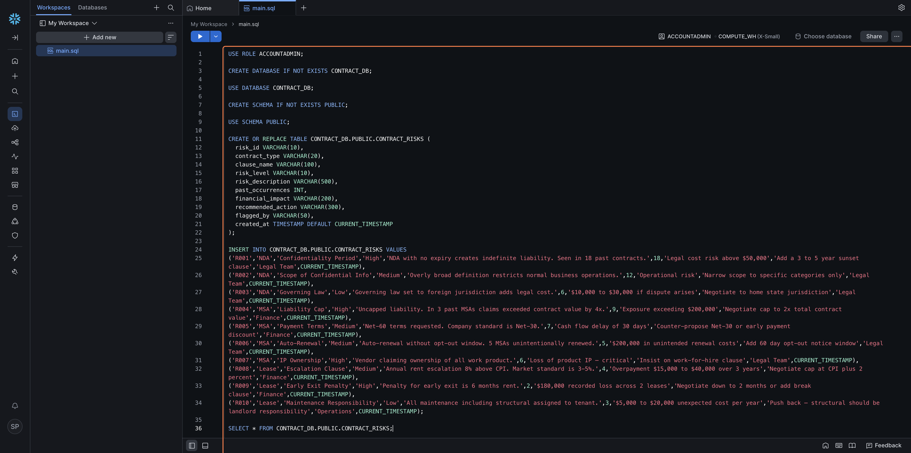

---

## Step 12: Run All the SQL

1. Click the **"Run"** dropdown button at the top of the editor

!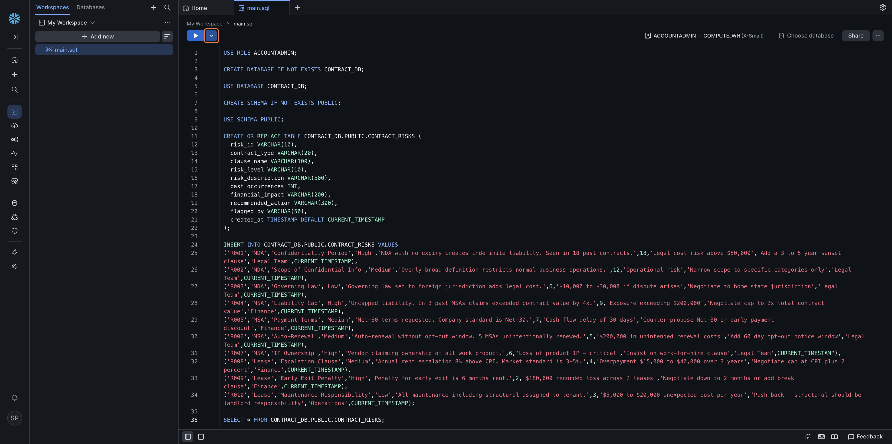

2. Select **"Run All"**

Snowflake will execute all the statements — creating the database, table, and inserting the dummy data.

!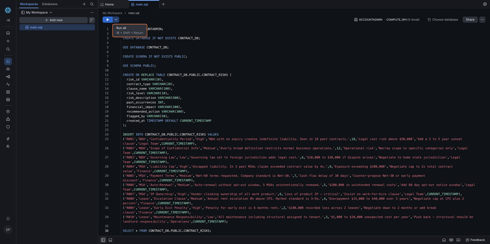

---

## Step 13: Confirm the Database and Data Was Created

After running, you will see success messages in the results panel at the bottom confirming:


!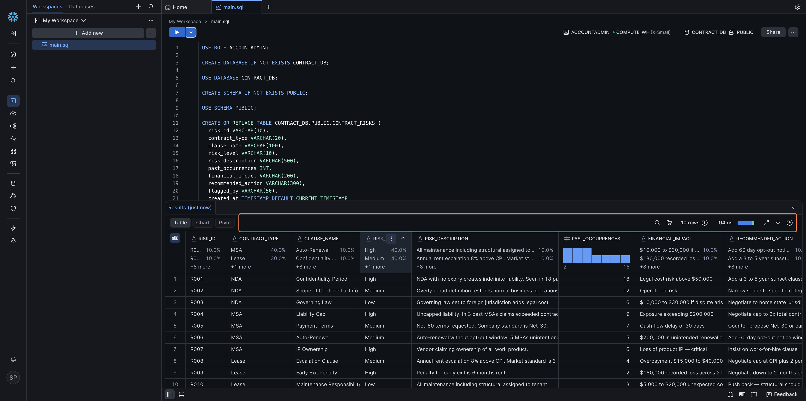

---

## Step 14: Open the Database Explorer

In the left sidebar, click **"Database Explorer"** (or the database icon) to browse your Snowflake objects.

!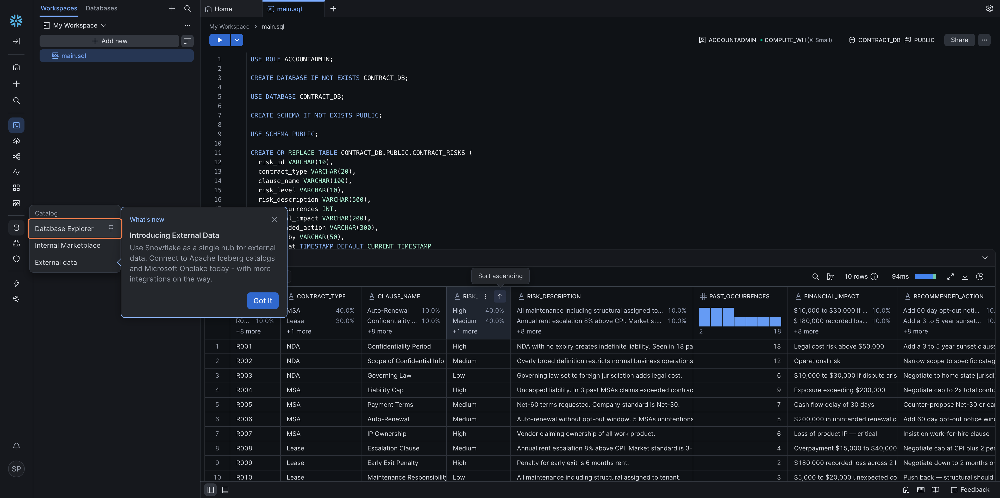

---

## Step 15: Navigate to the CONTRACT_RISKS Table

Inside the Database Explorer, drill down through the following path:

**CONTRACT_DB → PUBLIC → Tables → CONTRACT_RISKS**

Click on **CONTRACT_RISKS** to select it.

!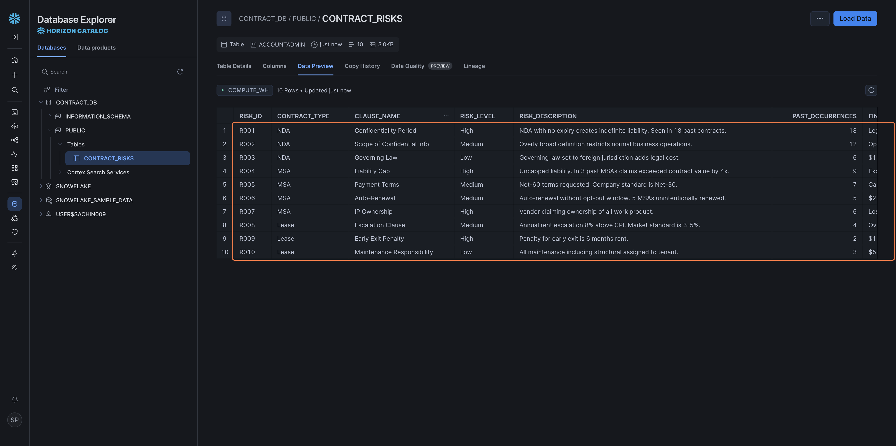

---

## Step 16: Click "Data Preview" to View Your Data

With `CONTRACT_RISKS` selected, click the **"Data Preview"** tab.

You will see the 10 rows of dummy contract risk data inserted in Step 12.

!

---

## Step 17: Click on Your Profile

Click your **profile initials** (e.g. `SP`) in the **bottom-left corner** of the screen to open the profile menu.

!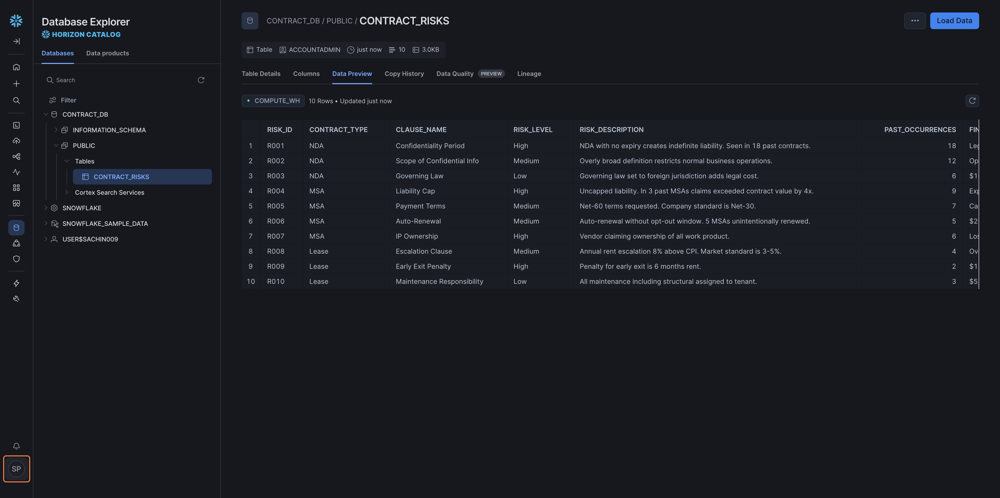

---

## Step 18: Click "Connect a Tool to Snowflake"

In the profile menu, click **"Connect a tool to Snowflake"**.

This opens the connection configuration panel.

!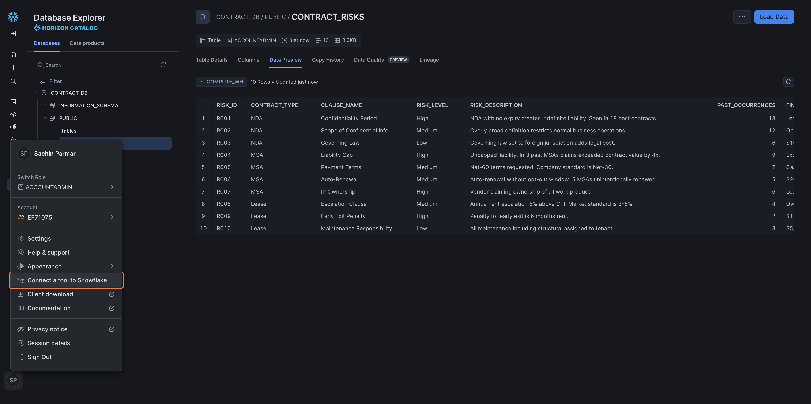

---

## Step 19: Select "Config File"

In the connection panel, click on **"Config File"** as the connection method.

!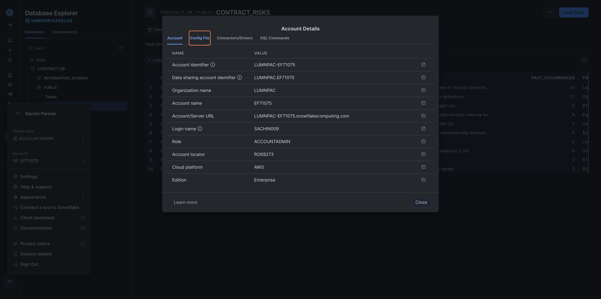

---

## Step 20: Set the Warehouse

At the top of the config panel:

1. Click the **"Warehouse"** dropdown
2. Select **`COMPUTE_WH`**

!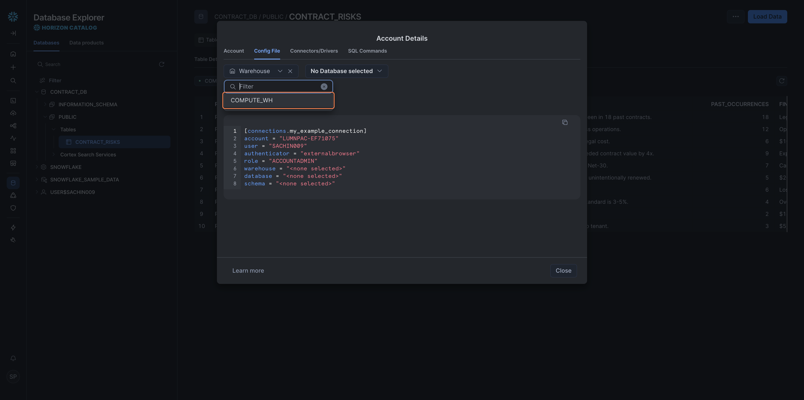

---

## Step 21: Select the Database and Schema

1. Click **"No Database selected"**
2. Select **`CONTRACT_DB`**
3. Then select **`PUBLIC`** as the schema

!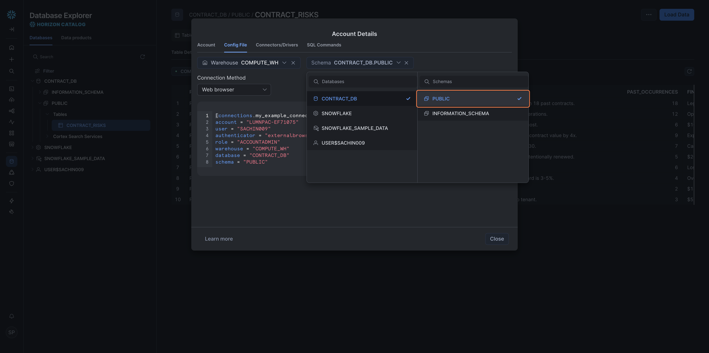

---

## Step 22: Change the Connection Method to Password

1. Find the **"Connection Method"** option
2. Change it from the default to **"Password"**

!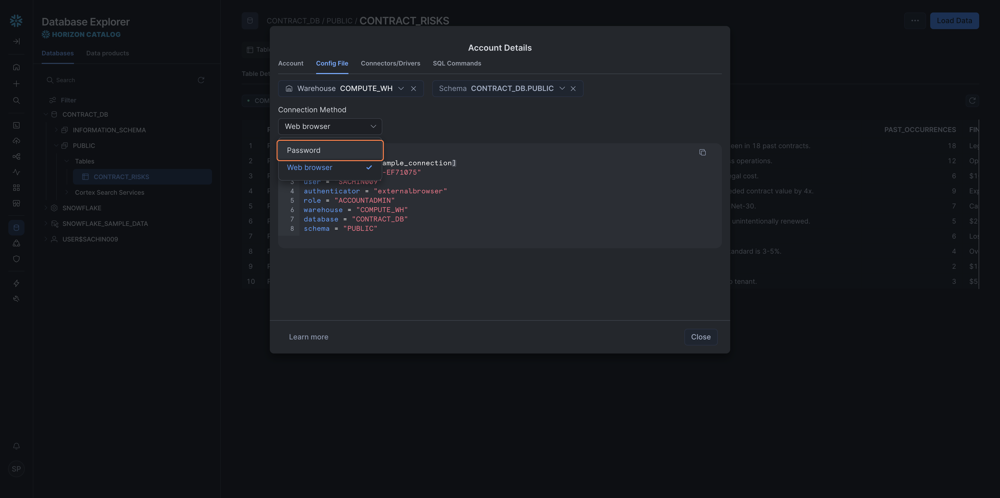

---

## Step 23: Copy and Save the Config File

Click **"Copy"** to copy the generated config file contents.

**Paste and save this somewhere safe** (a text file, notes app, or password manager) — you will need this config when setting up the **n8n integration** in a later lesson.

The config will look something like this:

```toml
[connections.my_example_connection]
account   = "your-account-identifier"
user      = "your-username"
password  = "your-password"
warehouse = "COMPUTE_WH"
database  = "CONTRACT_DB"
schema    = "PUBLIC"
```
!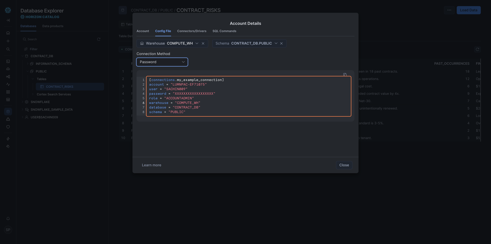

---

## Summary

| Step | What You Did |
|---|---|
| Sign up | Created a Snowflake trial account |
| Activate | Verified email and set credentials |
| Workspace | Created `main.sql` in your workspace |
| SQL | Pasted and ran SQL to create `CONTRACT_DB` and `CONTRACT_RISKS` |
| Explore | Browsed the table and previewed data |
| Config | Generated and saved the Snowflake config file for n8n |

Your Snowflake account is set up and your config file is ready — you will use it in the **n8n setup lesson**.

