# Supabase Setup & SQL Execution

## Overview

In this lesson you will create a free Supabase project, run SQL to set up your database, and collect the API credentials needed for connecting Supabase to external tools like n8n.

By the end of this module you will:

- Have an active Supabase project with a live PostgreSQL database
- Know how to run SQL in the Supabase SQL editor
- Have your **Service Role Key** and **Supabase URL** saved for the n8n setup

---

## What is Supabase?

**Supabase** is an open-source Firebase alternative built on top of PostgreSQL. It gives you a hosted database, instant REST and GraphQL APIs, authentication, storage, and realtime subscriptions — all in one platform.

| Feature | What It Means |
|---|---|
| PostgreSQL | Full relational database — standard SQL |
| Auto-generated API | REST and GraphQL APIs built from your tables automatically |
| Row Level Security | Fine-grained access control per row |
| Free tier | Generous free plan — no credit card required |

---

## Step 1: Go to Supabase and Click "Start Your Project"

1. Open your browser and go to [https://supabase.com/](https://supabase.com/)
2. Click **"Start your project"**


---

## Step 2: Sign Up

Create a Supabase account:

- Sign up with **GitHub** (recommended — fastest), or
- Use your **email address**

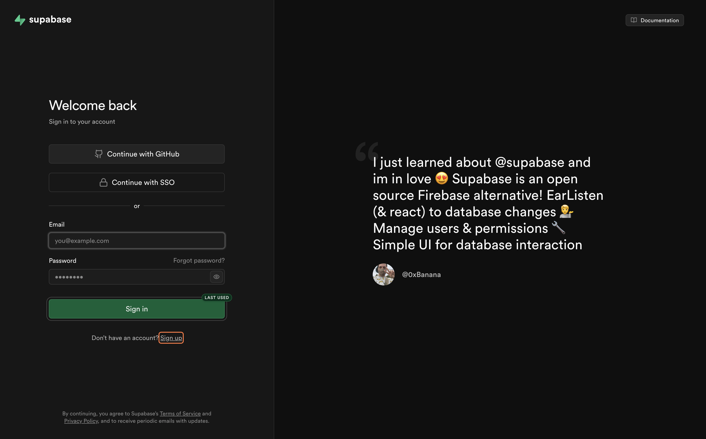

---

## Step 3: Create a New Organization

After signing in, Supabase will prompt you to create an organization:

1. Enter a name for your organization (e.g. your name or team name)
2. Select the **Free** plan
3. Click **"Create organization"**


---

## Step 4: Create a New Project

Inside your organization:

1. Click **"New project"**
2. Enter a **Project Name** (e.g. `contract-risk-db`)
3. Set a strong **Database Password** — save this somewhere safe
4. Choose the **Region** closest to you
5. Click **"Create new project"**

> Wait 1–2 minutes while Supabase provisions your database.


---

## Step 5: Open the SQL Editor

Once your project is ready:

1. In the left sidebar, click **"SQL Editor"**

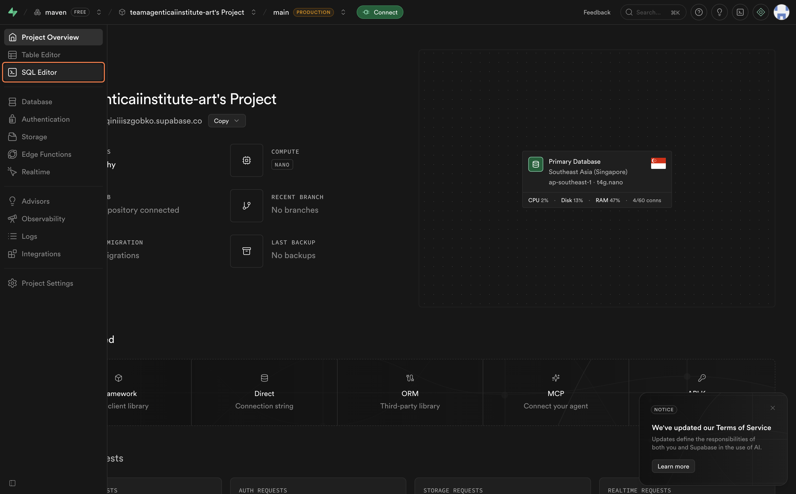

---

## Step 6: Paste and Run the SQL Query

Click inside the editor, paste the full SQL query below, then run it:

```sql
CREATE TABLE IF NOT EXISTS contract_risks (
  risk_id VARCHAR(10),
  contract_type VARCHAR(20),
  clause_name VARCHAR(100),
  risk_level VARCHAR(10),
  risk_description TEXT,
  past_occurrences INT,
  financial_impact TEXT,
  recommended_action TEXT,
  flagged_by VARCHAR(50),
  created_at TIMESTAMP DEFAULT NOW()
);

INSERT INTO contract_risks VALUES
('R001','NDA','Confidentiality Period','High','NDA with no expiry creates indefinite liability. Seen in 18 past contracts.',18,'Legal cost risk above $50,000','Add a 3 to 5 year sunset clause','Legal Team',NOW()),
('R002','NDA','Scope of Confidential Info','Medium','Overly broad definition restricts normal business operations.',12,'Operational risk','Narrow scope to specific categories only','Legal Team',NOW()),
('R003','NDA','Governing Law','Low','Governing law set to foreign jurisdiction adds legal cost.',6,'$10,000 to $30,000 if dispute arises','Negotiate to home state jurisdiction','Legal Team',NOW()),
('R004','MSA','Liability Cap','High','Uncapped liability. In 3 past MSAs claims exceeded contract value by 4x.',9,'Exposure exceeding $200,000','Negotiate cap to 2x total contract value','Finance',NOW()),
('R005','MSA','Payment Terms','Medium','Net-60 terms requested. Company standard is Net-30.',7,'Cash flow delay of 30 days','Counter-propose Net-30 or early payment discount','Finance',NOW()),
('R006','MSA','Auto-Renewal','Medium','Auto-renewal without opt-out window. 5 MSAs unintentionally renewed.',5,'$200,000 in unintended renewal costs','Add 60 day opt-out notice window','Legal Team',NOW()),
('R007','MSA','IP Ownership','High','Vendor claiming ownership of all work product.',6,'Loss of product IP — critical','Insist on work-for-hire clause','Legal Team',NOW()),
('R008','Lease','Escalation Clause','Medium','Annual rent escalation 8% above CPI. Market standard is 3-5%.',4,'Overpayment $15,000 to $40,000 over 3 years','Negotiate cap at CPI plus 2 percent','Finance',NOW()),
('R009','Lease','Early Exit Penalty','High','Penalty for early exit is 6 months rent.',2,'$180,000 recorded loss across 2 leases','Negotiate down to 2 months or add break clause','Finance',NOW()),
('R010','Lease','Maintenance Responsibility','Low','All maintenance including structural assigned to tenant.',3,'$5,000 to $20,000 unexpected cost per year','Push back — structural should be landlord responsibility','Operations',NOW());

SELECT * FROM contract_risks;
```

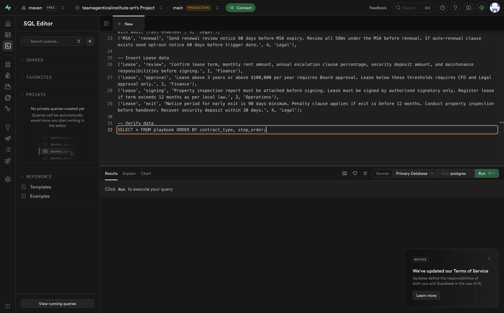

Click **"Run"** to execute. If prompted, click **"Run Without RLS"** — this bypasses Row Level Security so the insert succeeds during setup.

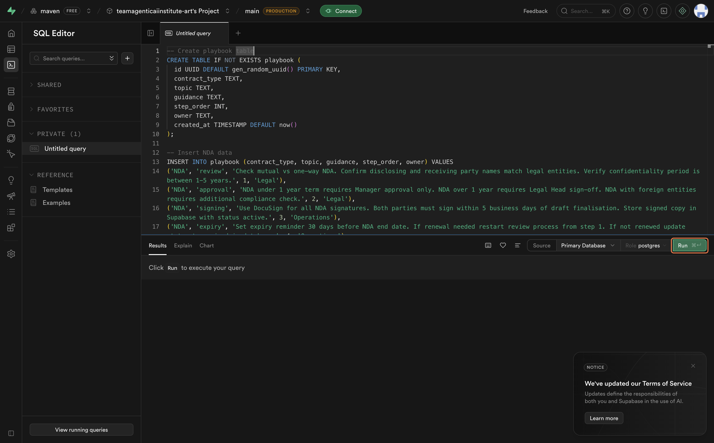

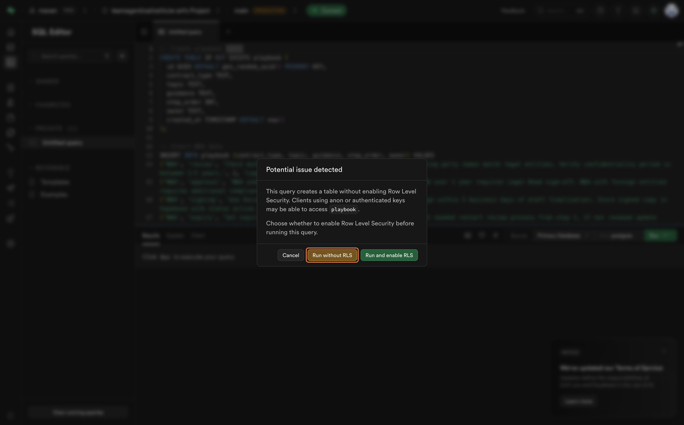


---

## Step 7: Verify Your Data in the Table Editor

Confirm the data was inserted correctly:

1. In the left sidebar, click **"Table Editor"**
2. Click on the **`contract_risks`** table
   
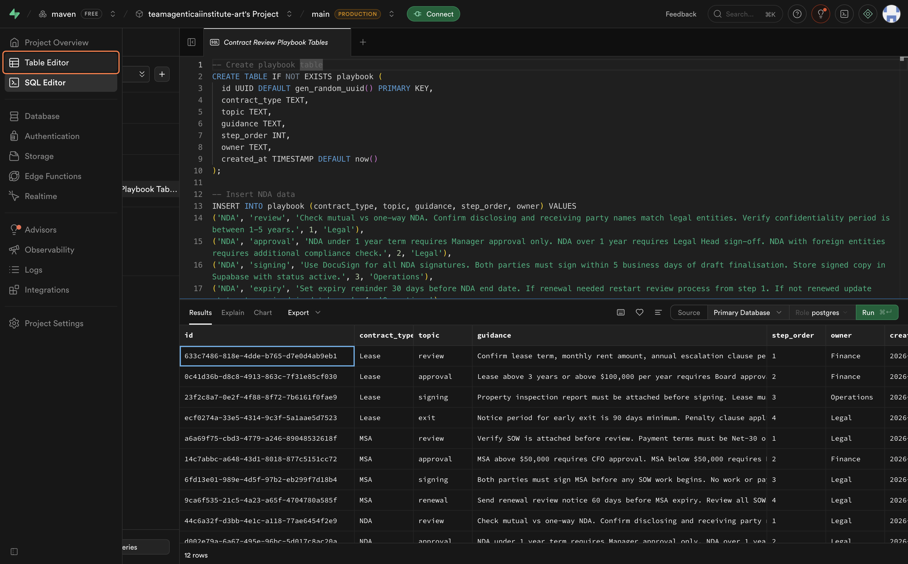

3. You should see all 10 rows of contract risk data

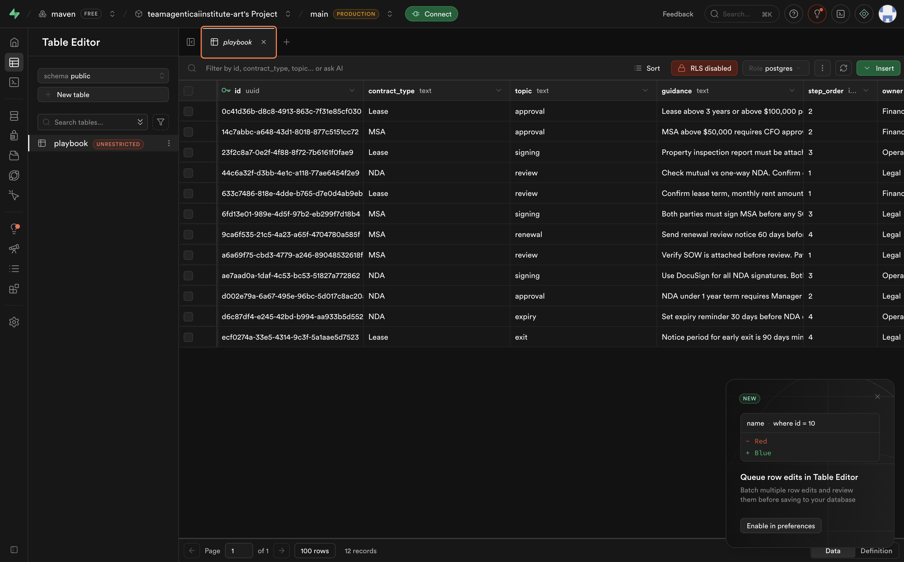

---

## Step 8: Go to Project Settings and Open API Keys

1. In the left sidebar, click **"Project Settings"** (gear icon at the bottom)

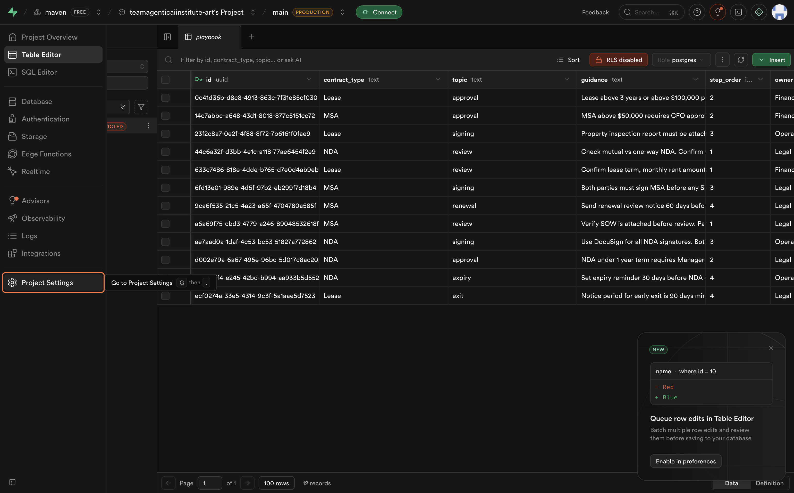

2. Click **"API"** in the settings menu
3. Scroll down to the **"Project API keys"** section

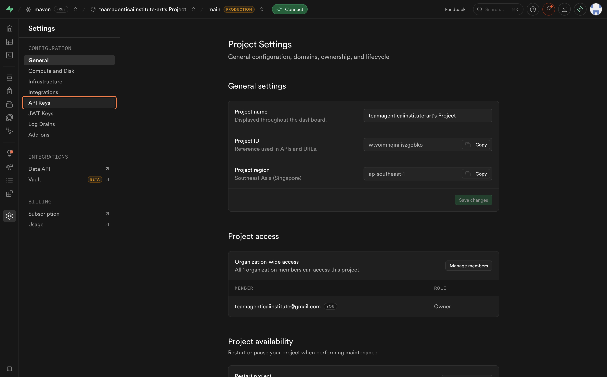


---

## Step 9: Copy the Service Role Secret Key

1. Find the **`service_role`** key (listed under *Legacy* or *Project API keys*)

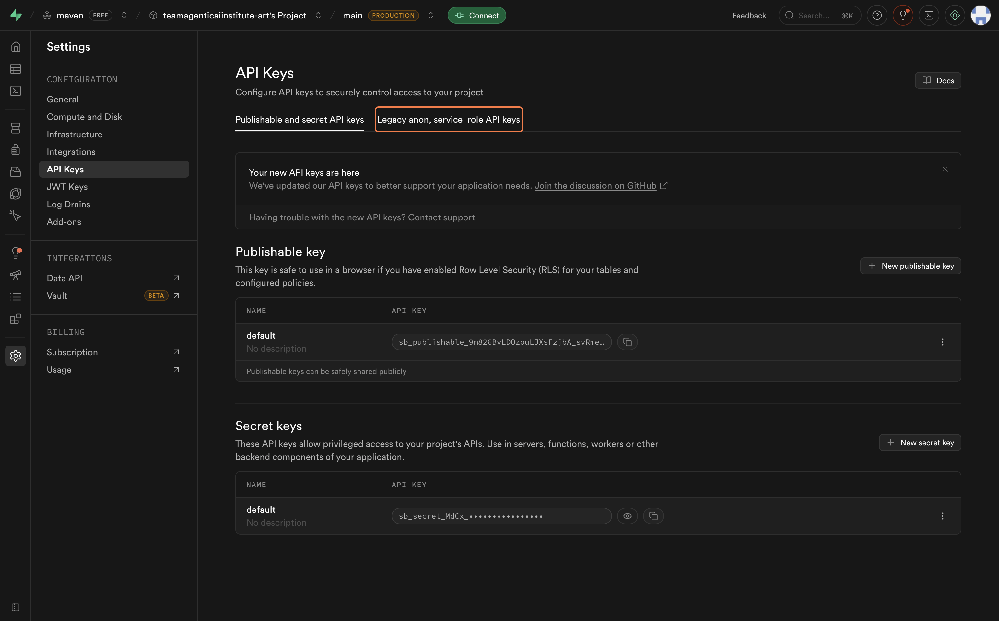

2. Click **"Copy"** next to the service role key

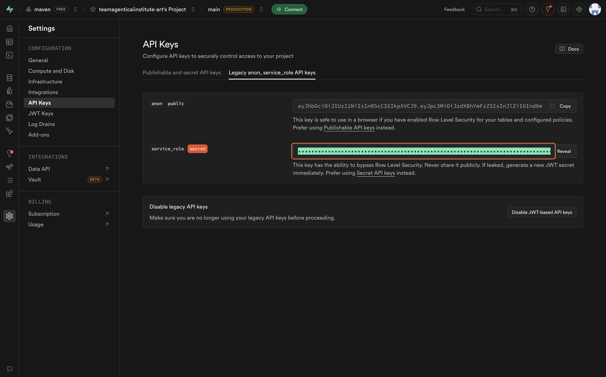

3. **Paste and save it somewhere safe** — you will need this for the n8n setup

> Never expose your `service_role` key in client-side code or public repositories. It has full database access.


---

## Step 10: Copy the Supabase Project URL

1. CLick on the Connect 

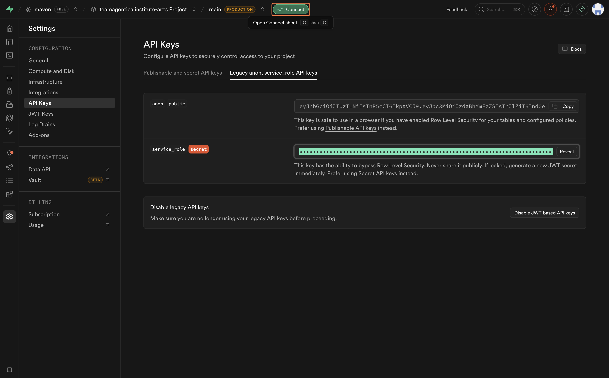

2. At the top of the page, find the **"Project URL"** section
3. Copy the URL — it looks like:

```
https://<your-project-ref>.supabase.co
```

**Save this URL alongside your service role key** — both are required for the n8n integration.

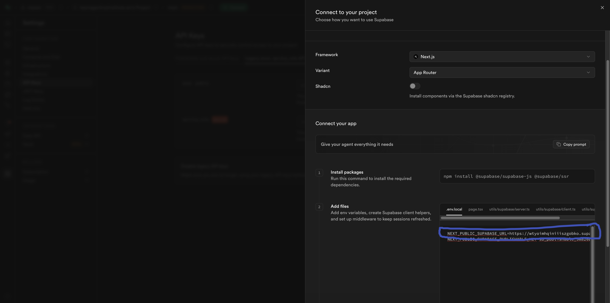

---

## Summary

| Step | What You Did |
|---|---|
| Sign up | Created a Supabase account and organization |
| Project | Created a new Supabase project with a PostgreSQL database |
| SQL | Ran SQL to create the `contract_risks` table and insert 10 rows |
| Verify | Confirmed data in the Table Editor |
| API Key | Copied the `service_role` secret key |
| URL | Copied the Supabase project URL |

Both the **Service Role Key** and **Project URL** are now saved — you will use them in the **n8n setup lesson**.

---

## Important Notes

### Keep Your Keys Safe

- The `service_role` key has **full database access** — treat it like a password
- Never commit it to Git or share it publicly
- Store it in a secure notes app or password manager

### Free Tier Limits

- Supabase free tier includes **500 MB database storage** and **2 GB bandwidth/month**
- Projects on the free tier **pause after 1 week of inactivity** — resume them from the dashboard if needed
