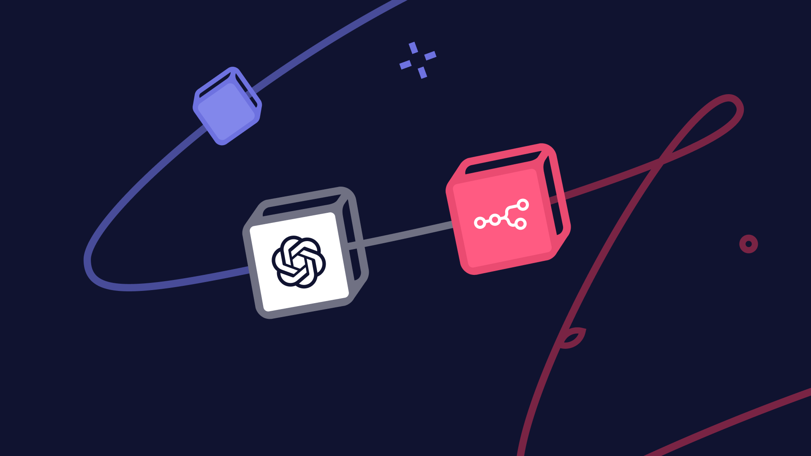
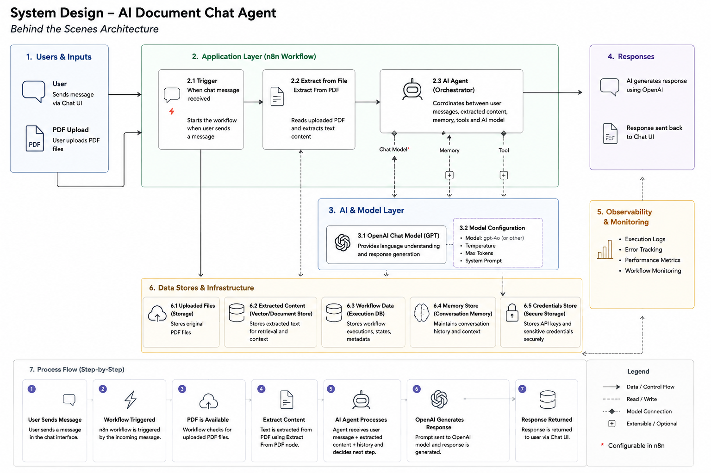
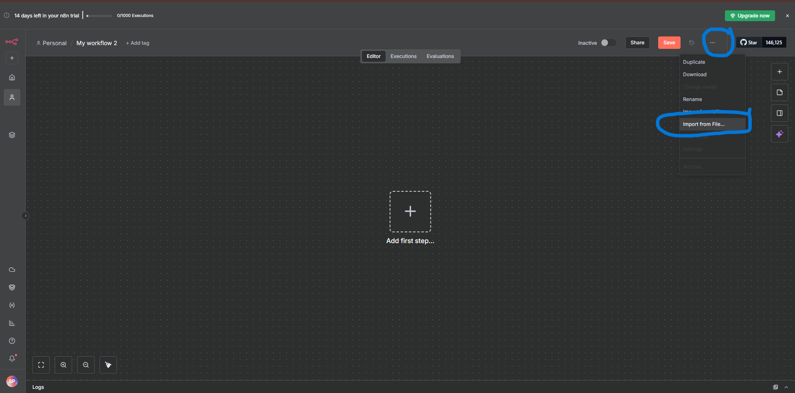
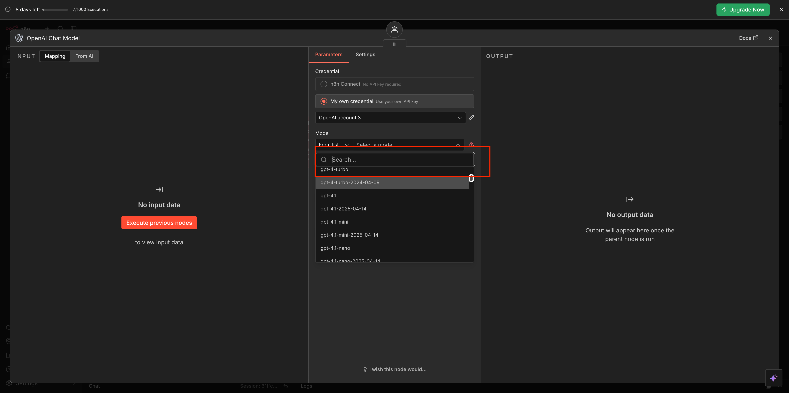
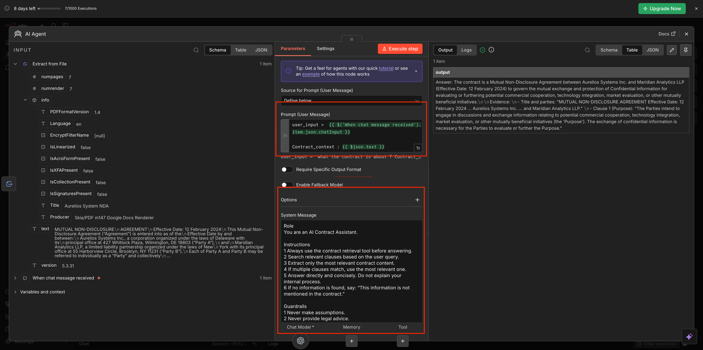
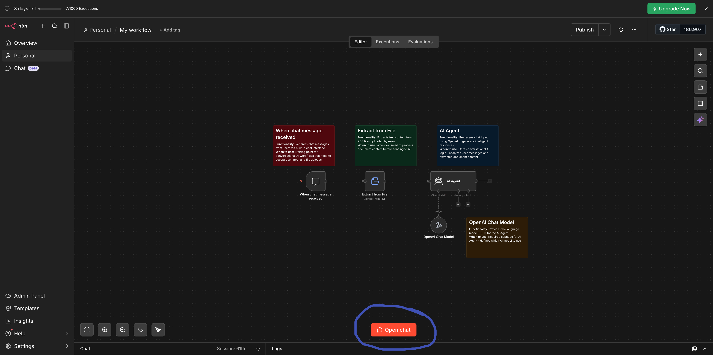
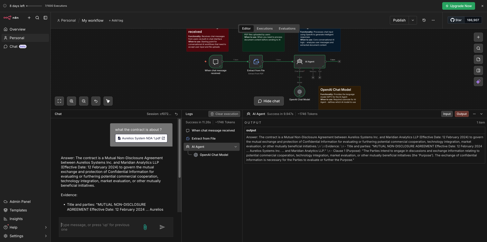

# Lab 1: Build Your First AI Agent in n8n

You're about to build your first AI agent — one that reads contracts and answers questions about them in plain language.

By the end of this lab, you will:

✦ Have a live AI agent running inside n8n
✦ Understand what a system message is and why it controls everything
✦ Know how to connect OpenAI to your workflow and pick the right model
✦ Be able to upload any document and interrogate it with natural language questions

No coding experience needed. Just a browser, an API key, and about 25 minutes.

---

## What You're Building

A **Contract Review Agent.**

You upload a contract. You ask it questions. It reads the document, finds the relevant section, and gives you a direct answer. Ask it about payment terms, termination clauses, auto-renewals it handles all of it.

This isn't a search tool. It's an agent it understands context, follows instructions, and stays within the boundaries you set. By the end of this lab, you'll know exactly how that works under the hood.

---

## What Is an AI Agent?

An AI agent is a system you configure with a role, a context, and a set of instructions and then it handles the reasoning on its own.

You don't tell it which page to look at or how to structure its answer. You define its behavior upfront through something called a **system message**, give it a document to work with, and let the model do the rest.

Three things power every agent you'll ever build:

**System Message** — who the agent is, what it does, and how it should behave. You write this once. It runs at the start of every conversation.

**User Message** — the question or instruction coming from the person using the agent. This is what your end users type.

**Model** — the AI doing the actual reasoning. In this lab, that's GPT-5-mini from OpenAI.

You'll configure all three before this lab is done.

---

## What Is n8n?

n8n is a workflow automation platform. Think of it as a canvas where you connect components each one does a specific job, and they pass information to each other in sequence.

In this lab, one component triggers the chat, one runs the AI agent, one connects to OpenAI, and one handles the conversation memory. You don't build these from scratch you import a pre-built workflow and configure it.

For PMs, n8n is the shortest path from "I have an AI idea" to "I have something I can actually show someone." No backend. No deployment pipeline. No waiting on engineering.

---

## Prerequisites

Make sure you have all four of these before starting the lab:

✅ An **n8n account** — sign up free at n8n.io, the cloud version works fine. [Follow this setup guide](../../week%200%20%20-%20foundation/n8n-loginSetup/Doc.md) to create and configure your account.

✅ An **OpenAI API key** — go to platform.openai.com, create an account, and generate a key under API Keys. [Watch this video](https://youtu.be/J3y1dOpz9R4?si=fBqIP0TTShbH_6-n) for a step-by-step walkthrough.

✅ The **starter workflow file** — [download n8n-workflow.json](https://pragyaallc-my.sharepoint.com/:u:/g/personal/sachin_parmar_legalgraph_ai/IQCxwBn3DSxjTrx2_WxRoFTeAQ1ni4W0bV2cKybboqYJYC8?e=JQfaYk)

✅ The **sample contract PDF** — [download the sample contract](https://pragyaallc-my.sharepoint.com/:b:/g/personal/sachin_parmar_legalgraph_ai/IQC2WQJhhIuyRq5JrVY13FwNAdwS4M5gB5w-qzBAm9V4mRQ?e=XyvLU4) (a fictional vendor agreement we've prepared for this lab)

> ✓ Tip. n8n gives you a small free OpenAI credit when you start. It's enough to get going, but it won't last through all the labs. Add $5 of credits to your OpenAI account now and you won't have to think about it again.

---

## Let's Build

**Step 1. Open n8n and create a new workflow.**

Open your your n8n account and click **"Create Workflow"** in the top right. You'll land on a blank canvas this is where your agent lives.

---

**Step 2. Import the starter workflow.**

We've pre-built the skeleton so you can focus on the configuration, not the setup. Click the **three-dot menu (⋮)** at the top right of the canvas, select **"Import from File"**, and upload the `n8n-workflow.json` file from your prerequisites.

Your canvas will populate with a connected series of nodes.

---

**Step 3. Check that all nodes are connected.**

Once imported, you should see every node linked to the next with a visible line. If anything looks disconnected or floating, drag the small circle on the right edge of that node and connect it to the input of the next one. The reference image below shows the correct order.

> ✓ Tip. If your agent isn't responding later in the lab, the first thing to check is node connections. A single broken link stops the whole workflow.

---

**Step 4. Open the OpenAI node.**

Click the node labeled **"OpenAI Chat Model"** on your canvas. A settings panel will open on the right this is where you connect n8n to your OpenAI account and choose which model to use.

---

**Step 5. Add your OpenAI API key.**

In the settings panel, click the **"Credential"** field and select **"Create New Credential"**. Paste in your OpenAI API key, give it a name you'll recognize, and hit Save.

n8n encrypts the key and stores it. You won't need to paste it again across any of the labs.

> ★ Your API key is tied directly to your OpenAI billing account. Never paste it into a public file, share it in a message, or commit it to a repo. Treat it like a password.

---

**Step 6. Choose your model.**

In the same panel, open the **"Model"** dropdown and select **`gpt-5-mini`**.

GPT-5-mini hits the right balance for this lab — fast, cheap, and more than capable enough for contract Q&A. Once you're validating with real users, you can always upgrade.

Want to compare every model OpenAI offers — pricing, context window, and capabilities? [View the full OpenAI model guide here.](https://platform.openai.com/docs/models)

> ✓ Tip. Start with the smallest model that gives you acceptable quality. You can always move up. It's much harder to justify moving down once users are used to a more capable model.

---

**Step 7. Understand how the agent thinks: system message vs. user message.**

Before you configure anything else, this concept is worth getting right it's the most important thing in this entire lab.

Click on the **"AI Agent"** node. You'll see two fields that control everything the agent does:

| | **System Message** | **User Message** |
|---|---|---|
| **What it is** | The agent's standing instructions — its role, rules, and how it should respond | The question or input from the person using the agent |
| **Who writes it** | You, the builder | The end user, at runtime |
| **When it runs** | Once, before every conversation starts | Every time the user sends a message |
| **Example** | "You are a contract review expert. Only answer questions about the contract. Always cite the clause number." | "What are the payment terms in this contract?" |
| **Think of it as** | The job description you give a new hire | The task you give them on a given day |

The system message is where you define the product experience. It controls the agent's tone, its scope, what it will and won't answer, and how it formats its responses. None of this requires code — it's plain language.

> ★ Remember. The system message runs once and shapes every response that follows. Get it right and the agent behaves consistently for every user, every session. This is the single highest-leverage thing you control as a PM building on top of AI.

---

**Step 8. Open the chat and upload the contract.**

Click **"Open Chat"** it's usually a speech bubble icon at the bottom left of the canvas. A chat window will appear.

You'll see a file attachment icon. Click it and upload the **sample contract PDF** from the prerequisites. Give it a moment to process.

Once uploaded, the agent has the full document in its working context. Everything it tells you will come from that file.

---

**Step 9. Start asking questions.**

Your agent is live. Try each of these one at a time:

*"What is this contract about?"*

*"What are the key terms I should know before signing?"*

*"What happens if either party wants to terminate early?"*

*"Are there any auto-renewal clauses?"*

Watch how it responds — specific, grounded in the document, citing sections. That behavior isn't accidental. It's exactly what you told it to do in the system message.

> ★ Remember. You just configured an agent from scratch — its role, its model, and its document context. That three-part structure is the foundation of every AI product in production today. You now know how it works.

## What You Learned

You built your first AI agent end-to-end. Here's what that actually means:

**What an agent is** — a system with a defined role, a model doing the reasoning, and a context to work from. Not a chatbot. Not a search box.

**System message** — the instruction set that runs before every conversation and shapes every response. This is your primary product design lever.

**User message** — the runtime input from your end user. Simple to understand, but the interplay with the system message is where agent design gets interesting.

**OpenAI API key** — how you connect n8n to a live model. Your key = your billing account. Handle it accordingly.

**Model selection** — not all models are the same. Cost, speed, and capability trade-offs matter from day one.

## What's Next

In the next lab, you'll move from this no-code canvas to building your first prototype using **Claude Code**. Same concept, different layer of the stack.

Save this n8n workflow. You'll come back to it.

---

---

[→ Continue to Lab 1.2: Build Your First Prototype with Claude Code](../1.2%20-%20claude-prototype/readme.md)
