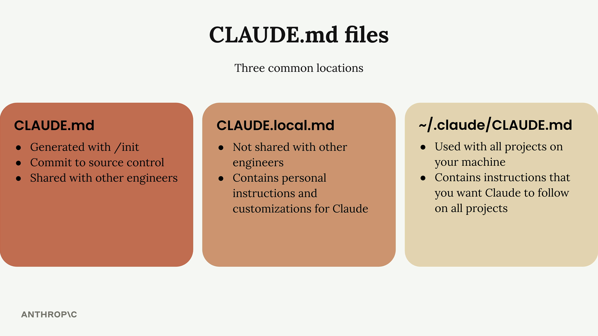
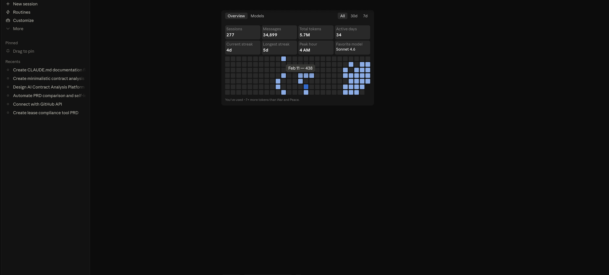
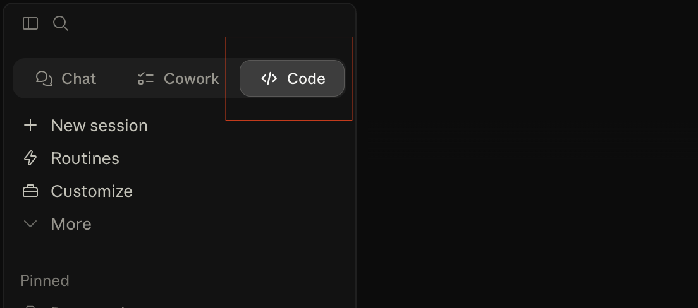
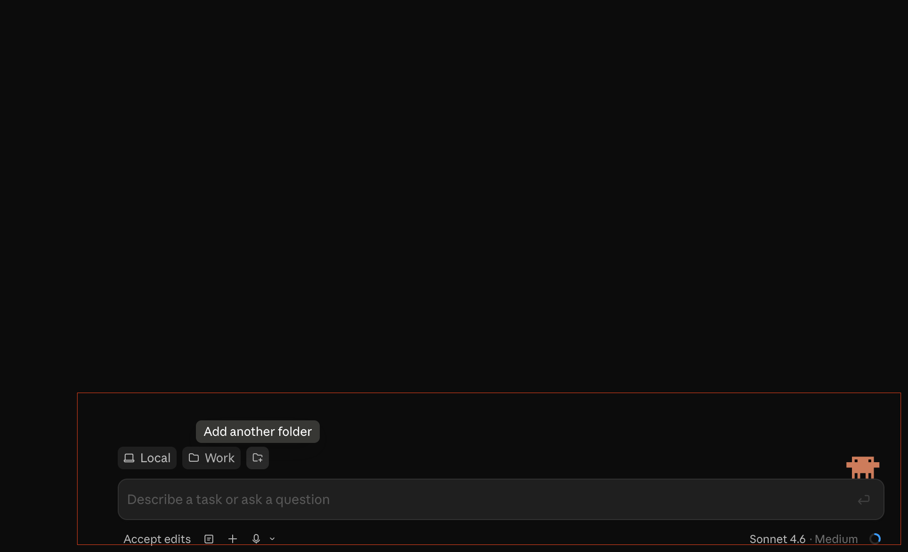
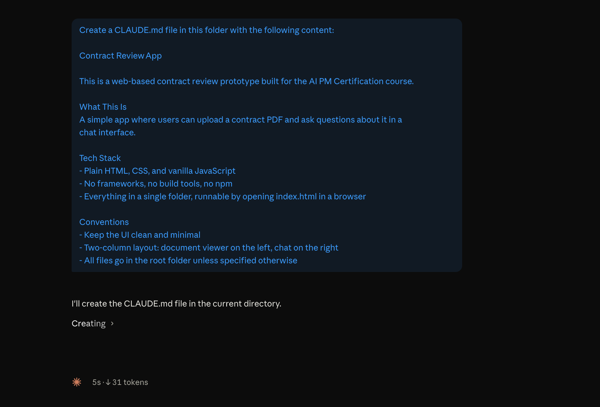
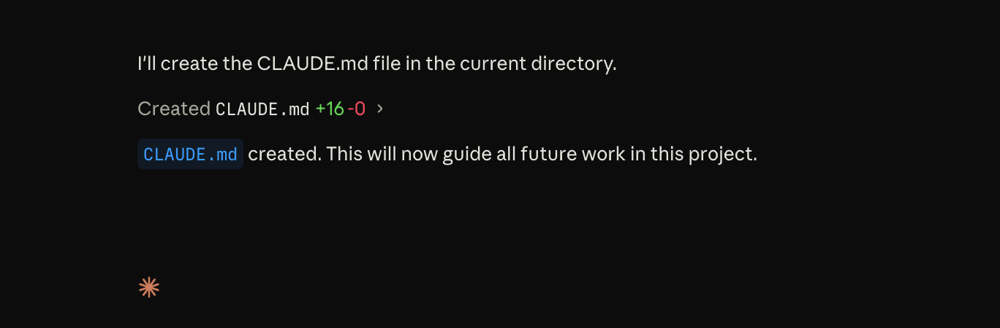
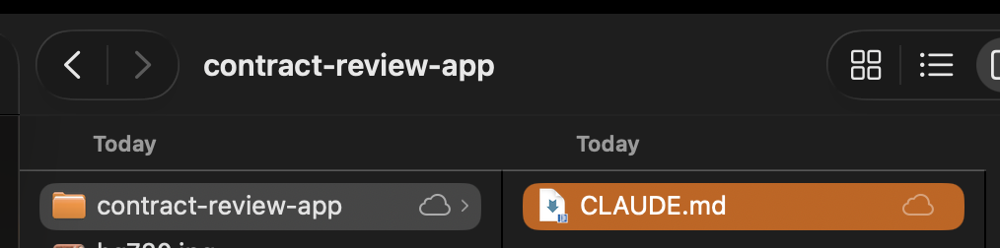
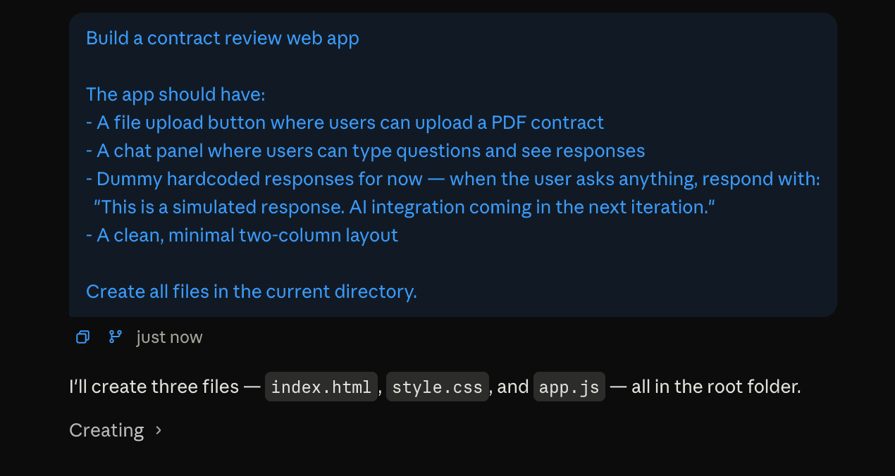
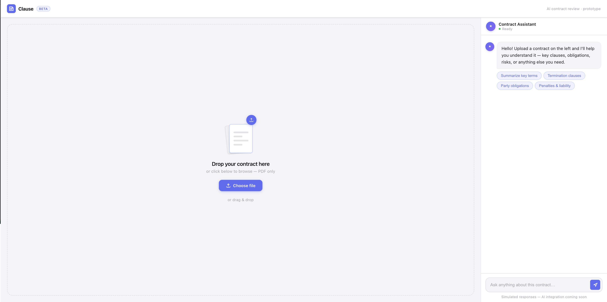
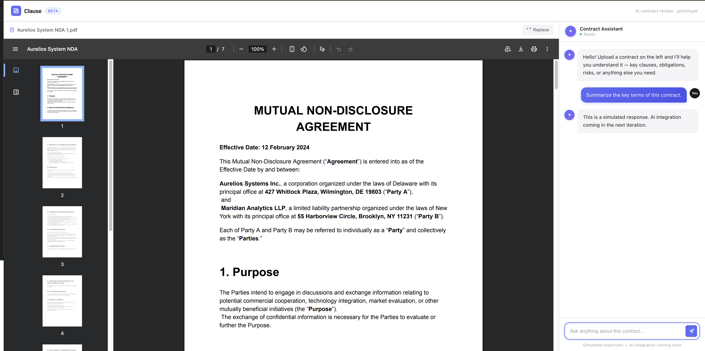

# Lab 1.2: Build Your First Prototype with Claude Code


You just built an agent in n8n. Now you're going to build an actual web app — using Claude Code to write the code for you.

By the end of this lab, you will:

✦ Know the difference between Claude Chat, Claude Cowork, and Claude Code
✦ Understand what CLAUDE.md is and how to use it
✦ Have a working contract review web app, built in two iterations
✦ Know how to go from a prompt to a testable prototype in one session

No coding experience needed. Just the Claude app and about 25 minutes.

---

## Before We Build: Understanding Claude

Claude isn't one thing. There are three modes, built for three different kinds of work. Most people discover Chat, stay there, and wonder why it feels limited. The modes aren't different interfaces to the same thing — they are different capabilities.

The simplest way to think about it:


**Chat = Think. Cowork = Do. Code = Build.**

**Claude Chat** is the conversation interface. You ask, it answers, you iterate. No file access, no autonomy, no actions taken on your behalf. That constraint is actually useful — it keeps the interaction at the reasoning level. Great for research, brainstorming, and thinking through a problem before you touch anything. The trap is staying here too long. If you're copy-pasting file contents into the chat window or manually applying Claude's suggestions yourself, you've outgrown it.

**Claude Cowork** is the doing mode. Describe a task and it plans the work, executes it autonomously, and delivers real files to your folder — Word docs, slide decks, PDFs, spreadsheets you can open immediately. It runs inside a sandboxed VM on your machine, so it can't accidentally touch anything outside the folder you share with it. It connects to Gmail, GitHub, Slack, and Google Drive without any setup. It has Computer Use, meaning it can see your screen and click things. Non-technical users who don't want a terminal should start here. One thing to know: you won't see every step it takes. It shows you a high-level plan, not every command. If you need full visibility into what's happening, that's Code.

**Claude Code** is the terminal-based mode with direct access to your file system — no VM, no sandbox. It reads and writes your actual files, runs your tests, knows your git branch, creates commits, and sees errors in real time. It's transparent: every action is visible, every decision is traceable. Token-efficient too, since there's no VM overhead. The tradeoff is that fewer guardrails means more attention required, especially early on. This is where builders work.

This lab uses Claude Code.

> ✓ Tip. A good decision rule: does this involve code or files? Go to Code. Is it a recurring task you want automated — a weekly report, a document, a data pull? Go to Cowork. Are you still figuring out what you want to build? Start in Chat.

---

## What Is CLAUDE.md?

When Claude Code opens a project folder, the first thing it does is look for a file called `CLAUDE.md`. If it finds one, it reads it before doing anything else.

This file is how you brief Claude on your project. You put things in it like what the project does, what tech stack to use, and any conventions you want followed. Claude reads it at the start of every session, so it never walks in without context.

Think of it like onboarding a contractor. Except instead of a 30-minute intro call, you write it down once — and they read it every single time they show up.



### Three Types of CLAUDE.md

Claude recognizes three different CLAUDE.md files, placed in different locations:

| File | Location | Shared with team? | What it's for |
|---|---|---|---|
| `CLAUDE.md` | Project root | ✅ Yes — committed to git | Project-wide instructions for everyone. Generated with `/init`. |
| `CLAUDE.local.md` | Project root | ❌ No — in `.gitignore` | Your personal preferences and customizations. Stays off the shared repo. |
| `CLAUDE.md` | `~/.claude/` home directory | ❌ No — your machine only | Global instructions that apply across every project you work on. |

In this course we'll use two: `CLAUDE.md` for the shared project context and `CLAUDE.local.md` for your personal setup. That's enough to cover both collaboration and individual preference without overcomplicating things.

> ★ Remember. Without a CLAUDE.md, Claude starts every session cold. With one, it always knows what you're building, how you like to work, and what rules to follow.

---

## What You're Building

A **Contract Review Web App** 

**Iteration 1** gets the structure right. Upload button, chat panel, simulated responses. Nothing connected to a real AI yet just the shell working correctly.

**Iteration 2** improves the experience. Better UI and a contract preview panel so users can read the document while they're asking questions about it.

---

## Prerequisites

✅ The **Claude desktop app** — [download here](https://claude.ai/download). New to Claude Code? [Follow this setup guide](../../week%200%20%20-%20foundation/lesson-1-claude-code-setup/Lesson1.0%20-%20Installation.md) to get it running on your machine in under 5 minutes.

✅ **Claude Code** — built into the Claude desktop app, no extra install needed

✅ The **sample contract PDF** from Lab 1.1 same file, use it again here. [Download it here](https://pragyaallc-my.sharepoint.com/:b:/g/personal/sachin_parmar_legalgraph_ai/IQC2WQJhhIuyRq5JrVY13FwNAdwS4M5gB5w-qzBAm9V4mRQ?e=XyvLU4) if you don't have it.

---

## Let's Build

**Step 1. Download and open the Claude desktop app.**

Go to claude.ai/download, install it for your OS, and sign in with your Claude account.



**Troubleshooting**
If the app doesn't open after install, try restarting your machine. If login fails, make sure you're using the same email linked to your Claude subscription.

---

**Step 2. Open Claude Code.**

Inside the Claude desktop app, find **Claude Code** in the sidebar. Click it.

You'll land in a terminal-style interface. This is Claude working inside your file system — not a chat window.



**Troubleshooting**
If you don't see Claude Code in the sidebar, make sure you're on the latest version of the Claude desktop app. Go to the app menu → Check for Updates.

---

**Step 3. Create a project folder and navigate to it.**

Create a new folder on your Desktop called `contract-review-app`. Then in Claude Code, add that folder to the workspace using the folder picker or by typing:


Everything Claude builds will land in this folder.



**Troubleshooting**
If Claude says it can't access the folder, make sure you've granted the Claude desktop app permission to access your Desktop. On Mac: System Settings → Privacy & Security → Files and Folders.

---

**Step 4. Create your CLAUDE.md file.**

Before writing a single line of the app, give Claude its briefing. Run this prompt in Claude Code:

```
Create a CLAUDE.md file in this folder with the following content:

Contract Review App

This is a web-based contract review prototype built for the AI PM Certification course.

What This Is
A simple app where users can upload a contract PDF and ask questions about it in a chat interface.

Tech Stack
- Plain HTML, CSS, and vanilla JavaScript
- No frameworks, no build tools, no npm
- Everything in a single folder, runnable by opening index.html in a browser

Conventions
- Keep the UI clean and minimal
- Two-column layout: document viewer on the left, chat on the right
- All files go in the root folder unless specified otherwise
```

Once Claude creates it, open the file and read it. This is now your project's source of truth.



You should now see the `CLAUDE.md` file sitting in your project folder.





> ✓ Tip. Come back and update CLAUDE.md whenever your project changes direction. Claude reads it fresh every session — so whatever's in there is what it follows.

---

**Step 5. Run the Iteration 1 prompt.**

Now build the first version. Copy this prompt and run it in Claude Code:

```
Build a contract review web app and design using your design skills.

The app should have:
- A file upload button where users can upload a PDF contract
- A chat panel where users can type questions and see responses
- Dummy hardcoded responses for now — when the user asks anything, respond with:
  "This is a simulated response. AI integration coming in the next iteration."
- A clean, minimal two-column layout

Create all files in the current directory.
```

Claude will generate the files — usually `index.html`, `style.css`, and `script.js`. Watch what it produces.



> Note. The UI Claude generates may look different from the screenshots in this guide. Claude makes its own design decisions colors, fonts, and layout details will vary. That's expected. What matters is that the structure is correct: upload area and chat panel both present and working.

**Troubleshooting**
If Claude generates files but nothing appears in the folder, check you're in the right directory. Type `pwd` in Claude Code to confirm the path matches your `contract-review-app` folder.

---

**Step 6. Open the app and test Iteration 1.**

Go to your project folder and open `index.html` in your browser by double-clicking it.



Try each of these:

*Upload the sample contract PDF*

*Type: "What is this contract about?"*

*Type: "What are the payment terms?"*

You'll get the same dummy response every time. That's expected — the AI isn't connected yet. The point of Iteration 1 is to confirm the structure is solid before wiring up the intelligence. Shell first, intelligence second.

> ★ Remember. A prototype with dummy responses is still a prototype. You can show this to a stakeholder today, get feedback on the layout, and validate the concept — before writing a single line of AI logic.

**Troubleshooting**
If the page opens blank or broken, go back to Claude Code and describe exactly what you see — "the page loads but the upload button is missing" is enough for Claude to find and fix the issue in one message.

> ✓ Tip. If something looks off — layout breaks, a button doesn't respond, the chat won't scroll — describe it to Claude exactly as you see it. One message is usually all it takes.

---

**Step 7. Run the Iteration 2 prompt.**

Time to improve. This iteration has two goals: a better-looking UI and a contract preview so users can read the document while they chat.

Run this in Claude Code:

```
Improve the prototype with two changes:

1. UI polish — make the interface look more professional. Better spacing,
   typography, and visual hierarchy. It should feel like a real product.

2. Contract preview — when the user uploads a PDF, display the contract
   in the left panel so they can read it while chatting. The chat stays
   on the right. Both panels visible and scrollable at the same time.
```

When Claude finishes, refresh your browser.



> Note. The improved UI will look different from the screenshots here — and that's fine. Claude will make its own styling choices. What you're validating is that the contract appears on the left when uploaded and the chat remains functional on the right. The exact visual style is secondary at this stage.

**Troubleshooting**
If the contract doesn't appear after upload, describe it to Claude: "The PDF isn't showing in the left panel after I upload it. The chat still works but the preview is empty." Claude will identify whether it's a rendering or file-reading issue and fix it.

---

## What You Learned

**Claude Chat vs Claude Cowork vs Claude Code** — three tools, three jobs. Chat is for thinking, Cowork is for doing, Code is for building. Using the wrong one doesn't just slow you down — it caps what's possible.

**CLAUDE.md** — your project briefing. One file that keeps Claude consistent across every session. Write it once, update it as your project evolves.

**Iteration-first prototyping** — structure first, polish second, AI integration third. Trying to do all three at once is how prototypes stall.

**UI will vary** — Claude makes its own design decisions. Screenshots in this guide are references, not specs. What matters is the structure works, not that it looks identical to the examples.

**Prompt to prototype** — two prompts, a working web app. No boilerplate, no Stack Overflow, no engineering sprint. This is the new baseline for PMs who know how to use Claude Code.

---

## What's Next

In the next lab, you'll connect the prototype you just built to the n8n agent from Lab 1.1. The dummy responses go away replaced by your live contract review agent, wired directly into this UI.

Two labs, one working product.

---

[→ Continue to Lab 1.3: Connect Your n8n Agent to Your Prototype](../1.3%20-%20connect-n8n-prototype/readme.md)
