# Lab 1.3: Connect Your n8n Agent to Your Prototype


You've built two things separately an AI agent in n8n and a web app prototype in Claude Code. Right now they have no idea the other exists.

This lab connects them.

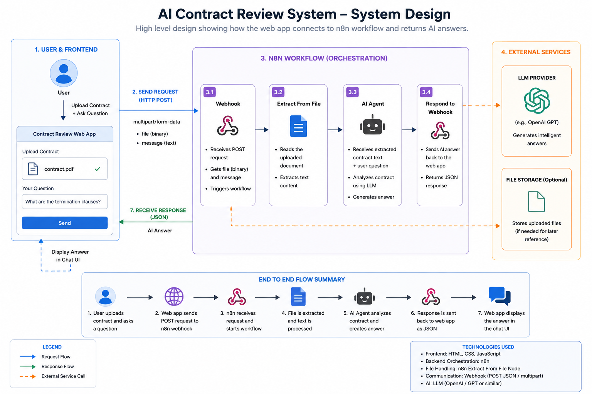


By the end of this lab, you will:

✦ Understand what a webhook is and how it works
✦ Replace the n8n chat trigger with a webhook so external apps can talk to it
✦ Update your prototype to send the contract and user message to n8n
✦ Have a fully working contract review app — real AI, real answers

This lab has three phases. Work through them in order.

---

## Before You Start

This lab builds directly on the work from the previous two labs. Before continuing, make sure you have both of these done and working:

✅ **Lab 1.1 complete** — your n8n contract review workflow is built and the AI agent responded correctly inside n8n's own chat interface

✅ **Lab 1.2 complete** — your Claude Code prototype is built, `index.html` opens in your browser, and the two-panel layout (contract viewer + chat) is working

If either of these isn't done, go back and complete them first. This lab won't work without both pieces in place.

---

## Before We Start: What Is a Webhook?

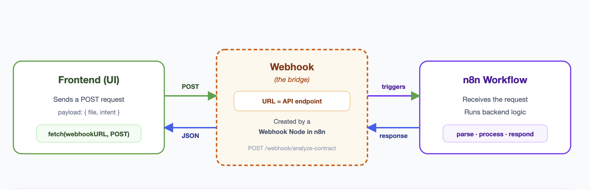

A webhook is a URL that listens for incoming data.

When something sends a request to that URL — like your web app clicking Send — the webhook receives it, triggers a workflow, and can send a response back.

Think of it like a doorbell. Your n8n workflow is sitting inside the house. Your web app is outside. Right now there's no doorbell — they can't talk. A webhook is the doorbell. The app rings it, n8n answers, processes the contract, and sends the answer back.

In Lab 1.1, your n8n agent used a built-in chat trigger — it only worked inside n8n's own interface. Now we're replacing that with a webhook so any external app (your prototype) can send it a contract and a message and get a real answer back.

> ★ Remember. A webhook is just a URL. When your app sends data to it, n8n wakes up, runs the workflow, and returns a response. That's the entire mental model.

---

## Phase 1: Set Up the Webhook in n8n

**Step 1. Open the workflow from Lab 1.1.**

Log into your n8n account and open the contract review workflow you built in Lab 1.1. This is the same workflow — you are not creating a new one.

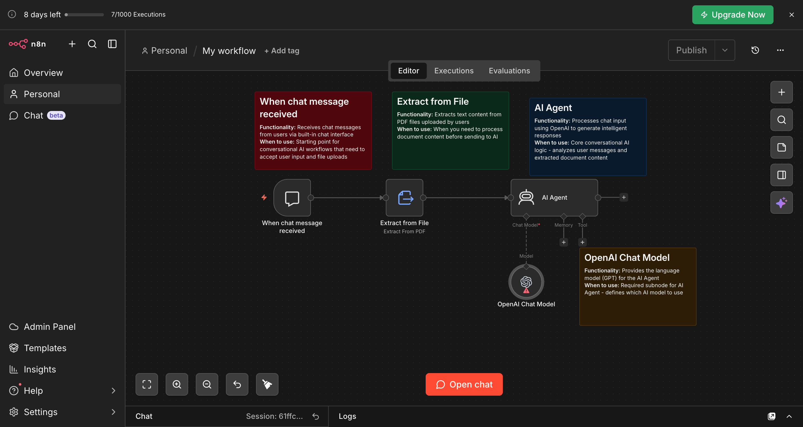

---

**Step 2. Delete the "When Chat Message Received" node.**

Find the node at the very start of your workflow labeled **"When Chat Message Received"**. Click on it to select it, then press Delete.

This node only works inside n8n's built-in chat interface. We're replacing it with a webhook so your external web app can trigger the workflow instead.

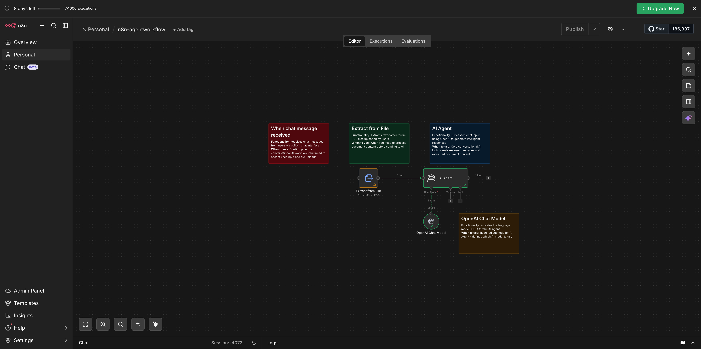

> ✓ Tip. Don't worry about breaking the workflow — deleting the trigger node only disconnects the starting point. You'll reconnect everything in the next steps.

---

**Step 3. Add the Webhook and Respond to Webhook nodes.**

Click the **(+)** button on the canvas to open the node panel. Search for **"Webhook"** and add it to the canvas.

Search again for **"Respond to Webhook"** and add that one too.

You should now have both nodes sitting on the canvas, unconnected.

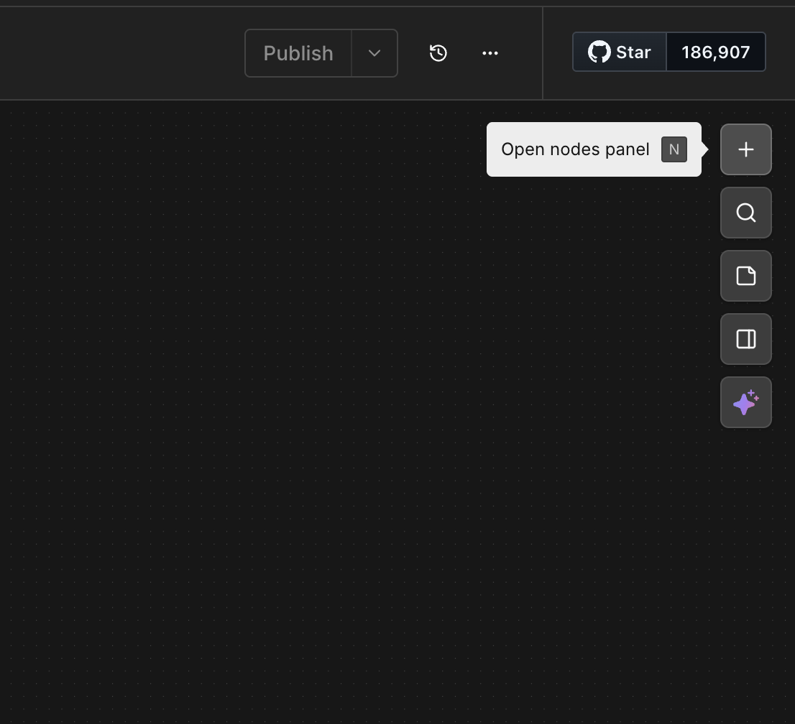

Here's what each node does:

| Node | Role |
|---|---|
| **Webhook** | The entry point. Receives the contract file and user message from your web app. |
| **Respond to Webhook** | The exit point. Sends the AI agent's answer back to your web app. |

These two nodes always work as a pair. Every request that comes in through the Webhook node must exit through the Respond to Webhook node.

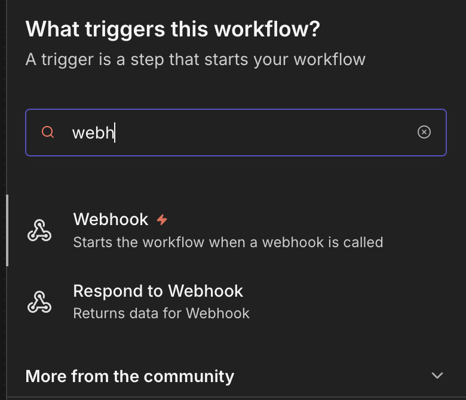

---

**Step 4. Connect the Webhook node to the Extract from File node.**

Draw a connection from the **Webhook** node output to the **Extract from File** node — the same node that was previously connected to the deleted chat trigger.

Your workflow now starts at the Webhook node instead of the old chat trigger.

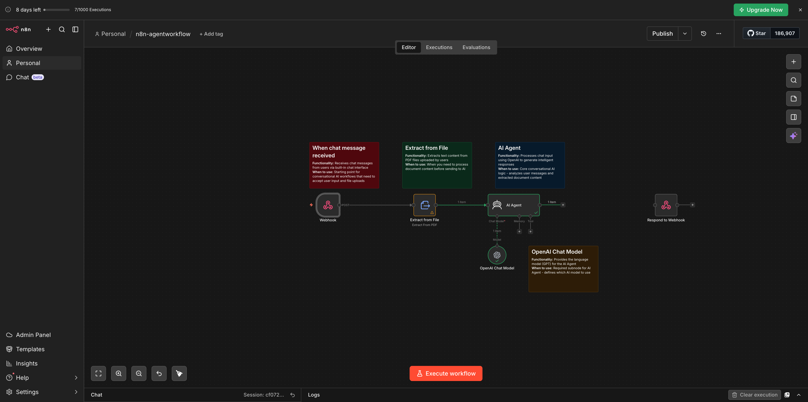

---

**Step 5. Configure the Webhook node.**

Click on the **Webhook** node to open its settings panel. Make the following four changes in order:

**1. Change the HTTP Method to POST.**

POST is the method used when an app is sending data to a URL — in this case, a file and a message. GET is for fetching data. POST is for submitting it. Your web app will be submitting data, so this must be set to POST.

**2. Set the Response field to "Using 'Respond to Webhook' node".**

This tells n8n to wait for your AI agent to finish processing before it sends a reply. Without this setting, n8n would respond immediately with an empty acknowledgement — before the agent even runs.

**3. Click "Add Option" at the bottom and add: Field Name for Binary Data.**

This tells n8n what to call the uploaded contract file when it arrives. Without a name, n8n can't reference the file in the rest of the workflow.

**4. Click "Add Option" again and add: Allowed Origins (CORS). Set the value to `*`.**

CORS is a browser security rule. Without it, your browser will block the request before it even reaches n8n — you'll see a CORS error in the browser console and nothing will happen in n8n. Setting it to `*` allows requests from any origin, which is fine for development.

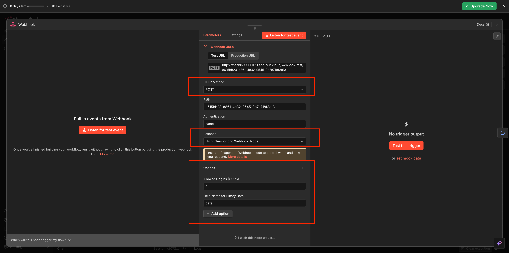

> ★ Remember. CORS is one of the most common reasons webhooks appear to fail during local development. If your app isn't getting a response and n8n shows no activity, CORS is the first thing to check.

**Copy the Webhook URL.**

After saving the settings, you'll see the webhook URL displayed in the node panel. It looks like this:

```
https://your-instance.app.n8n.cloud/webhook-test/your-unique-id
```

Copy this URL now and paste it into a notes app or text file. You'll need it in Phase 2.


---

**Step 6. Connect the AI Agent to the Respond to Webhook node.**

Draw a connection from the **AI Agent** node output to the **Respond to Webhook** node.

Your full workflow should now follow this path:

**Webhook → Extract from File → AI Agent → Respond to Webhook**


Take a moment to trace every connection visually before moving on. Every node in that chain must be linked. One broken connection and the workflow won't run.

> ✓ Tip. If any node looks disconnected, drag the small circle on the right edge of that node and connect it to the input of the next one. Use the image above as your reference.

**Troubleshooting**
If you can't see all four nodes on the canvas at once, use the scroll wheel to zoom out. All connections should be visible before you move to Phase 2.

---

## Phase 2: Wire Up the Prototype

**Step 7. Go back to Claude Code — use the same conversation from Lab 1.2.**

Open the Claude desktop app and find the Claude Code session where you built the prototype in Lab 1.2. It's important to use that same conversation — Claude already knows the project files, the folder structure, and what the app does. Opening a new conversation means Claude starts cold with no context.

> ★ Remember. Claude Code's memory lives in the conversation. The session that built your prototype knows exactly what index.html contains and how the code is structured. Use it — don't open a new chat.

---

**Step 8. Run the integration prompt.**

Copy the prompt below. Before pasting it, replace `<Your Webhook URL>` with the actual webhook URL you copied in Step 5.

```
Now add this feature to the existing prototype:

A user uploads a contract file in the UI.
The user enters a message in the chat input.
When the user clicks the Send button:

1. Collect both:
   - The uploaded contract file
   - The user's chat message

2. Send both to this webhook URL:
   <Your Webhook URL>

3. After the webhook processes the request:
   - Capture the response returned by the webhook
   - Display that response inside the chat UI as the assistant reply

Replace the dummy hardcoded responses with this webhook integration.
```

Paste the updated prompt into Claude Code and run it.

Claude will update your existing files — it won't rewrite the whole app. It will find the part of the code that handles the Send button and modify it to call the webhook instead of returning a dummy response.

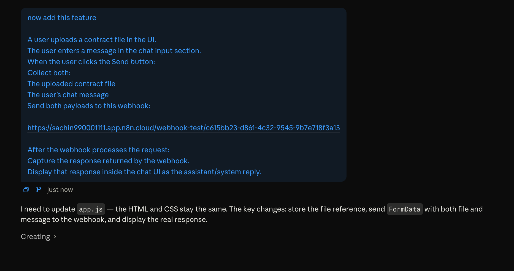

**Troubleshooting**
If Claude says it can't find the files, confirm you're in the right folder. Type `pwd` in Claude Code and check that it matches your `contract-review-app` directory path.

---

## Phase 3: Test and Configure

**Step 9. Open index.html in your browser.**

Go to your `contract-review-app` folder on your Desktop and double-click `index.html` to open it — the same way you've been opening it since Lab 1.2.

---

**Step 10. Activate the workflow in n8n, then run your first test.**

Before you test anything in the browser, go to n8n first and click **"Execute Workflow"**.

This step is critical. The webhook only listens for incoming requests when the workflow is actively running. If you skip this and go straight to the browser, n8n won't receive anything — your request will just time out.

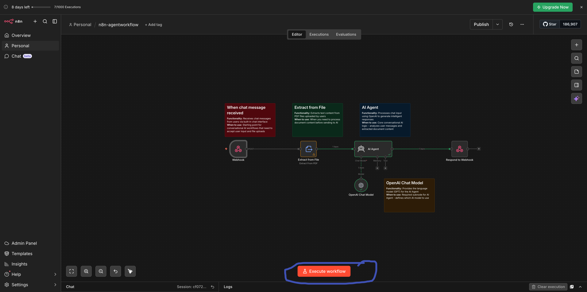

With the workflow running, go back to your browser. Upload the sample contract, type a message, and click Send.

You will likely see an error. That is expected and completely normal at this point.

The reason: the AI Agent node is still configured with the old user input from Lab 1.1 — it's looking for input from the built-in n8n chat, not from the webhook. We'll fix that in the next step.

> ✓ Tip. Getting an error here means the webhook connection is working — your app is successfully reaching n8n. The error is coming from inside the workflow, not from a broken connection. That's actually progress.

---

**Step 11. Update the AI Agent to use the webhook input.**

Go back to n8n and click on the **AI Agent** node to open its settings.

Find the **user message** field. This is the field the agent reads as the question to answer. Right now it's pointing to the old chat trigger — a field that no longer exists in your workflow. You need to point it to the message coming in from the webhook instead.

Replace the current value with the message field from the webhook body. In n8n expressions, that looks like this:

```
{{ $json.body.message }}
```

The exact field name depends on what Claude Code named it when building the integration. If `message` doesn't work, check the webhook execution data in n8n — click on the Webhook node after a test run and you'll see the exact fields that arrived.

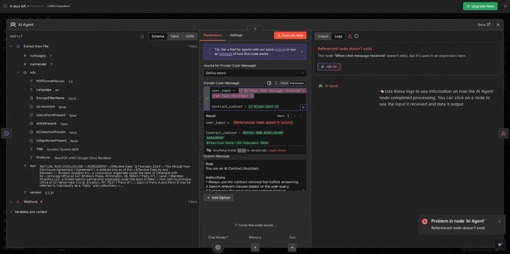

The contract file is already handled by the Extract from File node earlier in the workflow — you do not need to change that. Only the user message field needs updating.

Save the node.

**Troubleshooting**
If you're unsure what field name to use, go to the Claude Code session and ask: "What field name are you sending the user message under in the webhook request?" Claude will tell you exactly.

---

**Step 12. Final test — the full end-to-end flow.**

Go to n8n and click **"Execute Workflow"** to put it back into listening mode.

Go to your browser. Upload the sample contract. Type this question and click Send:

*"What is this contract about?"*

This time you'll get a real response — pulled from the actual contract, processed by your n8n AI agent, and displayed in your web app chat panel.

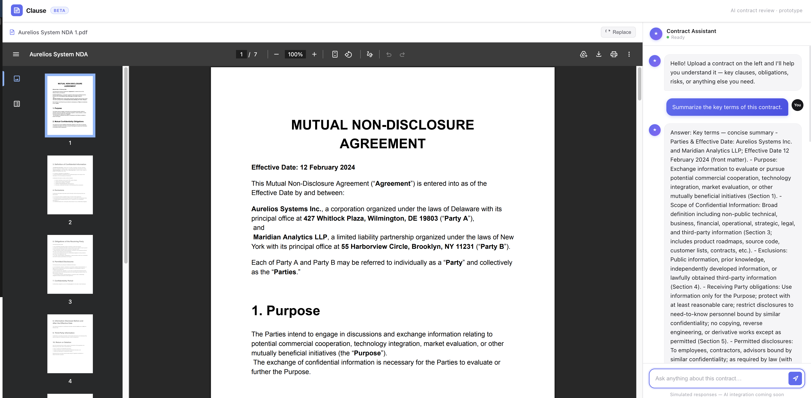

Try a few more:

*"What are the payment terms?"*

*"What happens if either party wants to terminate early?"*

*"Are there any auto-renewal clauses?"*

Every answer comes directly from the contract. Every response travels through your n8n agent. Your prototype and your agent are now one working product.

> ★ Remember. What you just built is a real integration — a web UI, an AI agent, and a webhook connecting them. This is the same architecture pattern used in production AI products. You now understand how it works because you built it yourself.

---

## What You Learned

**Webhooks** — a URL that listens for incoming requests, triggers a workflow, and sends a response back. Your web app rings the doorbell, n8n answers, processes the contract, and returns the answer.

**Why we deleted the chat trigger** — the built-in n8n chat trigger only works inside n8n's own interface. A webhook opens the agent up to any external app, any frontend, any platform.

**HTTP POST** — the method used when submitting data to a URL. GET fetches data. POST sends it. Your web app submits a file and a message, so POST is always correct here.

**CORS** — a browser security rule that must be configured on the webhook to allow requests from your local web app. Skip it and the browser silently blocks every request before n8n sees a single byte.

**Execute Workflow** — the webhook only listens when the workflow is actively running. Always click Execute before testing from the browser.

**The complete stack** — Lab 1.1 built the agent. Lab 1.2 built the UI. Lab 1.3 connected them with a webhook. Three labs, one working product.

---

[← Back to Week 1 Overview](../readme.md)
