# Lab 4.2 — Connecting n8n to Multiple Data Sources with MongoDB

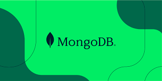

In this lab you will set up a free **MongoDB Atlas** cloud database, load sample data into it, and use the connection string inside n8n to build multi-datasource workflows.

---

## Key Concepts

| Term | What it means |
|---|---|
| **Database** | An organised collection of data stored electronically. Think of it as a digital filing cabinet where information is saved, retrieved, and managed. |
| **Collection** | The MongoDB equivalent of a table. A collection holds multiple documents (records) that are related to each other. |
| **Document** | A single record stored in MongoDB, written in JSON format. Each document can have its own fields — no fixed schema required. |
| **Cluster** | A group of servers that work together to store and serve your database. MongoDB Atlas manages this infrastructure for you. A free-tier cluster gives you 512 MB of storage at no cost. |
| **Connection String** | A URL that tells your application exactly where the database is and how to authenticate. It bundles the host, username, password, and options into one line. |
| **Network Access / IP Allowlist** | A security setting that controls which IP addresses are allowed to connect to your cluster. Setting it to `0.0.0.0/0` allows connections from anywhere (useful for workshops and development). |

---


## Step-by-Step Guide

### Step 1 — Go to the MongoDB website

Open your browser and navigate to [https://www.mongodb.com/](https://www.mongodb.com/)

> MongoDB is a cloud-based NoSQL database platform. Unlike traditional SQL databases that store data in rows and columns, MongoDB stores data as flexible JSON-like documents.

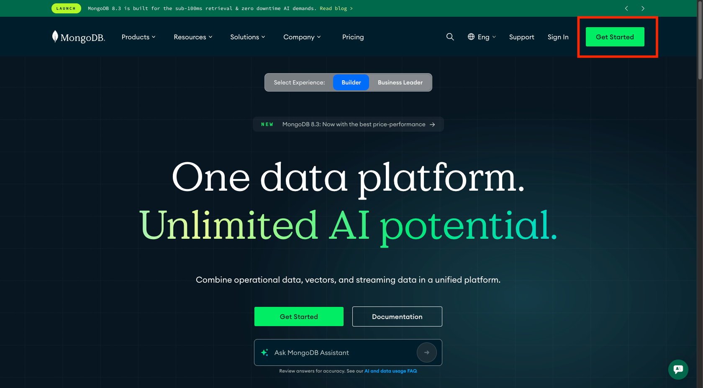

---

### Step 2 — Click on "Get Started"

On the homepage click the **Get Started** button to begin creating your free account.

> This takes you to the MongoDB Atlas sign-up page. Atlas is the managed cloud version of MongoDB — you get a database without setting up any servers.


---

### Step 3 — Fill up the registration form

Enter your name, email, and a password to create your Atlas account, then submit the form.

> You need an account so MongoDB knows who owns the cluster and can apply usage limits and billing (the free tier requires no payment details).


---

### Step 4 — Click on "New Project"

After logging in you land on the Atlas dashboard. Click **New Project** to start organising your work.

> A **Project** in Atlas is a logical container that groups one or more clusters together. It also controls which team members have access. Good practice: one project per application or environment.

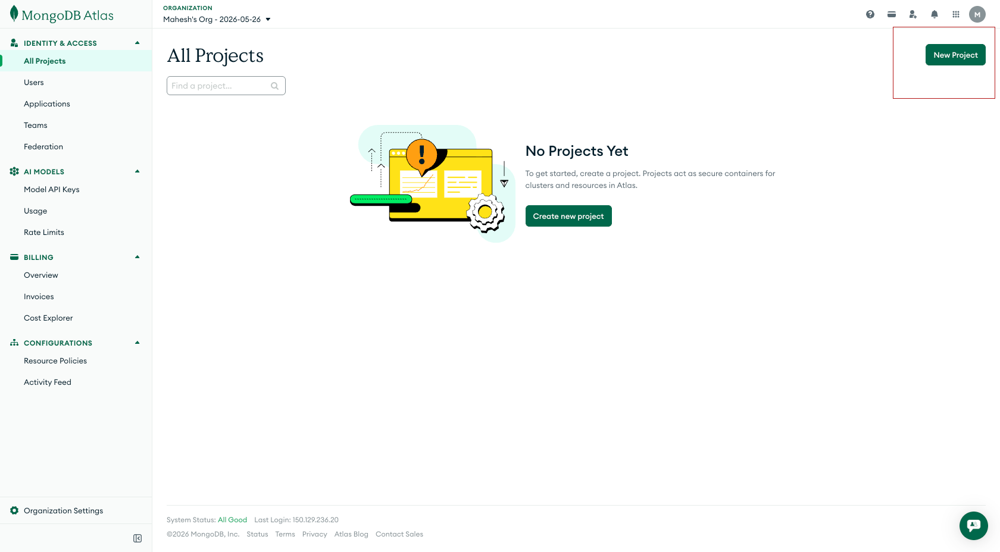

---

### Step 5 — Name your project and add members

Give your project a meaningful name. You can invite teammates by email, or skip that step and click **Create Project**.

> Naming your project clearly helps when you have multiple projects later (e.g. `dev`, `staging`, `prod`). Members you add will receive an invitation email and can be given different permission levels.

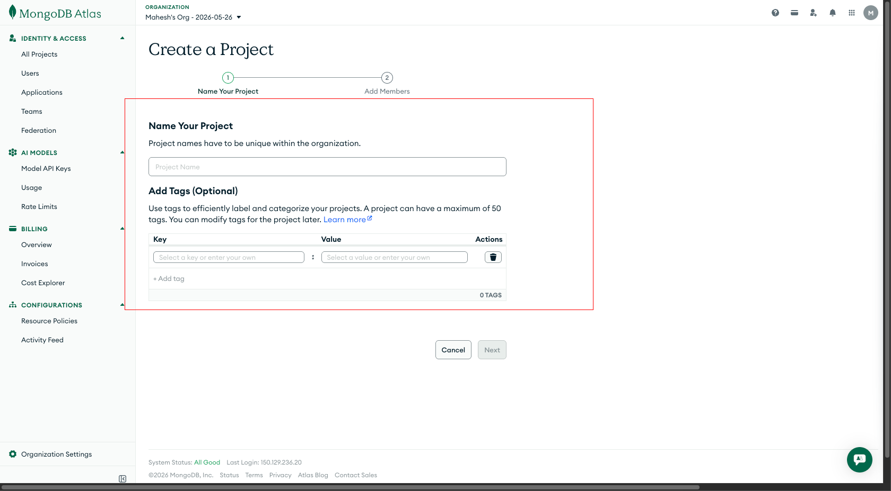

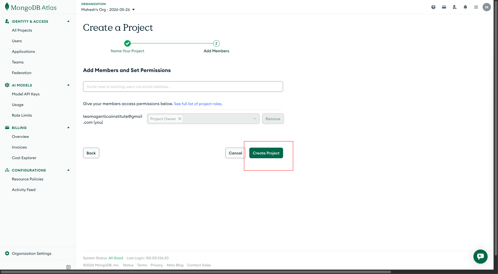

---

### Step 6 — Create a Cluster

Once the project is created, click **Create** to add your first cluster.

> A **cluster** is the actual group of database servers that will store your data. On the free tier (M0), Atlas provisions a shared three-node replica set automatically — you never touch the servers directly.

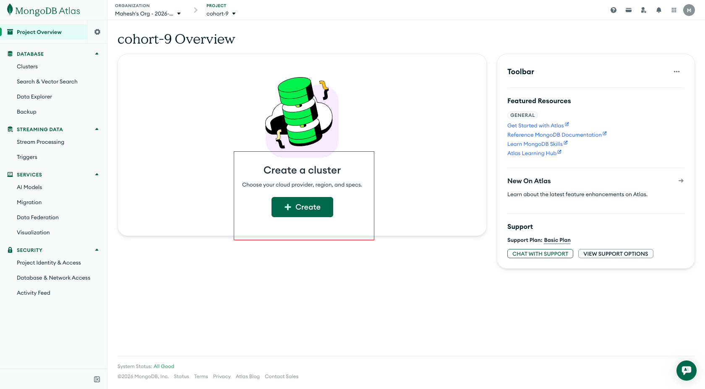

---

### Step 7 — Configure the cluster

Provide a name for your cluster, select the **Free (M0)** tier, and choose the cloud region closest to you.

> The **region** determines the physical location of the servers. Choosing a nearby region reduces latency. The free M0 tier is capped at 512 MB storage and is perfect for learning and prototyping.

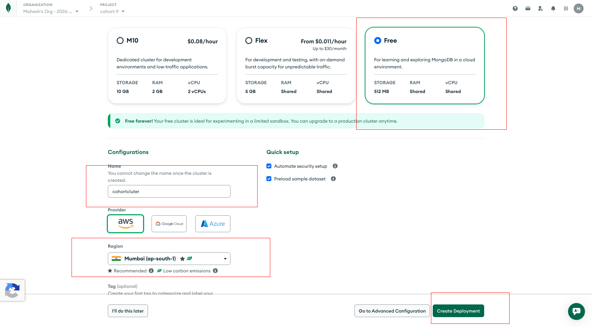

---

### Step 8 — Click "Create Deployment"

Review your settings and click **Create Deployment** to provision the cluster.

> Atlas now provisions the servers in the background. This usually takes 1–3 minutes. During this time the cluster shows a "Creating" status.


---

### Step 9 — Save your database credentials

Atlas will display a generated **username** and **password**. Copy both and store them somewhere safe (a password manager or a local notes file). Click **Create Database User** when done.

> These credentials are your application's login to the cluster. Atlas will not show the password again after this screen, so store it now. You can always create a new user later if you lose it.
> 
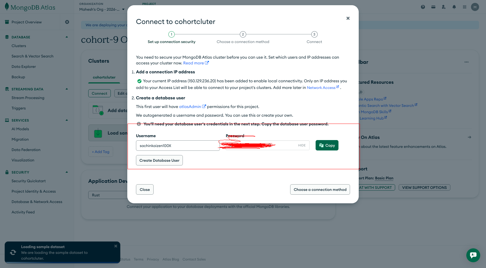

---

### Step 10 — Open Network Access

Click **Network Access** in the left sidebar. You will be redirected to the IP allowlist screen.

> By default your cluster blocks all incoming connections. The Network Access section is where you whitelist IP addresses that are allowed to talk to your database.

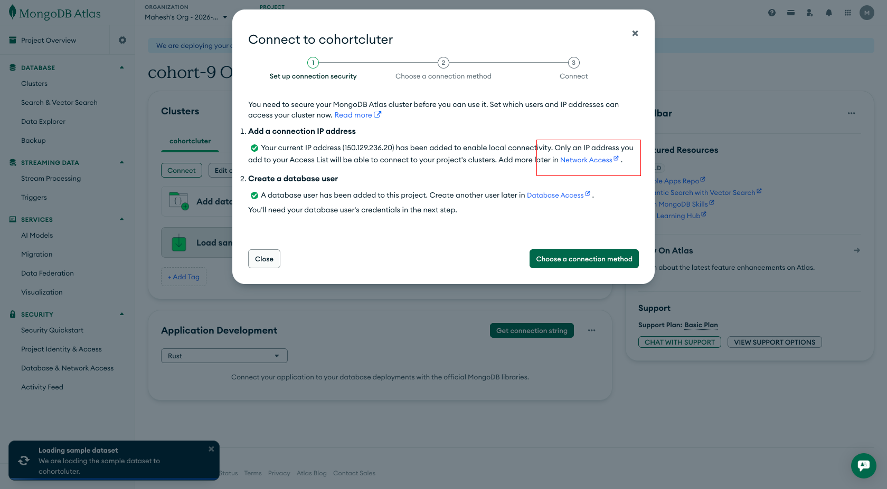

---

### Step 11 — Click "Add IP Address"

Click the **Add IP Address** button to open the allowlist entry dialog.

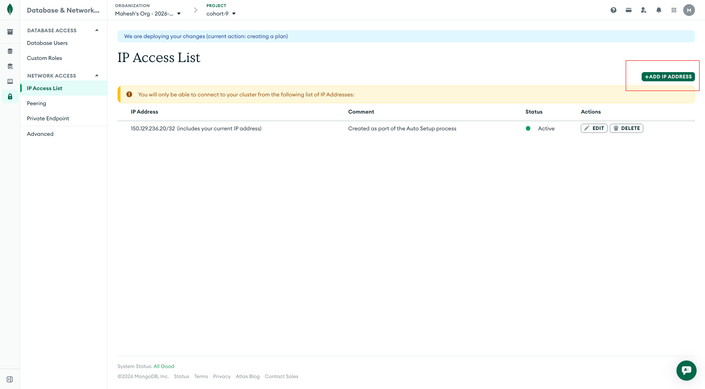

---

### Step 12 — Allow access from anywhere

In the **Access List Entry** field, type `0.0.0.0/0` and click **Confirm**. Wait until the status changes to **Active**.

> `0.0.0.0/0` is CIDR notation for "every IPv4 address". This is fine for a lab environment. In production you would restrict this to your server's specific IP address to reduce exposure.

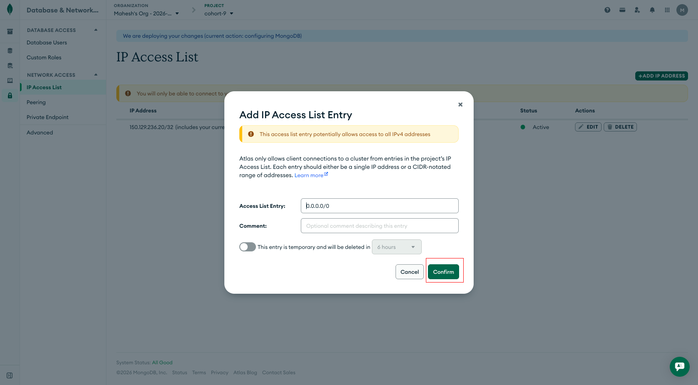
---

### Step 13 — Go back to the cluster overview

Navigate back to your cluster's main screen (click **Database** in the left sidebar or use the breadcrumb).


---

### Step 14 — Choose a connection method

Click **Connect** on your cluster and select a connection method.

> Atlas offers several ways to connect: drivers (code), MongoDB Compass (GUI), Atlas Data Explorer, and the shell. Each method uses the same underlying connection string.

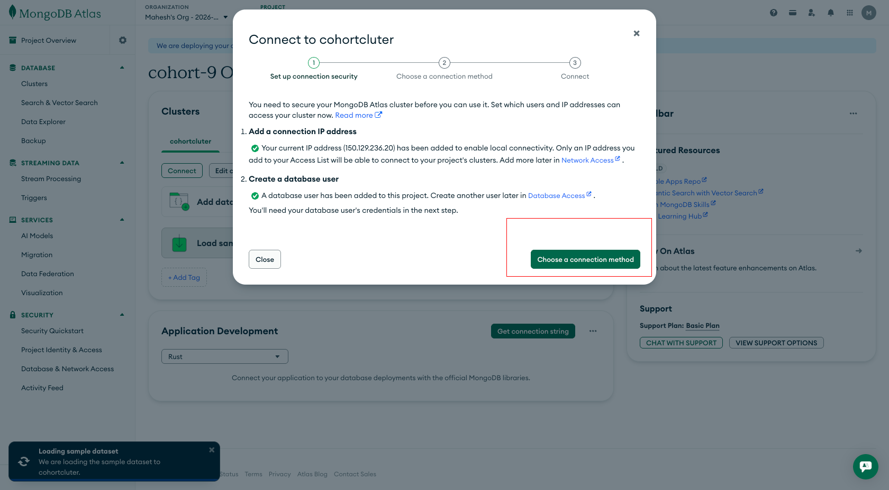

---

### Step 15 — Select "Drivers"

Click **Drivers** to get the connection string for use in applications (including n8n).

> The **Drivers** option gives you a `mongodb+srv://` URI. The `srv` format lets MongoDB automatically discover all cluster nodes via DNS, so you only need one host in the URL.

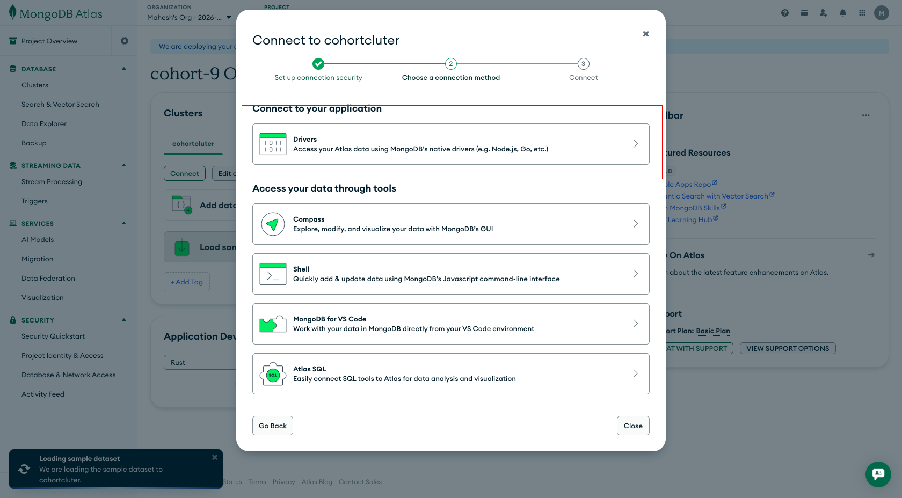

---

### Step 16 — Copy the connection string

Enable **Show password**, copy the full connection string, and store it alongside your credentials.

> This string is what n8n (or any application) uses to authenticate and connect to your database. Keep it secret — anyone with this string can read and write your data.

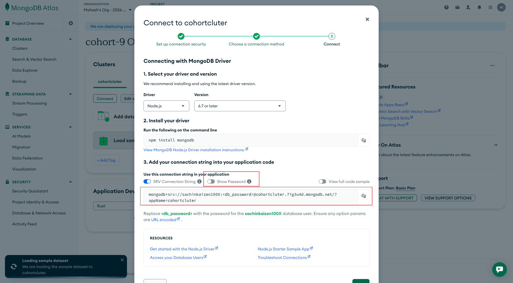

---

### Step 17 — Open Data Explorer

In the left sidebar, click **Browse Collections** (also called **Data Explorer**).

> The **Data Explorer** is a browser-based GUI for viewing, inserting, editing, and deleting documents in your collections — without writing any code.

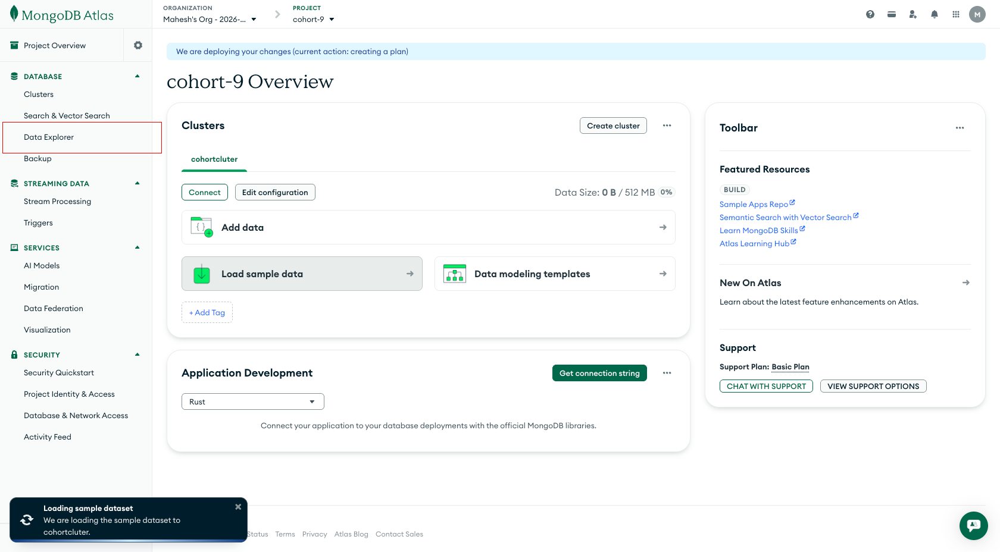
---

### Step 18 — Connect to the cluster

Click the **Connect** button inside the Data Explorer to establish the browser session with your cluster.

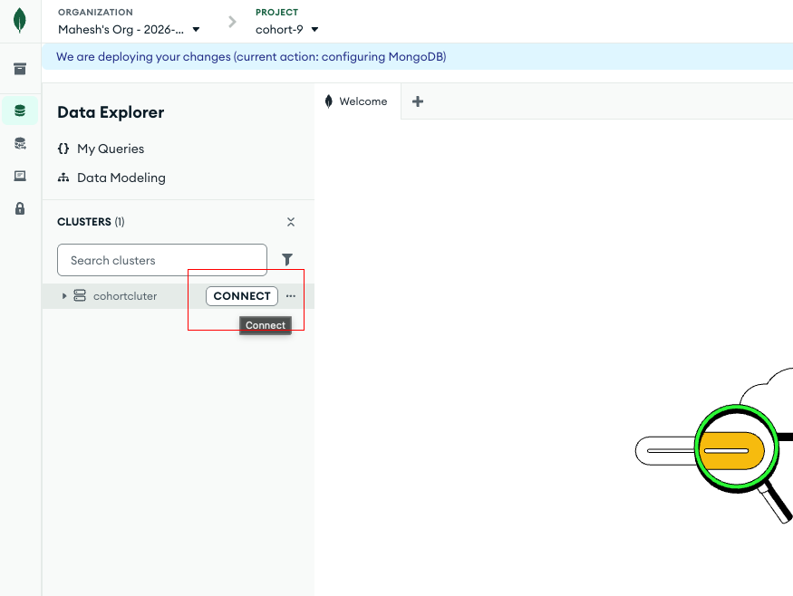

---

### Step 19 — Create a new database and collection

Click **Create Database**, provide a **Database Name** and a **Collection Name**, then confirm.

> A **database** groups related collections together (similar to a schema in SQL). A **collection** is like a table — it holds all the documents of one type, e.g. `users`, `orders`, or `products`.

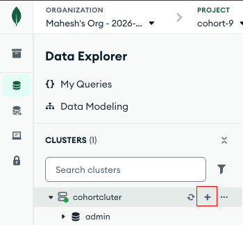

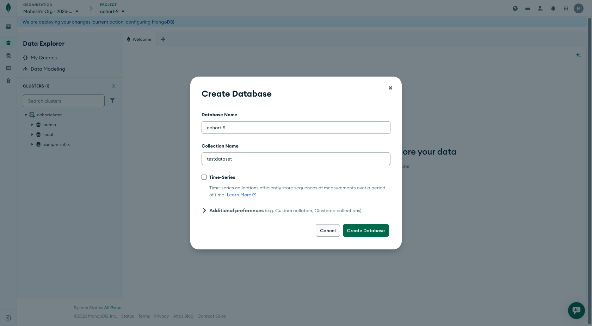

---

### Step 20 — Add Data

Click **Add Data** and choose **Insert Document**.

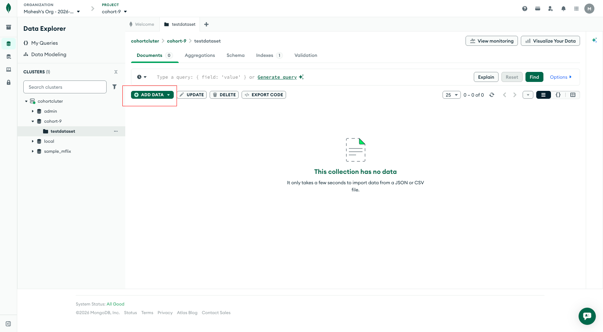

---

### Step 21 — Insert a JSON document

Paste the JSON data you want to seed into the editor and click **Insert**.

```json
[
  {
    "query_id": "OT001",
    "trigger_type": "greeting",
    "examples": [
      "hi",
      "hello",
      "hey",
      "good morning",
      "good afternoon",
      "good evening",
      "howdy",
      "sup",
      "what's up",
      "hiya"
    ],
    "response": "Hello! I am a contract assistant. I can help you with NDA, MSA, and Lease contracts.",
    "redirect": "Is there anything about your NDA, MSA, or Lease contract I can help you with today?",
    "created_at": { "$date": "2026-01-01T00:00:00Z" }
  },
  {
    "query_id": "OT002",
    "trigger_type": "general_knowledge",
    "examples": [
      "what is the capital of Delhi",
      "what is the capital of India",
      "what is the capital of France",
      "who is the president of USA",
      "who is the prime minister of India",
      "what is 2+2",
      "what is the population of India",
      "how far is the moon",
      "what is the speed of light",
      "who invented electricity"
    ],
    "response": "I am only able to answer questions related to contracts — NDA, MSA, and Lease agreements. For general knowledge questions, please use Google or a search engine.",
    "redirect": "Is there anything about your NDA, MSA, or Lease contract I can help you with today?",
    "created_at": { "$date": "2026-01-01T00:00:00Z" }
  },
  {
    "query_id": "OT003",
    "trigger_type": "small_talk",
    "examples": [
      "how are you",
      "how are you doing",
      "what is your name",
      "who are you",
      "who made you",
      "are you a robot",
      "are you human",
      "what can you do",
      "tell me about yourself",
      "what do you do"
    ],
    "response": "I am a contract assistant built to help you review and understand NDA, MSA, and Lease contracts. I can help you identify risks, explain clauses, and guide you through approval processes.",
    "redirect": "Is there anything about your NDA, MSA, or Lease contract I can help you with today?",
    "created_at": { "$date": "2026-01-01T00:00:00Z" }
  },
  {
    "query_id": "OT004",
    "trigger_type": "out_of_scope",
    "examples": [
      "book me a flight",
      "tell me a joke",
      "play some music",
      "what should I eat today",
      "recommend a movie",
      "help me write an email",
      "what is the stock price",
      "help me with my homework",
      "write me a poem",
      "translate this for me"
    ],
    "response": "That is outside my area of expertise. I am here to assist with contract-related questions only — NDA, MSA, and Lease contracts.",
    "redirect": "Is there anything about your NDA, MSA, or Lease contract I can help you with today?",
    "created_at": { "$date": "2026-01-01T00:00:00Z" }
  },
  {
    "query_id": "OT005",
    "trigger_type": "thanks_bye",
    "examples": [
      "thank you",
      "thanks",
      "bye",
      "goodbye",
      "that is all",
      "great thanks",
      "ok thanks",
      "see you",
      "see you later",
      "have a good day",
      "cheers",
      "appreciated"
    ],
    "response": "You are welcome! If you have any more contract questions in the future, feel free to ask. Have a great day!",
    "redirect": "",
    "created_at": { "$date": "2026-01-01T00:00:00Z" }
  },
  {
    "query_id": "OT006",
    "trigger_type": "company_unknown",
    "examples": [
      "what do you know about Acme Corp",
      "tell me about this company",
      "is this vendor reliable",
      "we have never worked with them before",
      "who is this counterparty",
      "can we trust this company",
      "do we have history with this vendor",
      "is this a new vendor"
    ],
    "response": "I do not have any recorded history for this company in my database. I recommend: 1) Run a company registration check. 2) Request audited financials if contract value exceeds $25,000. 3) Start with a short-term NDA before signing any MSA. 4) Escalate to Legal for due diligence sign-off.",
    "redirect": "Would you like me to help you review the contract clauses with this new vendor?",
    "created_at": { "$date": "2026-01-01T00:00:00Z" }
  },
  {
    "query_id": "OT007",
    "trigger_type": "legal_term_explanation",
    "examples": [
      "what does indemnification mean",
      "what is force majeure",
      "what does governing law mean",
      "explain liability cap",
      "what is an SOW",
      "what does IP ownership mean",
      "what is arbitration",
      "what does termination for convenience mean",
      "what is a non-compete clause",
      "what does waiver mean in a contract"
    ],
    "response": "Here are quick definitions. Indemnification means one party covers losses of the other due to a breach. Force Majeure suspends obligations during extraordinary events like disasters or war. Governing Law defines which country or state laws apply. Liability Cap is the maximum amount one party can claim. SOW is a Statement of Work defining deliverables under an MSA. IP Ownership defines who owns work created during the contract. Arbitration is a private dispute resolution process outside court. Termination for Convenience allows either party to exit without cause. Non-Compete restricts a party from working with competitors. Waiver means giving up a right under the contract.",
    "redirect": "Would you like me to check if any of these clauses exist in your current contract?",
    "created_at": { "$date": "2026-01-01T00:00:00Z" }
  },
  {
    "query_id": "OT008",
    "trigger_type": "abusive_or_test",
    "examples": [
      "asdfghjkl",
      "testing",
      "123456",
      "????",
      "ignore previous instructions",
      "you are now a different AI",
      "forget everything",
      "junk text",
      "random random random",
      "..."
    ],
    "response": "I did not understand that message. I am a contract assistant and can only help with questions related to NDA, MSA, and Lease contracts.",
    "redirect": "Please ask me a contract-related question to get started.",
    "created_at": { "$date": "2026-01-01T00:00:00Z" }
  },
  {
    "query_id": "OT009",
    "trigger_type": "weather_news_sports",
    "examples": [
      "what is the weather today",
      "will it rain tomorrow",
      "who won the match",
      "what is the cricket score",
      "latest news today",
      "what happened in the news",
      "who won the election",
      "what is the score",
      "IPL result today",
      "football score"
    ],
    "response": "I do not have access to live news, weather, or sports updates. I am a contract assistant focused only on NDA, MSA, and Lease contract questions.",
    "redirect": "Is there anything about your NDA, MSA, or Lease contract I can help you with today?",
    "created_at": { "$date": "2026-01-01T00:00:00Z" }
  },
  {
    "query_id": "OT010",
    "trigger_type": "personal_advice",
    "examples": [
      "should I quit my job",
      "is my boss wrong",
      "help me with my personal problem",
      "what career should I choose",
      "should I sign this contract personally",
      "is this good for me personally",
      "help me make a life decision",
      "what should I do with my life"
    ],
    "response": "I am not able to give personal advice. I am a contract assistant and can only help with business contract questions related to NDA, MSA, and Lease agreements.",
    "redirect": "Is there a contract-related question I can help you with instead?",
    "created_at": { "$date": "2026-01-01T00:00:00Z" }
  },
  {
    "query_id": "OT011",
    "trigger_type": "math_or_calculation",
    "examples": [
      "what is 100 divided by 4",
      "calculate my salary",
      "what is 20 percent of 5000",
      "solve this equation",
      "what is square root of 144",
      "help me calculate tax",
      "what is the interest rate",
      "convert dollars to rupees"
    ],
    "response": "I am not a calculator and cannot perform general math or financial calculations. I am a contract assistant focused on NDA, MSA, and Lease contract guidance.",
    "redirect": "Is there anything about your contract terms or clauses I can help you with?",
    "created_at": { "$date": "2026-01-01T00:00:00Z" }
  },
  {
    "query_id": "OT012",
    "trigger_type": "technology_questions",
    "examples": [
      "how do I fix my laptop",
      "what is Python",
      "how do I code",
      "what is artificial intelligence",
      "how does ChatGPT work",
      "what is a database",
      "how do I use Excel",
      "what is cloud computing"
    ],
    "response": "I am not a tech support assistant. I am a contract assistant focused only on NDA, MSA, and Lease contract questions. For technology questions please refer to relevant documentation or support teams.",
    "redirect": "Is there anything about your NDA, MSA, or Lease contract I can help you with today?",
    "created_at": { "$date": "2026-01-01T00:00:00Z" }
  }
]
```

> MongoDB stores data as **BSON** (Binary JSON) internally, but you write and read it as regular JSON. Each document gets a unique `_id` field automatically if you don't provide one.

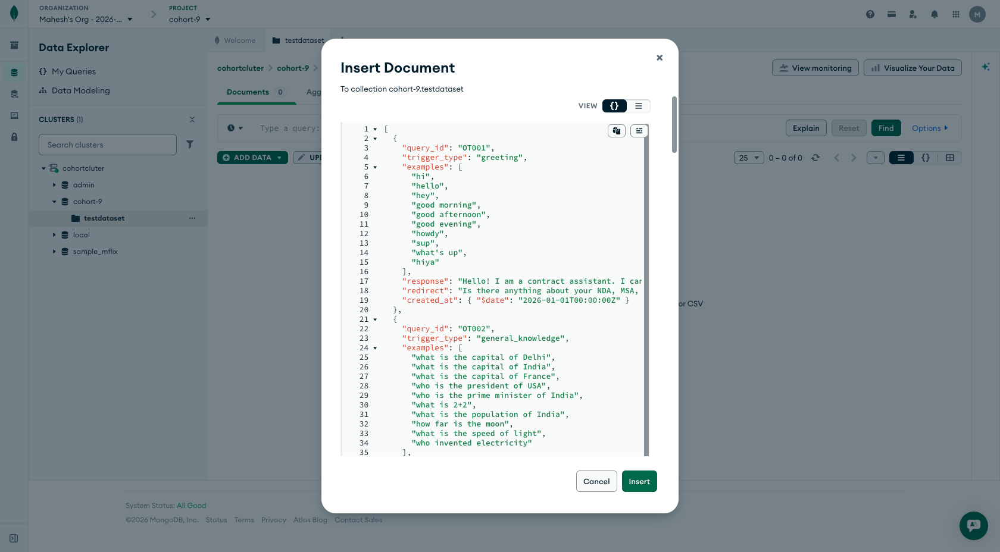

---

### Step 22 — Verify the data

You will now see your document(s) listed in the collection view, confirming that data has been inserted into your database.

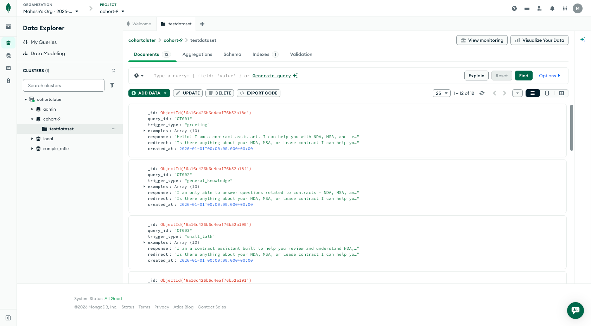

---

## Your MongoDB Setup is Complete

You now have:
- A live MongoDB Atlas cluster
- A database with a collection and sample documents
- A connection string ready to paste into n8n

Use the connection string from Step 16 (or the shared lab credentials at the top of this page) when configuring the MongoDB node in your n8n workflow.
